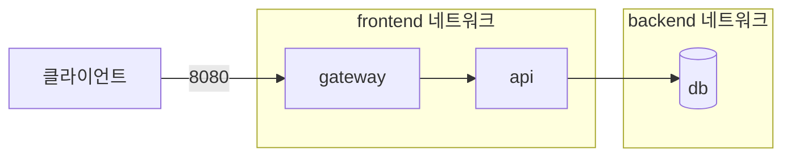
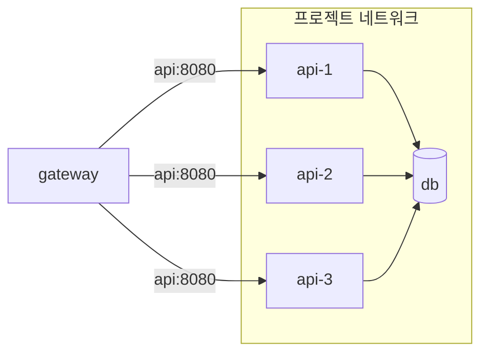

# 4. Docker Compose 네트워크와 확장

## Compose 네트워크 구조

Docker Compose는 별도의 네트워크 설정이 없어도 프로젝트 전용 `default` 네트워크를 자동으로 만든다. 같은 프로젝트의 서비스는 이 네트워크에 연결되며 서비스 이름을 DNS 이름처럼 사용할 수 있다.

```yaml
name: sample-app

services:
  web:
    image: example/web:1.0
    ports:
      - "8080:8080"

  db:
    image: postgres:18-alpine
```

이 파일로 만들어지는 기본 구조는 다음과 같다.


호스트는 게시된 포트인 `localhost:8080`으로 `web`에 접근한다. 반면 `web` 컨테이너는 호스트 포트를 거치지 않고 `db:5432`로 데이터베이스에 접근한다.

```text
호스트 → localhost:8080 → web:8080
web    → db:5432        → db 컨테이너
```

컨테이너 안에서 `localhost`는 해당 컨테이너 자신을 가리킨다. 따라서 `web`에서 `localhost:5432`로 연결하면 `db`가 아니라 `web` 컨테이너 내부의 5432 포트를 찾게 된다.

## 서비스 이름 기반 통신

Compose의 내부 DNS는 서비스 이름을 해당 서비스 컨테이너의 IP 주소로 변환한다.

```yaml
services:
  api:
    image: example/api:1.0
    environment:
      DATABASE_URL: postgres://study:password@db:5432/app

  db:
    image: postgres:18-alpine
```

여기서 `db`는 컨테이너 이름이나 고정 IP가 아니라 서비스 이름이다. 컨테이너가 재생성되면 IP는 바뀔 수 있지만 서비스 이름은 유지되므로 애플리케이션은 IP 주소를 직접 저장하지 않는 것이 좋다.

### 여러 네트워크로 역할 분리

프록시, 애플리케이션, 데이터베이스를 서로 다른 네트워크 영역으로 분리할 수 있다.

```yaml
services:
  gateway:
    image: nginx:alpine
    ports:
      - "8080:80"
    networks:
      - frontend

  api:
    image: example/api:1.0
    networks:
      - frontend
      - backend

  db:
    image: postgres:18-alpine
    networks:
      - backend

networks:
  frontend:
  backend:
    internal: true
```



- `gateway`는 `frontend`에만 연결되어 `db`에 직접 접근할 수 없다.
- `db`는 `backend`에만 연결되어 외부에서 직접 접근할 수 없다.
- `api`는 두 네트워크를 연결하는 애플리케이션 계층이다.
- `internal: true`인 네트워크는 외부 연결이 차단된 내부 전용 네트워크로 생성된다.

네트워크 분리는 통신 경로를 줄여 주지만 애플리케이션 인증이나 데이터베이스 권한 설정을 대신하지 않는다.

## `docker compose scale`

Compose 서비스 하나를 동일한 설정의 여러 컨테이너로 확장할 수 있다.

```bash
docker compose up -d --scale api=3
```

또는 별도의 `scale` 명령을 사용할 수 있다.

```bash
docker compose scale api=3
```

`up --scale`은 실행과 확장을 함께 처리하고, 명령에 지정한 수가 Compose 파일의 `scale` 또는 `deploy.replicas` 값보다 우선한다.

### 확장 후 구조



확장된 컨테이너는 모두 같은 서비스 설정을 사용하지만 각각 별도의 프로세스, 파일 시스템 쓰기 계층, IP 주소와 컨테이너 이름을 갖는다.

```text
sample-app-api-1
sample-app-api-2
sample-app-api-3
```

같은 네트워크의 다른 서비스는 개별 컨테이너 이름보다 `api`라는 서비스 이름을 사용한다. 요청을 여러 replica에 실제로 분산하려면 애플리케이션 프로토콜과 연결 방식에 맞는 프록시 또는 로드 밸런싱 구성을 함께 고려해야 한다.

### 고정 호스트 포트 충돌

다음처럼 서비스에 고정 호스트 포트를 지정하면 여러 replica가 동일한 호스트 포트를 사용할 수 없어 충돌한다.

```yaml
services:
  api:
    image: example/api:1.0
    ports:
      - "8080:8080"
```

```bash
docker compose up -d --scale api=3
```

세 컨테이너 모두 호스트의 8080 포트를 점유하려고 하기 때문이다.

일반적으로 외부 포트는 gateway 또는 reverse proxy 하나에만 게시하고, 확장 대상 서비스는 Compose 네트워크 내부 포트로만 접근한다.

```yaml
services:
  gateway:
    image: nginx:alpine
    ports:
      - "8080:80"

  api:
    image: example/api:1.0
    expose:
      - "8080"
```

각 replica에 임의의 호스트 포트를 할당하는 방식도 가능하다.

```yaml
services:
  api:
    image: example/api:1.0
    ports:
      - "8080"
```

```bash
docker compose up -d --scale api=3
docker compose port --index 1 api 8080
docker compose port --index 2 api 8080
docker compose port --index 3 api 8080
```

호스트 포트가 고정되어 있지 않으므로 Docker가 replica마다 사용 가능한 포트를 선택한다.

### `container_name` 사용 주의

```yaml
services:
  api:
    image: example/api:1.0
    container_name: fixed-api
```

컨테이너 이름은 한 호스트에서 유일해야 한다. `container_name`을 지정한 서비스는 1개를 초과해 확장할 수 없으므로, scale할 서비스에서는 Compose가 만드는 기본 컨테이너 이름을 사용한다.

### 데이터와 상태 관리

여러 replica가 같은 서비스를 처리하려면 컨테이너 내부에 사용자 세션이나 중요한 상태를 저장하지 않는 편이 좋다. 컨테이너마다 로컬 쓰기 계층이 다르기 때문에 다음 요청이 다른 replica로 가면 상태를 찾지 못할 수 있다.

상태는 목적에 맞는 외부 저장소에 둔다.

- 사용자 세션: Redis 같은 공유 저장소
- 영구 데이터: 데이터베이스 또는 적절한 named volume
- 사용자 업로드: 오브젝트 스토리지나 공유 파일 스토리지

같은 named volume을 여러 replica에 동시에 연결할 수 있다는 사실이 동시 쓰기의 안전성을 보장하지는 않는다. 애플리케이션과 스토리지 드라이버가 다중 접근을 지원하는지 확인해야 한다.

### Compose scale의 범위

Docker Compose의 scale은 한 Docker Engine에서 동일한 서비스 컨테이너 수를 늘리는 기능이다.

- 여러 호스트에 replica를 자동으로 분산하지 않는다.
- 호스트가 중단되면 해당 호스트의 모든 컨테이너가 함께 중단된다.
- 컨테이너 재시작은 서비스의 `restart` 정책에 영향을 받는다.
- 클러스터 수준의 배치, rolling update와 노드 장애 복구가 필요하면 Swarm 같은 오케스트레이터를 사용한다.

## 네트워크 확인 명령

실습할 때는 다음 순서로 연결 상태를 확인할 수 있다.

```bash
docker compose ps
docker compose config --networks
docker network ls
docker network inspect <프로젝트_네트워크>
docker compose exec api getent hosts db
```

마지막 명령의 `getent`는 대상 이미지에 해당 프로그램이 설치되어 있을 때만 사용할 수 있다.

## 참고

- [Compose 네트워킹](https://docs.docker.com/compose/how-tos/networking/)
- [Compose 네트워크 정의](https://docs.docker.com/reference/compose-file/networks/)
- [Compose 서비스 정의와 `container_name`](https://docs.docker.com/reference/compose-file/services/)
- [`docker compose up --scale`](https://docs.docker.com/reference/cli/docker/compose/up/)
