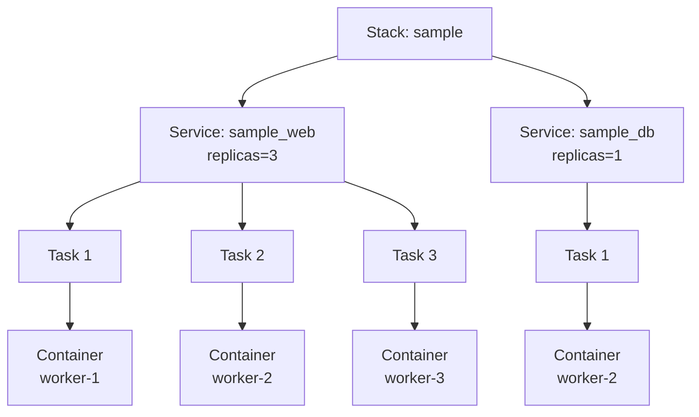
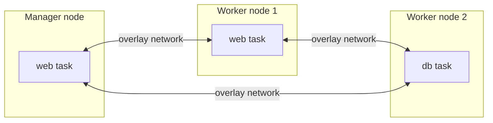

# 5. Docker Compose와 Swarm 함께 사용하기

## 개요

Docker Compose와 Docker Swarm은 모두 YAML 파일로 여러 컨테이너의 구성을 표현할 수 있지만 관리 범위가 다르다.

- Docker Compose: 주로 하나의 Docker Engine에서 여러 컨테이너를 프로젝트 단위로 관리한다.
- Docker Swarm: 여러 Docker Engine을 클러스터로 묶고 서비스를 노드에 배치한다.
- Docker Stack: Compose 형식의 파일을 Swarm의 여러 서비스로 배포하는 단위이다.

```text
Compose 파일
   │
   ├─ docker compose up  → Compose 프로젝트 → 로컬 컨테이너
   │
   └─ docker stack deploy → Swarm Stack → Service → Task → Container
```

같은 YAML 형식을 사용한다고 해서 `docker compose up`과 `docker stack deploy`가 완전히 같은 설정을 지원하는 것은 아니다.

## Compose와 Swarm의 차이

| 구분 | Docker Compose | Docker Swarm Stack |
| --- | --- | --- |
| 주요 명령 | `docker compose` | `docker stack`, `docker service` |
| 관리 범위 | 일반적으로 단일 Docker Engine | 여러 manager·worker node |
| 실행 단위 | 서비스 설정을 바탕으로 만든 컨테이너 | 서비스의 desired state를 수행하는 task |
| 네트워크 | 주로 단일 호스트 bridge | 여러 노드를 연결하는 overlay |
| 확장 | `--scale`로 로컬 컨테이너 수 증가 | `deploy.replicas` 또는 `docker service scale` |
| 장애 대응 | restart 정책 중심 | desired state를 유지하도록 task 재배치 |
| 업데이트 | 변경된 컨테이너 재생성 | rolling update와 rollback 정책 |
| 배치 제어 | 호스트 하나 안에서 실행 | node label·role·자원에 따른 placement |

Compose는 개발 환경에서 애플리케이션 구성을 빠르게 실행하기 좋다. Swarm은 같은 애플리케이션을 여러 노드에 배치하고 replica 수, 업데이트 순서와 장애 복구를 선언할 때 사용한다.

## 스택 사용하기

### 개념

Stack은 여러 Swarm service, network와 관련 리소스를 하나의 애플리케이션으로 묶은 배포 단위이다.



- Stack: 애플리케이션 전체 배포 단위
- Service: 이미지, 명령, replica 수와 업데이트 정책을 선언한 desired state
- Task: Swarm scheduler가 노드에 배치하는 작업 단위
- Container: task가 해당 노드에서 실제로 실행한 컨테이너

컨테이너가 종료되어 task가 실패하면 Swarm은 기존 task를 되살리지 않고 원하는 replica 수를 맞추기 위해 새 task와 새 컨테이너를 만든다.

### Compose 파일 호환성 주의

`docker stack deploy`는 최신 Compose Specification 전체가 아니라 legacy Compose 파일 버전 3 형식을 사용한다. 따라서 로컬에서 `docker compose up`으로 동작하는 파일이 Stack에서도 그대로 동작한다고 가정하면 안 된다.

Stack 배포용 파일에서는 다음 차이를 특히 확인한다.

- 최상위 `version: "3.8"`처럼 Stack이 지원하는 3.x 형식을 사용한다.
- `build`는 Stack이 이미지를 빌드해 주지 않으므로 배포 전에 이미지를 빌드하고 registry에 push한다.
- 모든 노드가 동일한 이미지를 받을 수 있도록 registry에서 접근 가능한 `image`를 사용한다.
- `links` 같은 미지원 옵션은 무시될 수 있으므로 overlay network와 서비스 이름을 사용한다.
- replica, placement, update와 restart 정책은 `deploy` 아래에 정의한다.

### Stack 파일 예시

다음은 `web` 서비스를 3개의 replica로 배포하는 개념 예시이다.

```yaml
version: "3.8"

services:
  web:
    image: registry.example.com/study/web:1.0.0
    ports:
      - target: 8080
        published: 80
        protocol: tcp
        mode: ingress
    networks:
      - frontend
      - backend
    deploy:
      replicas: 3
      update_config:
        parallelism: 1
        delay: 10s
        order: start-first
        failure_action: rollback
      rollback_config:
        parallelism: 1
        order: stop-first
      restart_policy:
        condition: on-failure
        delay: 5s
        max_attempts: 3
      resources:
        limits:
          cpus: "0.50"
          memory: 256M
        reservations:
          cpus: "0.10"
          memory: 64M
      placement:
        constraints:
          - node.labels.role == app

  db:
    image: postgres:18-alpine
    networks:
      - backend
    volumes:
      - db-data:/var/lib/postgresql/data
    deploy:
      replicas: 1
      placement:
        constraints:
          - node.labels.role == database

networks:
  frontend:
    driver: overlay
  backend:
    driver: overlay

volumes:
  db-data:
```

이 예시는 구조 설명을 위한 것이며 실제 배포 전에 registry 주소, node label, 데이터 저장 방식과 비밀값 관리 방법을 환경에 맞게 결정해야 한다.

### `deploy` 주요 항목

| 항목 | 역할 |
| --- | --- |
| `replicas` | replicated service가 유지할 task 수 |
| `mode` | `replicated` 또는 모든 적합한 노드에 하나씩 실행하는 `global` |
| `placement.constraints` | task를 배치할 수 있는 node 조건 |
| `placement.preferences` | 가능한 node 사이의 분산 선호도 |
| `resources.limits` | task가 사용할 수 있는 CPU와 메모리 상한 |
| `resources.reservations` | scheduler가 배치할 때 확보해야 하는 자원 |
| `restart_policy` | task 실패 시 재시작 조건과 횟수 |
| `update_config` | rolling update 순서, 간격과 실패 처리 |
| `rollback_config` | rollback 수행 방식 |

`deploy.replicas`는 단순히 컨테이너 수를 늘리는 것뿐 아니라 Swarm이 계속 유지하려는 desired state가 된다.

## CLI 명령어

모든 `docker stack`과 `docker service` 관리 명령은 Swarm manager node에서 실행한다.

### Swarm 준비 상태 확인

```bash
docker info --format '{{.Swarm.LocalNodeState}}'
docker node ls
```

로컬 실습에서 아직 Swarm이 없다면 manager를 초기화할 수 있다.

```bash
docker swarm init
```

`docker swarm init`은 현재 Docker Engine의 상태를 변경하고 인증서, join token과 Swarm 네트워크를 생성하므로 실습 환경인지 확인한 뒤 실행한다.

### Stack 배포

```bash
docker stack deploy \
  --compose-file compose.stack.yaml \
  --with-registry-auth \
  sample
```

- `--compose-file`, `-c`: Stack 파일 지정
- `--with-registry-auth`: manager의 registry 인증 정보를 agent에 전달
- `--prune`: 새 파일에서 제거된 기존 서비스를 함께 정리
- 마지막 `sample`: Stack 이름

리소스 이름에는 Stack 이름이 접두사로 붙는다.

```text
sample_web
sample_db
sample_frontend
```

### Stack과 서비스 상태 확인

```bash
docker stack ls
docker stack services sample
docker stack ps sample
```

- `stack ls`: 배포된 Stack 목록
- `stack services`: Stack에 속한 서비스의 replica 상태
- `stack ps`: Stack의 현재 task와 종료된 task 이력

특정 서비스의 상세 상태와 로그는 `docker service` 명령으로 확인한다.

```bash
docker service ps sample_web
docker service inspect --pretty sample_web
docker service logs -f sample_web
```

### 서비스 확장

```bash
docker service scale sample_web=5
```

이 명령은 서비스의 desired replica 수를 변경한다. Stack 파일의 `deploy.replicas`는 그대로이므로 나중에 원래 파일을 다시 배포하면 파일에 적힌 수로 돌아갈 수 있다. 지속할 설정은 Stack 파일에도 반영한다.

### 서비스 업데이트와 rollback

이미지 태그를 변경해 Stack을 다시 배포하면 기존 Stack을 새 선언으로 업데이트한다.

```bash
docker stack deploy -c compose.stack.yaml sample
```

서비스 하나를 직접 업데이트할 수도 있다.

```bash
docker service update \
  --image registry.example.com/study/web:1.1.0 \
  sample_web
```

문제가 발생하면 이전 서비스 설정으로 rollback할 수 있다.

```bash
docker service rollback sample_web
```

직접 변경한 값과 Stack 파일의 값이 달라지면 다음 Stack 배포에서 다시 바뀔 수 있다. Stack 파일을 배포 상태의 기준으로 관리하는 것이 좋다.

### Stack 제거

```bash
docker stack rm sample
```

Stack의 서비스와 네트워크가 비동기적으로 제거된다. 데이터 볼륨과 외부 리소스는 별도 생명주기를 가질 수 있으므로 제거 여부를 따로 확인한다.

## Swarm 네트워크

Compose의 기본 bridge 네트워크는 한 Docker Engine 안에서 동작한다. Swarm 서비스가 서로 다른 노드에 배치될 수 있으므로 Stack에서는 일반적으로 `overlay` 네트워크를 사용한다.



overlay network는 서로 다른 Docker daemon에서 실행되는 task가 같은 가상 네트워크에 있는 것처럼 통신하게 한다.

### 서비스 발견

같은 overlay network의 서비스는 서비스 이름으로 접근한다.

```text
web → db:5432
```

기본 VIP 방식에서는 `db`라는 이름이 service virtual IP로 해석되고 Swarm이 실행 중인 task로 연결을 분배한다. 개별 task 주소가 필요하면 `tasks.<서비스 이름>`을 조회하는 DNSRR 형태도 사용할 수 있다.

### Routing mesh

Stack 서비스가 ingress mode로 포트를 게시하면 task가 없는 노드도 해당 포트의 요청을 받을 수 있다. Swarm의 routing mesh가 요청을 실행 중인 task로 전달한다.

```text
클라이언트 → worker-1:80 ─┐
클라이언트 → worker-2:80 ─┼→ ingress routing mesh → web task
클라이언트 → manager:80  ─┘
```

외부 load balancer를 별도로 사용하거나 task가 실행 중인 노드에서만 포트를 열어야 한다면 `mode: host`를 검토할 수 있다.

## 추가적으로 알면 좋은 점

### 1. 이미지 빌드와 registry

Swarm node는 각자 이미지를 pull한다. manager의 로컬에만 존재하는 이미지는 다른 worker에서 사용할 수 없으므로 배포 전에 모든 node가 접근 가능한 registry에 push한다. 변경 가능한 태그보다 고정 버전 태그와 digest를 사용하면 node별 이미지 차이를 줄일 수 있다.

### 2. 데이터 볼륨

기본 `local` volume은 각 node의 로컬 디스크에 존재한다. DB task가 다른 node로 이동하면 같은 이름이어도 다른 로컬 데이터가 연결될 수 있다.

상태 저장 서비스는 다음 중 환경에 맞는 방법을 선택한다.

- node label과 placement constraint로 특정 node에 고정
- 여러 node에서 접근 가능한 volume driver 또는 공유 스토리지 사용
- 클러스터 외부의 관리형 데이터베이스 사용
- 애플리케이션 수준의 복제와 백업 구성

특정 node 고정은 데이터 위치를 통제하지만 해당 node 장애 시 자동 복구 가능성을 낮춘다.

### 3. 시작 순서보다 재시도

분산 환경에서는 어떤 서비스가 먼저 실행되었더라도 네트워크나 애플리케이션 준비가 늦을 수 있다. 애플리케이션은 DB나 API 연결 실패를 예상하고 timeout, backoff와 재시도 로직을 갖는 것이 좋다.

### 4. 비밀값 관리

비밀번호와 인증서를 이미지, Compose 파일이나 일반 환경 변수에 직접 저장하지 않는다. Swarm secret을 사용하면 허용된 서비스 task에만 파일 형태로 전달할 수 있다.

### 5. 노드 통신 포트

Swarm node 사이에는 기본적으로 다음 통신이 필요하다.

| 포트 | 용도 |
| --- | --- |
| `2377/tcp` | 클러스터 관리 통신 |
| `7946/tcp`, `7946/udp` | node 간 통신과 발견 |
| `4789/udp` | overlay network 데이터 경로 |

방화벽과 클라우드 보안 그룹에서 필요한 node 사이의 트래픽만 허용한다.

## 참고

- [Swarm에 Stack 배포하기](https://docs.docker.com/engine/swarm/stack-deploy/)
- [`docker stack deploy`](https://docs.docker.com/reference/cli/docker/stack/deploy/)
- [Compose Deploy Specification](https://docs.docker.com/reference/compose-file/deploy/)
- [Swarm 서비스 네트워크](https://docs.docker.com/engine/swarm/networking/)
- [Swarm routing mesh](https://docs.docker.com/engine/swarm/ingress/)
