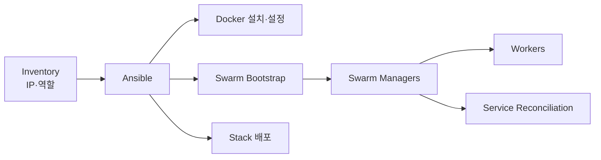

# 1. Swarm과 Ansible의 역할

## 두 도구의 경계

Docker Swarm은 실행 중인 Service의 배치와 상태를 지속적으로 조정하고, Ansible은 Host 준비부터 Cluster와 Stack 배포까지 반복 가능한 절차로 만든다.



| 구성 요소 | 책임 |
|---|---|
| Ansible Control Node | SSH로 Host 설정, Module 실행, 선언된 절차 재실행 |
| Swarm Manager | Cluster 상태·Service·Secret·Config 관리 |
| Swarm Leader | Raft 쓰기를 조정하는 현재 Manager, 장애 시 다시 선출 |
| Worker | 할당된 Task 실행 |

## Bootstrap Manager와 Leader

Inventory의 첫 Manager는 처음 `swarm init`을 수행할 고정된 Bootstrap 대상이다. Swarm Leader는 Raft가 동적으로 정한다. 이후 자동화가 영원히 첫 Manager나 현재 Leader 한 대에만 의존하면 장애 시 배포가 멈춘다.

```text
bootstrap_manager: 최초 Cluster 생성 기준
swarm_leader:      현재 Raft 상태에 따라 바뀌는 역할
deploy_manager:    이번 실행에서 접근 가능한 Manager
```

## Agentless와 멱등성

Ansible은 대상 Node에 전용 Agent를 상주시킬 필요 없이 SSH와 Python을 사용한다. 멱등 Module은 원하는 상태가 이미 충족되면 불필요한 변경을 하지 않는다. 단, Shell 명령을 그대로 실행하면 멱등성이 자동으로 생기지 않는다.

```yaml
- name: Swarm 상태를 선언한다
  community.docker.docker_swarm:
    state: present
    advertise_addr: "{{ swarm_advertise_addr }}"
```

## IP만으로 자동화하기 위한 공통 조건

IP 목록만 입력하더라도 다음 정보는 표준화되어 있어야 한다.

- SSH User·Key와 `sudo` 방식
- 지원 OS와 Package Repository 접근
- Hostname, 고정 IP, 시간 동기화와 DNS
- 방화벽 Port와 Network Interface 이름
- Manager·Worker 역할, Label과 Storage 경로
- Registry·사설 CA·Backup 위치

즉, IP만 입력한다는 것은 나머지 조건을 Convention과 Group Variable로 흡수한다는 뜻이다.

## 참고 자료

- [Swarm mode key concepts](https://docs.docker.com/engine/swarm/key-concepts/)
- [How Ansible works](https://docs.ansible.com/ansible/latest/getting_started/basic_concepts.html)

