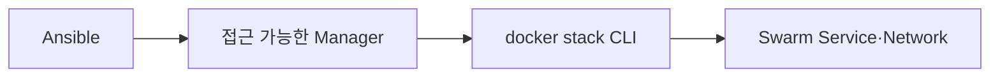

# 12. Ansible Docker Stack 배포

## 배포 전제

`community.docker.docker_stack` Module은 대상 Manager에서 Docker CLI의 `docker stack`을 호출한다. Docker CLI, PyYAML과 `jsondiff` 같은 Module 요구사항을 배포 Host에서 확인한다.



## Render와 검증

```yaml
- name: Stack 파일을 Manager에 Render한다
  ansible.builtin.template:
    src: platform.yml.j2
    dest: /opt/swarm/stacks/platform.yml
    owner: root
    group: root
    mode: "0600"
  register: stack_template

- name: Stack 구성을 검증한다
  ansible.builtin.command:
    cmd: docker stack config -c /opt/swarm/stacks/platform.yml
  changed_when: false
```

## Module 배포

```yaml
- name: Platform Stack을 배포한다
  community.docker.docker_stack:
    name: platform
    state: present
    compose:
      - /opt/swarm/stacks/platform.yml
    with_registry_auth: true
    prune: true
  register: stack_result
```

`prune: true`는 새 Stack 정의에서 빠진 Service를 제거하므로 Render 결과와 삭제 대상을 Review한 뒤 사용한다. `with_registry_auth`는 배포 Manager의 Registry Credential을 전달한다.

## Manager 선택

Stack 명령은 Manager에서 실행할 수 있다. 현재 Leader를 고정 Inventory 값으로 가정하지 말고, Managers 중 SSH·Docker API가 정상이고 Swarm Control이 가능한 Host를 선택한다. Raft 쓰기는 Swarm이 Leader로 전달한다.

## Check Mode 제한

`docker_stack` Module은 멱등 실행을 지원하지만 공식 문서상 Check Mode와 Diff Mode를 지원하지 않는다. Preview는 별도 Render, `docker stack config`, 현재 Service Spec 비교로 보완한다.

## 배포 완료의 의미

Module 성공은 Stack 정의가 Swarm에 제출되었다는 뜻이다. Replica 수렴, Healthcheck, 외부 Load Balancer와 Application 응답은 다음 단계에서 별도로 판정한다.

## 참고 자료

- [community.docker.docker_stack](https://docs.ansible.com/projects/ansible/latest/collections/community/docker/docker_stack_module.html)
- [docker stack deploy](https://docs.docker.com/reference/cli/docker/stack/deploy/)

