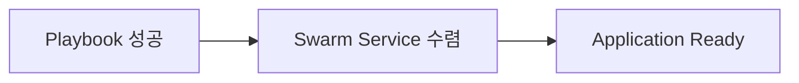

# 13. 배포 상태와 실패 판정

## 세 단계의 성공



1. Playbook 성공: Module이 오류 없이 Stack 정의를 제출했다.
2. Service 수렴: 원하는 Replica만큼 Task가 `Running` 상태에 도달했다.
3. Application Ready: Healthcheck와 실제 요청이 성공한다.

앞 단계가 성공해도 다음 단계가 자동으로 보장되지는 않는다.

## 상태 수집

```bash
docker stack services platform
docker stack ps platform --no-trunc
docker service inspect platform_api --pretty
docker service ps platform_api --no-trunc
```

Ansible에서는 조회 명령을 `changed_when: false`로 실행하고 결과를 판정한다.

```yaml
- name: Service Replica 상태를 조회한다
  ansible.builtin.command:
    cmd: docker service ls --filter label=com.docker.stack.namespace=platform --format json
  register: service_rows
  changed_when: false
  retries: 30
  delay: 10
  until: service_rows.rc == 0
```

실제 수렴 판정은 각 Service의 Mode가 Replicated인지 Global인지 구분하고 Desired/Running 수를 구조화해 비교해야 한다.

## 흔한 실패

| Task 상태·오류 | 확인 대상 |
|---|---|
| `No such image`·Pull 실패 | Registry DNS, CA, Credential, Digest |
| `no suitable node` | Constraint, Availability, Resource 부족 |
| Mount 실패 | Host Path, Volume Plugin, 권한, Node 이동 |
| 반복 재시작 | Application Log, Healthcheck, Secret·Config |
| Pending Update | Update Parallelism, 실패 비율, 이전 Task |

## Timeout 이후

Timeout은 곧바로 실패 원인을 뜻하지 않는다. 마지막 Task 상태, Error 문자열, 배치 Node와 Event 시각을 Artifact로 남긴다. 자동 Rollback을 사용하더라도 실패한 새 Revision의 진단 정보가 사라지기 전에 수집한다.

## Readiness 확인

Swarm Healthcheck는 Container 상태 판단에 사용되지만 외부 Load Balancer, TLS, DNS와 실제 Business API까지 검증하지 않는다. 배포 뒤 별도 Smoke Test를 실행하고 실패하면 Rollback 정책에 연결한다.

## 참고 자료

- [Deploy services to a swarm](https://docs.docker.com/engine/swarm/services/)
- [docker stack services](https://docs.docker.com/reference/cli/docker/stack/services/)

