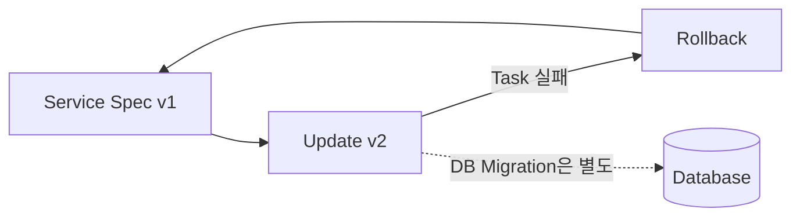

# 14. Rolling Update와 Rollback

## Update 정책

```yaml
services:
  api:
    image: registry.infra.local/apps/api@sha256:<new-digest>
    deploy:
      replicas: 4
      update_config:
        parallelism: 1
        delay: 10s
        order: start-first
        failure_action: rollback
        monitor: 30s
        max_failure_ratio: 0.25
      rollback_config:
        parallelism: 1
        delay: 5s
        order: stop-first
```

| Field | 의미 |
|---|---|
| `parallelism` | 한 번에 교체할 Task 수 |
| `delay` | Batch 사이 대기 시간 |
| `order` | 기존 Task 종료와 새 Task 시작 순서 |
| `monitor` | Update된 Task의 실패 관찰 시간 |
| `max_failure_ratio` | 허용할 실패 비율 |
| `failure_action` | Pause·Continue·Rollback 정책 |

`start-first`는 순간적으로 추가 Replica가 실행되므로 Port·Memory·Local Volume 충돌 가능성을 확인한다.

## 자동 Rollback의 범위

Swarm Rollback은 이전 Service Spec으로 되돌린다. 이미 변경한 DB Schema, 외부 API, Registry Tag와 Host File은 복구하지 않는다.



## 수동 Rollback

```bash
docker service rollback platform_api
docker service ps platform_api --no-trunc
```

Stack 파일도 Git에서 이전 Digest·Config·Secret 참조로 되돌려 다시 배포해야 선언 원본과 Runtime이 일치한다. Runtime만 수동 Rollback하면 다음 Ansible 실행이 새 Spec을 다시 적용할 수 있다.

## 배포 전략

- Image는 이전 Digest를 Rollback 기간 동안 보존한다.
- Config와 Secret은 Version 이름으로 함께 되돌릴 수 있게 한다.
- Database는 Expand-and-contract 방식으로 양방향 Application 호환 기간을 둔다.
- Update 시작 전 정상 Replica와 Node Capacity를 확인한다.
- 자동 Rollback 뒤에도 Smoke Test와 알림을 실행한다.

## 참고 자료

- [Apply rolling updates to a service](https://docs.docker.com/engine/swarm/swarm-tutorial/rolling-update/)
- [Compose Deploy Specification](https://docs.docker.com/reference/compose-file/deploy/)

