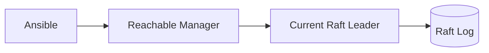

# 16. Manager HA와 Backup

## Raft Quorum

Manager는 Raft 과반수가 살아 있어야 Cluster 관리 작업을 수행한다.

| Manager 수 | 허용 가능한 Manager 장애 수 |
|---:|---:|
| 1 | 0 |
| 3 | 1 |
| 5 | 2 |

짝수 Manager는 같은 장애 허용 수에 합의 비용만 늘릴 수 있어 보통 3대나 5대를 사용한다. Manager를 여러 Rack과 전원 Domain에 분산하되 Network Latency도 고려한다.

## Leader 독립 자동화

모든 Manager는 관리 요청을 받아 Leader에게 전달할 수 있다. Ansible은 현재 Leader를 미리 고정하지 않고 접근 가능한 Healthy Manager에서 Stack 명령을 실행한다.



## Backup

Swarm 상태는 Manager의 `/var/lib/docker/swarm`에 있다. 공식 절차에 따라 한 Manager의 Docker를 중지하고 일관된 상태로 Backup한다.

```text
1. Healthy Manager와 Quorum 확인
2. 대상 Manager의 Docker 중지
3. /var/lib/docker/swarm Backup
4. Docker 시작과 Node 복귀 확인
5. Backup 암호화·복원 시험
```

실행 중인 Directory를 단순 복사해 일관성을 보장한다고 가정하지 않는다. Backup에는 Swarm Secret을 복호화할 수 있는 Key Material이 포함되므로 접근을 엄격히 제한한다.

## Autolock

Autolock을 사용하면 Docker 재시작 뒤 Manager Unlock Key가 필요하다. Key를 Cluster와 다른 안전한 Secret Store에 보관하고 운영자가 없는 자동 재부팅 상황의 복구 절차를 준비한다.

## Disaster Recovery

Quorum을 영구적으로 잃은 경우에만 공식 `--force-new-cluster` 복구 절차를 검토한다. 이 작업은 기존 Raft Membership을 바꾸므로 평상시 Leader 장애나 일시적 Network 단절에 사용하지 않는다. 복원 Drill에서 Service, Secret, Config와 외부 Volume이 함께 복구되는지 확인한다.

## 참고 자료

- [Administer and maintain a swarm](https://docs.docker.com/engine/swarm/admin_guide/)
- [Manage swarm security with public key infrastructure](https://docs.docker.com/engine/swarm/how-swarm-mode-works/pki/)

