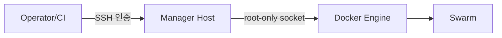

# 17. 보안과 접근 제어

## SSH와 Privilege

Ansible Control Node는 여러 Server의 Root 수준 변경 권한을 가지므로 일반 관리 PC보다 강하게 보호한다.

- Host Key 검증을 끄지 않는다.
- 개인별 SSH Key와 짧은 수명의 Certificate를 우선한다.
- `sudo` Command 범위를 운영 정책에 맞게 제한한다.
- CI Runner와 운영자 계정을 분리하고 실행 Log를 감사 가능하게 남긴다.

## Docker Socket

`/var/run/docker.sock` 접근은 사실상 Host Root 권한이다. TCP Docker API를 인증 없이 열지 않고, Ansible은 SSH를 통해 Local Socket을 사용하는 구조를 기본으로 둔다.



## Join Token

Join Token은 새 Node를 Cluster에 가입시킬 수 있지만 기존 Node 간 통신 Certificate 자체는 아니다. Token 노출이 의심되면 Manager와 Worker Token을 Rotation하고 자동화가 실행 시 새 값을 읽게 한다.

```bash
docker swarm join-token --rotate worker
docker swarm join-token --rotate manager
```

Token을 Inventory, Chat, CI Artifact와 Debug 출력에 남기지 않는다.

## Ansible Vault와 Log

- Vault Password와 복호화 Key를 저장소 밖에서 제공한다.
- Secret Task에 `no_log: true`를 적용한다.
- Callback Plugin, Fact Cache와 실패 재시도 파일을 점검한다.
- Rendered Stack과 Diff에 Credential이 포함되지 않게 한다.

## Backup과 Manager 보호

Manager의 Raft Data, Unlock Key와 Backup은 Application Secret을 포함하는 민감자료다. 암호화, 접근 통제, 보존 기간과 폐기 기록을 둔다. Manager SSH 권한은 Worker보다 더 좁게 부여한다.

## 참고 자료

- [Manage swarm security with PKI](https://docs.docker.com/engine/swarm/how-swarm-mode-works/pki/)
- [Docker daemon attack surface](https://docs.docker.com/engine/security/)
- [Protecting sensitive data with Ansible Vault](https://docs.ansible.com/ansible/latest/vault_guide/index.html)

