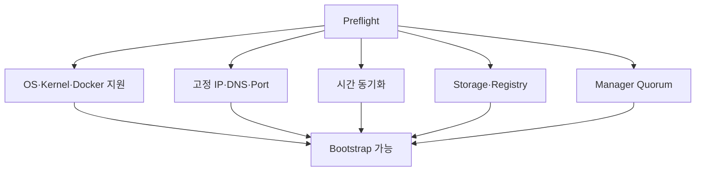

# 3. 온프레미스 Preflight

## Bootstrap 전 확인 항목



## Ansible 점검 예시

```yaml
- name: Swarm 사전 조건을 확인한다
  hosts: swarm_managers:swarm_workers
  gather_facts: true
  tasks:
    - name: 지원 OS 계열을 확인한다
      ansible.builtin.assert:
        that:
          - ansible_facts.os_family in ['Debian', 'RedHat']
        fail_msg: "지원 대상으로 검증되지 않은 OS입니다."

    - name: IPv4 주소가 고정 Inventory 값과 일치하는지 확인한다
      ansible.builtin.assert:
        that:
          - ansible_host is defined
          - swarm_data_addr is defined
```

실제 지원 범위는 Docker Engine 설치 문서와 조직이 검증한 OS·Kernel Matrix로 더 좁게 관리한다.

## 필수 통신

| Port | Protocol | 용도 |
|---|---|---|
| 2377 | TCP | Manager Control Plane |
| 7946 | TCP/UDP | Node Discovery와 Gossip |
| 4789 | UDP | Overlay Network VXLAN Data Path |

방화벽은 인터넷 전체가 아니라 Swarm Node 간 필요한 Source/Destination에만 연다. 암호화된 Overlay를 사용할 때 MTU와 Network 장비의 IP Protocol 지원도 확인한다.

## 온프레미스 운영 계획

- Manager 3대 또는 5대의 장애 Domain이 분리되어 있는가?
- 내부 Registry와 사설 CA를 모든 Node가 신뢰하는가?
- Stateful Service가 사용하는 공유/로컬 Storage의 장애 처리가 정의되어 있는가?
- NTP/Chrony Source가 폐쇄망에서도 접근 가능한가?
- DNS가 없을 때 IP 기반 Registry Certificate SAN과 Service 접근을 어떻게 처리할 것인가?
- `/var/lib/docker`와 `/var/lib/docker/swarm`의 용량·Backup 정책이 있는가?

## 실패 처리

Preflight는 일부 Node가 실패한 상태에서 나머지만 계속 Bootstrap하지 않도록 전체 Host 조건을 먼저 확정한다. 단, 확장 작업에서는 새 Node만 검증한 뒤 기존 Cluster에 가입시키는 별도 Playbook으로 범위를 제한할 수 있다.

## 참고 자료

- [Getting started with Swarm mode](https://docs.docker.com/engine/swarm/swarm-tutorial/)
- [Docker Engine installation](https://docs.docker.com/engine/install/)

