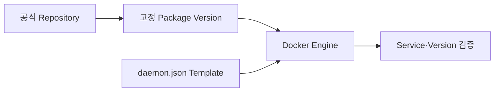

# 4. Ansible로 Docker Engine 설치

## 설치 원칙

온프레미스 Node마다 수동 설치하지 않고 공식 Docker Package Repository, 검증한 Version과 동일한 Daemon 설정을 Playbook으로 적용한다.



## Role 구조 예시

```text
roles/docker_engine/
├── defaults/main.yml
├── handlers/main.yml
├── tasks/main.yml
└── templates/daemon.json.j2
```

```yaml
# tasks/main.yml의 개념 예시
- name: Docker Package를 설치한다
  ansible.builtin.package:
    name: "{{ docker_packages }}"
    state: present

- name: Docker Daemon 설정을 배치한다
  ansible.builtin.template:
    src: daemon.json.j2
    dest: /etc/docker/daemon.json
    owner: root
    group: root
    mode: "0644"
  notify: Restart docker

- name: Docker Service를 활성화한다
  ansible.builtin.service:
    name: docker
    state: started
    enabled: true
```

Package 이름과 Repository Key 등록 방법은 OS별 공식 설치 문서를 따른다. 범용 `curl | sh`를 운영 자동화의 기본 경로로 사용하지 않는다.

## Daemon 설정 예시

```json
{
  "log-driver": "json-file",
  "log-opts": {
    "max-size": "20m",
    "max-file": "5"
  },
  "data-root": "/var/lib/docker"
}
```

`data-root`를 바꾸면 기존 Image·Volume·Container의 이동과 Service 중단이 필요하다. 이미 운영 중인 Node에는 단순 Template 변경으로 적용하지 않는다.

## 검증

```yaml
- name: Docker 정보를 읽는다
  community.docker.docker_host_info:
  register: docker_info

- name: Swarm 지원 Engine인지 확인한다
  ansible.builtin.assert:
    that:
      - docker_info.host_info.ServerVersion is defined
```

Docker Package Version과 API Version을 Inventory 결과에 남기고 Manager와 Worker의 Version Skew 정책을 정한다.

## 현재 운영 기준

- OS별 Role 분기와 검증 Version을 명시한다.
- Docker Restart는 `serial`과 Drain 절차를 포함해 한 Node씩 수행한다.
- `docker` Group은 Root 동등 권한이므로 사용자 추가를 최소화한다.
- Package Upgrade와 Swarm Upgrade를 같은 대규모 작업으로 한 번에 묶지 않는다.

## 참고 자료

- [Install Docker Engine](https://docs.docker.com/engine/install/)
- [Install Docker Engine on Ubuntu](https://docs.docker.com/engine/install/ubuntu/)

