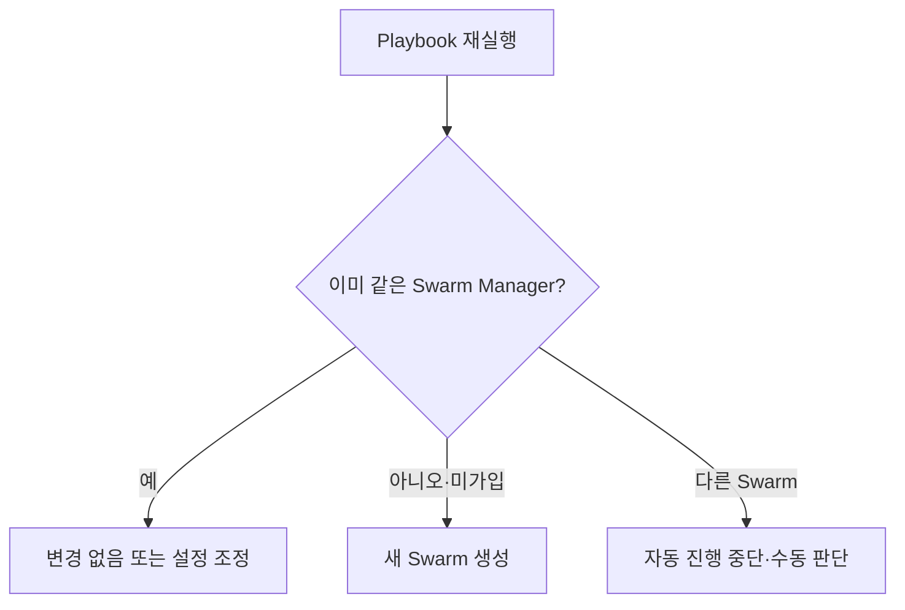

# 5. 첫 Manager 초기화

## Bootstrap 대상 선택

Inventory의 첫 Manager를 Bootstrap 기준으로 정하되, 이미 Swarm이 존재하는지 먼저 확인한다.

```yaml
- name: 첫 Manager에서 Swarm을 초기화한다
  hosts: swarm_managers[0]
  become: true
  tasks:
    - name: Swarm이 존재하도록 한다
      community.docker.docker_swarm:
        state: present
        advertise_addr: "{{ ansible_host }}"
        data_path_addr: "{{ swarm_data_addr }}"
        listen_addr: "0.0.0.0:2377"
      register: swarm_bootstrap
```

`state: present`는 대상 Engine이 Swarm Manager 상태가 되도록 하는 멱등 동작이다. 그러나 해당 Node가 다른 Swarm에 이미 속해 있는 상황을 자동으로 안전하게 합치지는 않는다. `docker info` 결과와 기존 Cluster ID를 Preflight에서 검사한다.

## 주소 선택

| Parameter | 기준 |
|---|---|
| `advertise_addr` | 다른 Node가 Control Plane에서 도달 가능한 안정된 주소 |
| `data_path_addr` | Overlay Data Traffic 전용 주소, 없으면 Advertise 주소 사용 |
| `listen_addr` | Swarm Control Traffic 수신 주소와 Port |

NAT 뒤의 임시 주소나 DHCP 주소를 Advertise 주소로 사용하지 않는다.

## 초기화 후 정보

Module 결과에는 Cluster 정보와 Join Token이 포함될 수 있다. Token을 Debug 출력하거나 Fact Cache에 장기 보관하지 않는다.

```yaml
- name: Bootstrap 결과에서 Cluster ID가 있는지 확인한다
  ansible.builtin.assert:
    that:
      - swarm_bootstrap.swarm_facts.ID | length > 0
  no_log: true
```

정확한 반환 Field는 설치한 `community.docker` Collection Version의 Module 문서를 기준으로 확인한다.

## 재실행 조건



Cluster를 새로 만들지 여부는 한 Node의 Local 상태만이 아니라 기존 Manager의 Cluster ID와 Inventory 의도를 함께 비교해야 한다.

## 참고 자료

- [community.docker.docker_swarm](https://docs.ansible.com/projects/ansible/latest/collections/community/docker/docker_swarm_module.html)
- [Create a swarm](https://docs.docker.com/engine/swarm/swarm-tutorial/create-swarm/)

