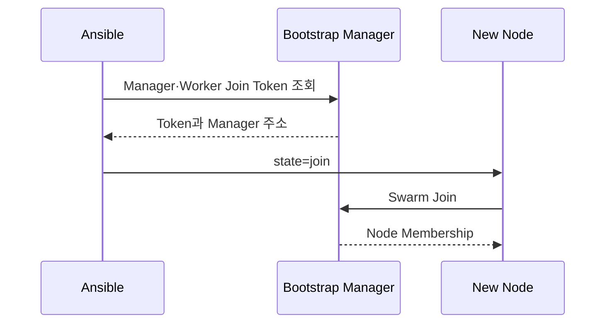

# 6. Manager와 Worker 자동 가입

## 가입 흐름



Token은 Manager에서 실행 시점에 읽고 대상 Group에만 전달한다. 파일이나 Inventory에 평문으로 고정하지 않는다.

## Module 예시

```yaml
- name: 추가 Manager를 가입시킨다
  hosts: swarm_managers[1:]
  become: true
  serial: 1
  tasks:
    - name: Manager 역할로 가입한다
      community.docker.docker_swarm:
        state: join
        advertise_addr: "{{ ansible_host }}"
        data_path_addr: "{{ swarm_data_addr }}"
        join_token: "{{ hostvars[groups['swarm_managers'][0]].manager_token }}"
        remote_addrs:
          - "{{ hostvars[groups['swarm_managers'][0]].ansible_host }}:2377"
      no_log: true
```

Worker에는 Worker Token을 전달한다. 실제 Playbook에서는 Token 등록 Task와 소비 Task 모두 `no_log: true`로 두고, 실패 메시지에도 값이 섞이지 않는지 확인한다.

## 여러 Manager 주소

`remote_addrs`에는 접근 가능한 Manager 주소를 여러 개 제공해 첫 Manager 장애에 대비할 수 있다. 자동화 실행 시 Manager 목록 중 Control Plane 연결이 가능한 대상을 선택하도록 설계한다.

```yaml
remote_addrs:
  - 10.10.0.11:2377
  - 10.10.0.12:2377
  - 10.10.0.13:2377
```

## 기존 가입 상태 처리

- 같은 Swarm에 이미 가입: 변경하지 않는다.
- Swarm에 미가입: 올바른 역할 Token으로 가입한다.
- 다른 Swarm에 가입: 자동 `force leave`하지 않고 실행을 중단한다.
- Down 상태의 같은 Host가 기존 Node ID로 남음: 기존 Node 정리와 재가입 순서를 운영자가 승인한다.

## 가입 후 확인

```bash
docker node ls
docker node inspect manager-02 --pretty
```

이 명령은 Manager에서 실행한다. `Ready` 상태, Manager Status와 Advertise 주소를 Inventory 의도와 비교한다.

## 참고 자료

- [Add nodes to the swarm](https://docs.docker.com/engine/swarm/swarm-tutorial/add-nodes/)
- [community.docker.docker_swarm](https://docs.ansible.com/projects/ansible/latest/collections/community/docker/docker_swarm_module.html)

