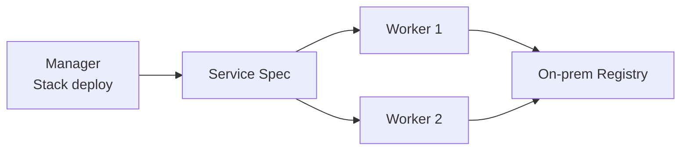

# 8. 온프레미스 Image Registry

## Registry가 필요한 이유

Swarm Manager는 Service 정의를 배포하지만 Image는 Task가 배치된 각 Node가 Registry에서 Pull한다. 모든 Node가 같은 Registry 주소, TLS Trust와 Credential 조건을 가져야 한다.



## 사설 CA 배포

Registry가 `registry.infra.local:5000`이라면 CA Certificate를 OS와 Docker가 신뢰하는 위치에 배치하고 Docker를 안전하게 재시작한다. File 내용과 경로는 배포 OS의 공식 Docker 문서를 따른다.

```yaml
- name: Registry CA를 배치한다
  ansible.builtin.copy:
    src: files/registry-ca.crt
    dest: /etc/docker/certs.d/registry.infra.local:5000/ca.crt
    owner: root
    group: root
    mode: "0644"
  notify: Restart docker safely
```

`insecure-registries`는 TLS를 포기하므로 폐쇄망에서도 기본 해법으로 사용하지 않는다.

## Credential 전달

```bash
docker login registry.infra.local:5000
docker stack deploy --with-registry-auth -c stack.yml platform
```

`--with-registry-auth`는 현재 Client의 Registry 인증 정보를 Swarm Agent에 전달한다. Ansible 실행 Host의 Credential Store와 Log 접근을 제한하고, 최소 Pull 권한의 Robot Account를 사용한다.

## 불변 Image

```yaml
image: registry.infra.local:5000/apps/api@sha256:<verified-digest>
```

동일 Tag가 다른 Image를 가리키면 Node별 Cache 때문에 혼합 Version이 실행될 수 있다. CI는 Commit Tag를 발행하고 Production Stack은 검증한 Digest를 사용한다.

## 운영 점검

- Registry DNS·VIP가 모든 Node에서 접근 가능한가?
- CA 만료와 교체가 자동화되어 있는가?
- Registry Storage와 Metadata Backup이 있는가?
- Image 삭제 정책이 Rollback 보존 기간보다 긴가?
- 취약점 검사와 Signature 검증 결과를 배포 기록에 연결하는가?

## 참고 자료

- [Deploy a stack to a swarm](https://docs.docker.com/engine/swarm/stack-deploy/)
- [Verify repository client with certificates](https://docs.docker.com/engine/security/certificates/)

