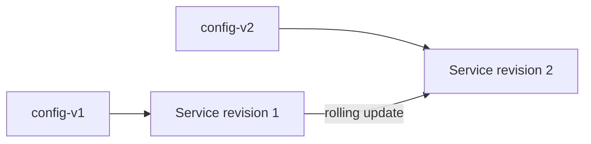

# 9. Swarm Config 자동화

## Config의 성격

Swarm Config는 일반 설정 파일을 Service에 전달한다. Secret과 달리 민감정보 보호 용도가 아니며, 생성된 Config 내용은 변경할 수 없다.

```yaml
- name: Version이 붙은 Nginx Config를 생성한다
  community.docker.docker_config:
    name: "nginx.conf-{{ nginx_config_checksum[:12] }}"
    data: "{{ lookup('ansible.builtin.file', 'files/nginx.conf') }}"
    state: present
  no_log: false
```

내용이 바뀌면 새 이름의 Config를 만들고 Service가 새 Config를 참조하도록 Update한다.



## Stack에서 참조

```yaml
services:
  proxy:
    image: nginx:1.29
    configs:
      - source: nginx_config
        target: /etc/nginx/nginx.conf

configs:
  nginx_config:
    external: true
    name: nginx.conf-a1b2c3d4e5f6
```

Ansible이 Config를 먼저 만들고 Stack Template에 확정된 이름을 전달한다. 삭제는 현재 어떤 Service가 참조하는지 확인한 뒤 이전 Version 보존 정책에 따라 수행한다.

## Image와 Config의 경계

- Application Build에 고정되어야 할 파일은 Image에 포함한다.
- 환경마다 달라지는 일반 설정은 Config로 분리한다.
- Password·Private Key·Token은 Secret으로 관리한다.
- 수 MB 이상의 큰 Asset이나 빈번히 바뀌는 Data는 Config에 넣지 않는다.

## Rotation 순서

1. 새 Content의 Checksum과 Config 이름을 만든다.
2. 새 Config를 Swarm에 생성한다.
3. Stack을 새 이름으로 배포한다.
4. Task 수렴과 Application 설정 반영을 확인한다.
5. Rollback 기간 뒤 참조되지 않는 이전 Config를 제거한다.

## 참고 자료

- [Store configuration data using Docker Configs](https://docs.docker.com/engine/swarm/configs/)
- [community.docker.docker_config](https://docs.ansible.com/projects/ansible/latest/collections/community/docker/docker_config_module.html)

