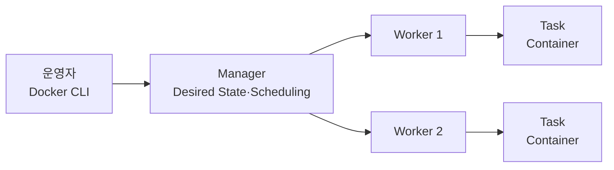

# 1. Docker Swarm이란?

## 정의

Docker Swarm mode는 여러 Docker Engine을 하나의 Cluster로 묶고, Container를 **Service**라는 선언형 단위로 배포하는 Docker Engine 내장 Orchestrator다.



- Node: Swarm에 참여한 Docker Engine Host
- Manager: Cluster State를 저장하고 Service의 Task를 Scheduling하는 Node
- Worker: Manager가 할당한 Task를 실행하는 Node
- Service: Image, Replica 수, Network, Update 정책 등을 정의한 Desired State
- Task: 특정 Node에 배치된 Service의 실행 단위이며 실제 Container를 만든다.

Task의 Container가 종료되면 기존 Container를 되살리는 것이 아니라, Manager가 Desired State를 맞추기 위해 새 Task를 생성한다.

## 왜 사용하는가

단일 Host에서 Container를 실행하면 Host 장애가 곧 Service 중단으로 이어진다. 여러 Host를 하나의 자원 Pool로 사용하면 Replica를 분산하고, 장애가 난 Task를 다른 Node에 다시 배치하며, 점진적으로 Version을 갱신할 수 있다.

Swarm은 다음 기능을 Docker Engine과 동일한 CLI 안에서 제공한다.

- Replica와 Global Service
- Desired State Reconciliation
- Overlay Network와 Service Discovery
- Routing Mesh 기반 Published Port
- Rolling Update와 Rollback
- Config·Secret 배포
- Node Label과 Placement Constraint
- Manager Raft Consensus와 Mutual TLS

다만 여러 저사양 Host를 묶는 것이 항상 고성능 Host 한 대보다 저렴하거나 빠른 것은 아니다. Network, Storage, 장애 영역, 운영 인력과 Licensing 비용까지 함께 비교해야 한다.

## 현재도 사용할 수 있는가

현재 Docker Engine에는 Swarm mode가 포함되어 있고 공식 문서와 CLI도 유지되고 있다. 과거의 별도 제품인 **Classic Swarm**과 Docker Engine의 **Swarm mode**는 구분해야 한다.

신규 운영 환경에서는 다음 조건을 먼저 판단한다.

| 조건 | 판단 |
| --- | --- |
| 소수의 Linux Host와 비교적 단순한 Service | Swarm이 간결한 선택이 될 수 있다. |
| Docker CLI·Compose 경험을 그대로 활용 | 학습 및 운영 진입 비용이 낮다. |
| Managed Control Plane, 풍부한 Operator·CNI·CSI 생태계 필요 | Kubernetes 또는 Managed Container Service를 우선 검토한다. |
| 조직의 채용·관측성·보안 도구가 Kubernetes 중심 | 장기 운영 표준과 맞는지 확인한다. |
| Stateful Database의 자동 Failover 필요 | Swarm Replica만으로 해결되지 않으므로 외부 Managed DB나 DB 전용 Cluster를 검토한다. |

따라서 “초보자는 Swarm, 운영은 Kubernetes”처럼 단순히 나누지 않는다. 요구 기능, 팀의 운영 역량, Ecosystem과 Migration 비용을 기준으로 선택한다.

## Docker Compose와의 차이

```text
compose.yaml
├─ docker compose up   → 일반적으로 단일 Docker Engine의 Container
└─ docker stack deploy → Swarm Cluster의 Service와 Task
```

Compose는 주로 개발·단일 Host 구성에 적합하고, Swarm은 여러 Node의 Scheduling과 Desired State 유지가 필요할 때 사용한다. `docker stack deploy`는 최신 Compose Specification 전체가 아닌 legacy Compose file version 3 형식을 사용하므로 같은 YAML이 완전히 동일하게 동작한다고 가정하지 않는다.

## Swarm이 대신하지 않는 것

- Application 데이터 복제와 Backup
- 외부 Load Balancer와 DNS 운영
- Image Registry의 가용성
- Application Readiness와 재시도 설계
- Log·Metric·Alert 수집
- Host Patch와 Docker Engine Upgrade
- Disaster Recovery Test

Orchestrator가 Process를 다시 실행해도 Application의 상태와 데이터가 올바르게 복구되는지는 별도의 책임이다.

## 참고 자료

- [Docker Swarm mode](https://docs.docker.com/engine/swarm/)
- [Swarm의 Service 동작](https://docs.docker.com/engine/swarm/how-swarm-mode-works/services/)
- [Swarm에 Stack 배포](https://docs.docker.com/engine/swarm/stack-deploy/)
