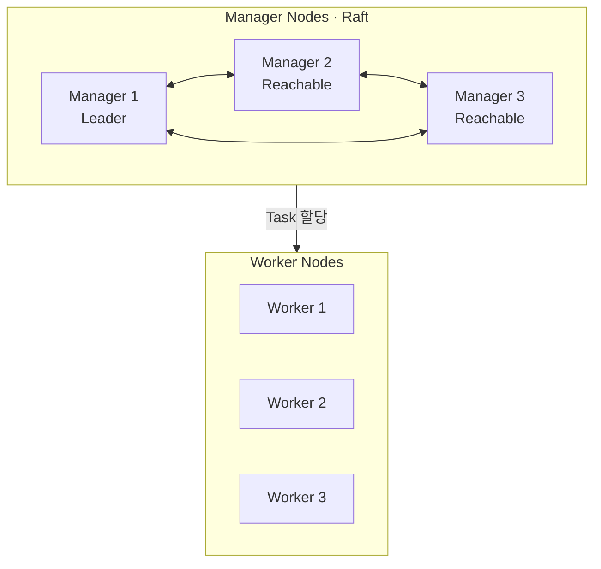

# 2. Docker Swarm mode

Docker Engine을 처음 설치하면 Swarm mode는 비활성 상태다. 별도 Orchestrator Package를 설치하는 대신 기존 Docker Engine에서 Cluster를 초기화하거나 기존 Cluster에 Join한다.

## 2.1 Docker Swarm 구조

### Manager와 Worker



- Manager는 Raft Log에 Cluster State를 저장하고 Scheduling·Reconciliation을 수행한다.
- Worker는 Manager가 전달한 Task를 실행하고 상태를 보고한다.
- Manager도 기본 Availability가 `Active`이면 Service Task를 실행할 수 있다.
- Control Plane 전용 Manager가 필요하면 Availability를 `Drain`으로 설정한다.

### Manager Quorum

Raft 변경을 승인하려면 전체 Manager의 과반수가 통신 가능해야 한다. 운영에서는 일반적으로 3개 또는 5개의 홀수 Manager를 서로 다른 장애 영역에 둔다.

| Manager 수 | 필요한 Quorum | 허용 가능한 Manager 장애 |
| ---: | ---: | ---: |
| 1 | 1 | 0 |
| 2 | 2 | 0 |
| 3 | 2 | 1 |
| 4 | 3 | 1 |
| 5 | 3 | 2 |

짝수 Manager를 하나 더 추가해도 장애 허용 수가 늘지 않는 구간이 있으므로 홀수를 권장한다. Manager가 너무 많으면 Raft 쓰기 합의 비용이 커진다.

Quorum을 잃어도 이미 실행 중인 Task는 계속 실행될 수 있지만, Service 변경·Task 재배치·Node 추가 같은 관리 작업은 수행할 수 없다.

### 시간과 주소 준비

- 모든 Node의 시간을 NTP나 Chrony로 동기화한다.
- Manager의 `--advertise-addr`에는 다른 Node가 지속적으로 접근할 수 있는 고정 주소를 사용한다.
- Control Plane과 Data Plane을 분리하려면 `--advertise-addr`와 `--data-path-addr`를 각각 설계한다.
- Hostname과 IP가 중복되지 않게 하고 Docker Engine Version 차이를 Upgrade 정책 안에서 관리한다.

### 필요한 Network Port

| Port·Protocol | 용도 | 기본 허용 범위 |
| --- | --- | --- |
| `2377/tcp` | Manager Control Plane·Join | Swarm Node에서 Manager로 |
| `7946/tcp`, `7946/udp` | Node Discovery·Gossip | Swarm Node 상호 간 |
| `4789/udp` | VXLAN Overlay Data Path | Swarm Node 상호 간 |
| IP Protocol 50 ESP | `--opt encrypted` Overlay | 사용하는 경우 Node 상호 간 |

`4789/tcp`는 기본 Swarm Port가 아니다. VXLAN Port를 Internet 전체에 공개하지 말고, 신뢰할 수 있는 Private Network나 방화벽 Allowlist 안에서만 허용한다.

## 2.2 Docker Swarm Cluster 구축

예시는 다음과 같은 고정 주소를 가정한다.

```text
manager-1  10.0.10.11
worker-1   10.0.10.21
worker-2   10.0.10.22
```

### 사전 확인

각 Node에서 Docker Engine과 연결 주소를 확인한다.

```bash
docker version
docker info --format '{{.Swarm.LocalNodeState}}'
ip address
```

Cloud VM이면 OS Firewall뿐 아니라 Security Group·Network ACL도 확인한다.

### Swarm 시작

첫 Manager에서 실행한다.

```bash
docker swarm init \
  --advertise-addr 10.0.10.11
```

초기화하면 현재 Node가 Leader Manager가 되고 다음 항목이 만들어진다.

- Cluster Root CA와 Node Certificate
- Worker·Manager Join Token
- Raft State Store
- 기본 `ingress` Overlay Network
- Host별 `docker_gwbridge`

운영 환경에서 Manager 재시작 후 Raft Encryption Key를 수동으로 해제하는 정책을 수용할 수 있다면 `--autolock`을 검토한다. Unlock Key는 Password Manager 같은 별도 안전한 위치에 보관한다.

### Worker Node 추가

Manager에서 Worker Join 명령을 확인한다.

```bash
docker swarm join-token worker
```

출력된 명령을 Worker에서 실행한다.

```bash
docker swarm join \
  --token <worker-join-token> \
  10.0.10.11:2377
```

Join Token은 Cluster 가입 권한을 주는 비밀값이다. 문서, Shell History나 공개 저장소에 실제 값을 남기지 않는다.

### Manager Node 추가

기존 Manager에서 별도의 Manager Token을 확인한다.

```bash
docker swarm join-token manager
```

추가 Manager에서 출력된 Join 명령을 실행한다. Manager는 전체 Swarm State와 Raft Log를 보유하므로 Worker보다 엄격하게 접근을 통제한다.

### Node 확인

Manager에서만 Cluster 전체 Node를 조회할 수 있다.

```bash
docker node ls
docker node inspect manager-1 --pretty
```

주요 상태는 다음과 같이 해석한다.

- `STATUS=Ready`: Node Agent와 통신 가능
- `AVAILABILITY=Active`: 새 Task를 받을 수 있음
- `MANAGER STATUS=Leader`: 현재 Raft Leader
- `MANAGER STATUS=Reachable`: Quorum에 참여하고 Leader 선출 가능
- `MANAGER STATUS=Unavailable`: 다른 Manager와 통신하지 못함

### Token 재확인과 Rotation

```bash
docker swarm join-token worker
docker swarm join-token --rotate worker
docker swarm join-token --rotate manager
```

Token Rotation은 앞으로 사용할 Join Token을 바꾼다. 이미 가입한 Node를 자동 퇴출하거나 기존 Node Certificate를 즉시 폐기하는 기능은 아니다. 의심되는 Node는 Drain·Remove하고 Certificate Rotation과 Cluster 접근 범위를 별도로 확인한다.

### Node가 Swarm에서 나가기

Worker에서 실행한다.

```bash
docker swarm leave
```

Manager에서 남은 Node Record를 확인하고 제거한다.

```bash
docker node ls
docker node rm worker-2
```

정상적인 운영 절차는 먼저 `Drain`하여 Task가 안전하게 이동했는지 확인한 뒤 Leave·Remove하는 것이다. 응답하지 않는 Node Record를 강제로 제거할 때만 다음 명령을 신중하게 사용한다.

```bash
docker node rm --force worker-2
```

### 마지막 Manager의 강제 Leave

```bash
docker swarm leave --force
```

`--force`는 단일 Manager 실습 Cluster 정리나 의도적인 Cluster 폐기처럼 영향 범위를 확인한 경우에만 사용한다. 다중 Manager에서 무심코 실행하면 Quorum을 잃을 수 있다.

### Worker와 Manager Role 변경

```bash
docker node promote worker-1
docker node demote manager-2
```

Role 변경 전후에 Manager 수와 Quorum을 계산한다. `promote`는 Worker의 보안 등급을 Manager 수준으로 높이는 작업이며, `demote`는 Quorum을 줄일 수 있다.

## 운영 유지보수 기준

- Manager 3개 이상이면 서로 다른 Host·Rack·Availability Zone에 분산한다.
- Quorum을 유지하면서 Manager 하나의 Docker Engine을 중지하고 `/var/lib/docker/swarm` 전체를 안전하게 Backup한 뒤 다시 시작한다. Autolock을 사용하면 Unlock Key도 별도 보관하고 Restore 절차를 시험한다.
- Docker Engine Upgrade는 Node를 하나씩 Drain하고 Quorum을 유지하며 수행한다.
- Root CA, Node Certificate와 Join Token의 만료·Rotation 정책을 기록한다.
- Swarm과 Application Metric·Log·Event를 별도로 수집한다.
- `docker swarm init --force-new-cluster`는 정상 운영 명령이 아니라 Quorum 상실 Disaster Recovery 절차로 취급한다.

## 참고 자료

- [Swarm mode 실행](https://docs.docker.com/engine/swarm/swarm-mode/)
- [Swarm 관리 가이드](https://docs.docker.com/engine/swarm/admin_guide/)
- [Swarm Node 관리](https://docs.docker.com/engine/swarm/manage-nodes/)
- [Swarm Port 요구사항](https://docs.docker.com/engine/network/drivers/overlay/)
- [Manager Autolock](https://docs.docker.com/engine/swarm/swarm_manager_locking/)
