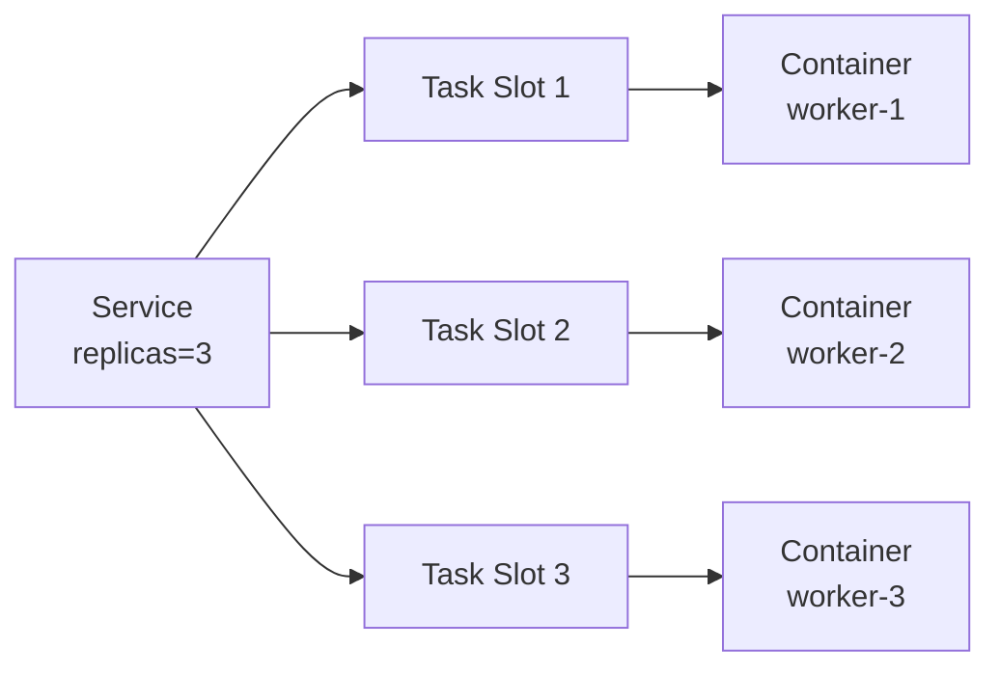
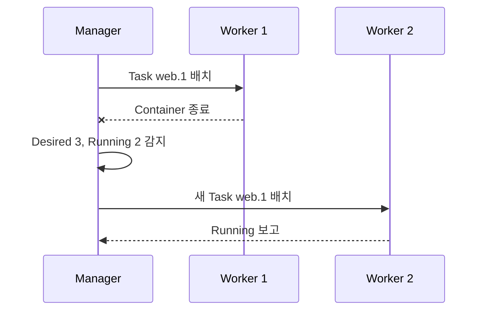
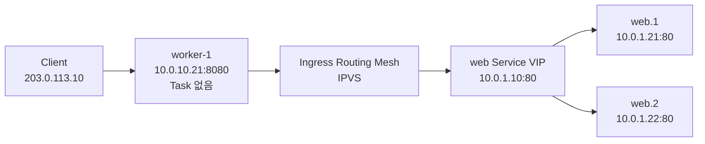
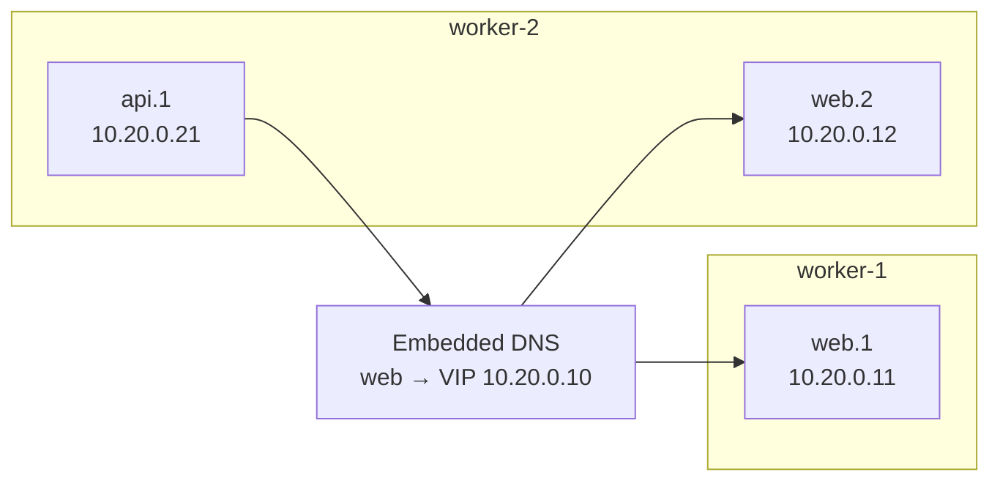
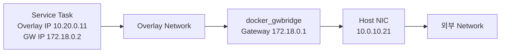

# 3. Swarm mode Service

## Service·Task·Container

일반 Docker CLI의 직접 제어 단위는 Container지만, Swarm의 제어 단위는 Service다. Manager는 Service에 선언한 Desired State를 보고 Task를 생성하며, 각 Task가 배치된 Node에서 Container 하나를 실행한다.



`docker service` 관리 명령은 Manager에서 실행한다. Service Task는 Swarm이 Background에서 관리하므로 Application Process는 Foreground에서 계속 실행되어야 한다. `docker service create -d`의 `-d`는 Service를 Background로 만드는 옵션이 아니라 CLI가 Convergence를 기다리지 않고 즉시 반환하도록 하는 옵션이다.

## Nginx Web Service 생성

Nginx Replica 세 개를 만들고 Cluster의 모든 Node에서 `8080` Port로 받을 수 있게 한다.

```bash
docker service create \
  --name web \
  --replicas 3 \
  --publish published=8080,target=80,protocol=tcp,mode=ingress \
  nginx:stable-alpine
```

`stable-alpine`은 학습용으로 읽기 쉬운 이동 Tag다. 운영 환경에서는 검증한 고정 Version Tag와 가능하면 Image Digest를 배포 기준으로 기록한다.

```bash
docker service ls
docker service ps web
docker service inspect --pretty web
```

Routing Mesh를 사용하므로 Task가 없는 Node의 주소로 요청해도 실행 중인 Web Task로 전달된다.

```bash
curl http://10.0.10.11:8080
curl http://10.0.10.21:8080
curl http://10.0.10.22:8080
```

실제 응답을 반환한 Replica를 구분하려면 Application 응답에 Hostname을 넣거나 Access Log·Trace를 사용한다. `curl` 성공만으로 세 Replica가 모두 정상이라고 판단하지 말고 `docker service ps`를 함께 확인한다.

Private Registry Image를 사용할 때는 Manager의 현재 Registry 인증 정보를 Swarm Agent에 전달할 수 있다.

```bash
docker service create \
  --name private-web \
  --with-registry-auth \
  registry.example.com/study/web:1.0.0
```

모든 Node가 Registry에 Network로 접근할 수 있어야 한다. 운영 배포에서는 변경 가능한 `latest`보다 승인된 Version Tag와 Digest를 사용한다.

## Replica 확장과 축소

Replicated Service의 Desired Replica 수는 실행 중에도 바꿀 수 있다.

```bash
docker service scale web=5
docker service ps web
curl http://10.0.10.11:8080

docker service scale web=3
```

`service scale`은 현재 Cluster State를 변경한다. Stack File로 관리하는 Service라면 다음 `docker stack deploy`에서 File의 `deploy.replicas` 값으로 다시 바뀔 수 있으므로 지속할 변경은 선언 파일에도 반영한다.

## Global Service 생성

Global Service는 Constraint와 Resource 조건을 만족하는 각 Active Node에 Task 하나를 배치한다. Node Agent, Log Collector와 Monitoring Exporter에 적합하다.

```bash
docker service create \
  --name node-web \
  --mode global \
  --publish published=8081,target=80,protocol=tcp,mode=host \
  nginx:stable-alpine
```

`mode=host`는 Routing Mesh를 우회하고 Task가 실행 중인 Node에서만 Port를 연다. Global Service는 Node마다 Task 하나이므로 고정 Published Port와 잘 맞지만, 같은 Node에 같은 Port를 쓰는 다른 Service가 있으면 충돌한다.

```bash
docker service ps node-web
curl http://10.0.10.11:8081
curl http://10.0.10.21:8081
curl http://10.0.10.22:8081
```

Manager가 `Drain`이거나 Constraint를 만족하지 않으면 해당 Node에는 Global Task가 생기지 않는다.

현재 CLI는 완료형 Workload를 위한 `replicated-job`과 `global-job` Mode도 제공한다. 항상 실행 중이어야 하는 Web·Agent Service와 완료를 목표로 하는 Job을 구분한다.

## Service 장애 복구

Swarm은 특정 Task가 종료되거나 Node가 Down되면 새 Task를 만들어 Desired Replica 수를 맞춘다.



학습 환경에서는 Task가 실행 중인 Node에서 해당 Container를 강제로 종료해 흐름을 관찰할 수 있다.

```bash
docker service ps web
docker ps --filter label=com.docker.swarm.service.name=web
docker rm --force <web-task-container-id>
```

Manager에서 새 Task와 과거 실패 이력을 확인한다.

```bash
docker service ps --no-trunc web
curl http://10.0.10.11:8080
```

Swarm의 복구는 Process 재생성이다. Readiness, Session, Transaction, 데이터 복제와 안전한 재시도까지 보장하지 않으므로 Application과 Storage가 장애를 견디도록 별도로 설계한다.

## Service Rolling Update와 Rollback

Update 정책을 Service에 설정하면 Task를 한꺼번에 교체하지 않고 정해진 수만큼 순차적으로 갱신한다.

```bash
docker service update \
  --image nginx:<approved-new-tag> \
  --update-parallelism 1 \
  --update-delay 10s \
  --update-order start-first \
  --update-monitor 30s \
  --update-failure-action rollback \
  web
```

- `parallelism`: 한 번에 교체할 Task 수
- `delay`: Batch 사이의 대기 시간
- `order=start-first`: 새 Task를 먼저 시작한 뒤 이전 Task 종료
- `monitor`: 갱신한 Task의 실패 여부를 관찰할 시간
- `failure-action=rollback`: Update 실패 시 이전 Service Spec으로 복귀

```bash
docker service ps web
docker service inspect --format '{{json .UpdateStatus}}' web
curl http://10.0.10.21:8080
```

직접 이전 Spec으로 되돌릴 수도 있다.

```bash
docker service rollback web
```

Rollback은 가장 최근 Service Spec을 되돌리는 기능이지 Database Schema나 외부 데이터까지 복구하는 기능은 아니다. `start-first`는 Update 중 Replica가 일시적으로 늘어날 수 있으므로 Port·Memory와 동시 실행 안전성을 확인한다.

## Config 전달

Config는 Nginx 설정처럼 민감하지 않은 파일을 Image와 분리한다. Swarm Config 내용은 불변이므로 변경할 때 새 이름으로 생성하고 Service가 새 Config를 사용하도록 Rolling Update한다.

먼저 `default.conf`를 준비한다.

```nginx
server {
    listen 80;
    location / {
        default_type text/plain;
        return 200 "config-v1\n";
    }
}
```

```bash
docker config create nginx_site_v1 ./default.conf

docker service create \
  --name config-web \
  --replicas 2 \
  --publish published=8082,target=80 \
  --config source=nginx_site_v1,target=/etc/nginx/conf.d/default.conf,mode=0444 \
  nginx:stable-alpine

docker config ls
curl http://10.0.10.11:8082
```

`default.conf`를 수정한 뒤 Version을 올려 Rotation한다.

```bash
docker config create nginx_site_v2 ./default.conf

docker service update \
  --config-rm nginx_site_v1 \
  --config-add source=nginx_site_v2,target=/etc/nginx/conf.d/default.conf,mode=0444 \
  config-web

curl http://10.0.10.11:8082
docker config rm nginx_site_v1
```

Config는 Secret의 기밀성 경계를 제공하지 않는다. Password, Private Key와 Token은 Config가 아니라 Secret에 둔다.

## Secret 전달

Secret은 Manager의 Raft State에 암호화되어 저장되고, 권한을 부여한 Service Task에만 기본적으로 `/run/secrets/<name>` 파일로 전달된다. 일반 환경 변수는 Inspect·Dump·Log를 통해 노출되기 쉬우므로 Application이 `_FILE` 또는 파일 경로를 읽도록 구성한다.

```bash
docker secret create api_token ./api-token.txt

docker service create \
  --name secret-check \
  --replicas 2 \
  --publish published=8083,target=8080 \
  --secret source=api_token,target=api_token,mode=0400 \
  alpine:3.22 \
  sh -c 'test -s /run/secrets/api_token && mkdir -p /www && printf "ok\n" > /www/health && exec httpd -f -p 8080 -h /www'

docker secret ls
curl http://10.0.10.11:8083/health
```

Secret도 내용을 직접 수정하지 않는다. `api_token_2026_02`처럼 새 Secret을 만들고 Service에서 `--secret-add`와 `--secret-rm`으로 교체한 뒤, 더 이상 참조되지 않는 이전 Secret을 제거한다. Secret 값 자체를 `docker secret inspect`로 다시 읽을 수 없으므로 원본은 별도 Secret Manager에서 관리한다.

## Swarm Network 구조

### 세 Network의 역할

| Network | 역할 | 생성 시점 |
| --- | --- | --- |
| `ingress` | Published Port의 Routing Mesh | Swarm Init·Join 시 자동 |
| 사용자 정의 `overlay` | 여러 Node의 Service 간 통신 | 운영자가 생성 |
| `docker_gwbridge` | Overlay와 각 Host의 물리 Network 연결 | Swarm Init·Join 시 자동 |

Control Plane Traffic은 Mutual TLS로 암호화된다. Application Data Plane의 사용자 정의 Overlay는 기본적으로 암호화되지 않으므로 필요한 Network에 `--opt encrypted`를 적용하고 성능 영향을 측정한다.

### Ingress Network와 Routing Mesh



Ingress Mode에서는 어떤 Node의 Published Port로 들어온 요청도 사용 가능한 Task로 전달될 수 있다. 외부 Load Balancer는 여러 Swarm Node를 Backend로 등록하고 Node Health도 별도로 검사해야 한다.

Task가 있는 Node에서만 Port를 열고 외부 Load Balancer가 직접 분배하게 하려면 `mode=host`를 사용한다. 이 경우 같은 Node에 같은 Published Port를 사용하는 Task를 둘 수 없다는 제약을 고려한다.

### 사용자 정의 Overlay Network



```bash
docker network create \
  --driver overlay \
  --attachable \
  app-net

docker service update --network-add app-net web
docker network inspect app-net
```

`--attachable`을 사용하면 진단용 Standalone Container도 Overlay에 연결할 수 있다. 참여 Node에서 Service 이름으로 접근한다.

```bash
docker run --rm \
  --network app-net \
  curlimages/curl:<pinned-tag> \
  http://web
```

Service 간 내부 통신 Port는 외부에 Publish할 필요가 없다. 필요한 Service만 같은 Overlay에 연결해 Network 경계를 줄인다.

### docker_gwbridge



표시한 주소는 구조 설명용 예시이며 실제 Subnet은 환경마다 다르다. `docker_gwbridge`는 해당 Docker Host에서 Overlay Network와 Host의 물리 Network 사이를 연결한다. Service VIP Load Balancing은 Ingress·Overlay의 IPVS가 담당하며 `docker_gwbridge` 자체의 주 역할은 Load Balancer가 아니라 Host 외부 연결이다.

```bash
docker network inspect docker_gwbridge
docker service ps web
curl http://10.0.10.21:8080
```

Swarm이 자동 생성하므로 Subnet·MTU 같은 값을 바꾸려면 Cluster 생성 전에 주소 계획과 변경 절차를 검증한다. 운영 중 즉흥적으로 삭제·재생성하지 않는다.

## Service Discovery

같은 Overlay Network의 Client는 기본적으로 Service 이름을 조회해 VIP에 연결한다. VIP 뒤의 Task 목록은 Swarm이 관리한다.

```text
api → http://web:80 → web VIP → web Task 중 하나
```

각 Task IP가 필요한 Client-side Load Balancer는 DNS Round Robin을 사용할 수 있다. Ingress로 Port를 Publish한 기존 `web`과 분리해, 외부 Published Port가 없는 내부 Service로 확인한다.

```bash
docker service create \
  --name api-dnsrr \
  --replicas 3 \
  --network app-net \
  --endpoint-mode dnsrr \
  nginx:stable-alpine
```

- `vip`: 기본값이며 Swarm의 L3·L4 Load Balancing 사용
- `dnsrr`: DNS 질의에 Task IP 목록을 반환하고 Client나 외부 Load Balancer가 선택
- `tasks.web`: 해당 Service의 개별 Task 주소 조회

```bash
docker run --rm --network app-net alpine:3.22 nslookup web
docker run --rm --network app-net alpine:3.22 nslookup api-dnsrr
docker run --rm --network app-net alpine:3.22 nslookup tasks.api-dnsrr
```

DNSRR과 Routing Mesh 조합에는 제약이 있으므로 외부 Load Balancer 설계 시 `endpoint-mode`와 `publish mode`를 함께 검증한다. DNS 응답은 연결 수준의 Health·Retry 정책을 대신하지 않는다.

## Swarm mode Volume

### Volume Type Mount

```bash
docker service create \
  --name volume-web \
  --replicas 1 \
  --publish published=8084,target=80 \
  --mount type=volume,source=web-data,target=/usr/share/nginx/html \
  nginx:stable-alpine

docker service ps volume-web
curl http://10.0.10.11:8084
```

기본 `local` Driver의 `web-data` Volume은 Cluster 공용 Volume이 아니다. Task가 다른 Node에 배치되었는데 그 Node에 같은 이름의 Volume이 없으면, Docker는 그 Node에 새로운 빈 Local Volume을 만들 수 있다. 같은 이름이어도 Node마다 데이터가 다르다.

### Bind Type Mount

Bind Mount의 Host Path는 Task가 배치될 모든 대상 Node에 미리 존재하고 같은 의미를 가져야 한다. 예를 들어 대상 Node마다 `/srv/swarm/site`를 준비한 뒤 Label을 붙인다.

```bash
docker node update --label-add storage=site worker-1

docker service create \
  --name bind-web \
  --constraint 'node.labels.storage==site' \
  --publish published=8085,target=80 \
  --mount type=bind,source=/srv/swarm/site,target=/usr/share/nginx/html,readonly \
  nginx:stable-alpine

docker service ps --no-trunc bind-web
curl http://10.0.10.11:8085
```

Path가 없거나 권한이 맞지 않으면 Task가 `Rejected`될 수 있다. Placement Constraint는 올바른 Storage가 준비된 Node만 선택하게 하지만 Storage 자체를 복제하지는 않는다.

### Swarm Volume의 한계와 운영 선택

기존의 “Local Volume이 없는 Node에는 Task를 할당할 수 없다”는 설명은 정확하지 않다.

- Named Local Volume: 대상 Node에 없으면 새로 생성될 수 있어 **기존 데이터가 연결되지 않는 것**이 핵심 위험이다.
- Bind Mount: Source Path가 없으면 Task 시작이 실패한다.
- Shared Volume Driver: 여러 Node에서 같은 Backend를 사용할 수 있지만 Driver 유지보수, 동시 쓰기, Lock과 장애 처리를 검증해야 한다.
- Stateful Application: Application 수준 복제, Backup·Restore와 Failover가 필요하다.

상태 저장 Service는 다음 중 하나를 명시적으로 선택한다.

1. Node Label·Constraint로 특정 Node에 고정하고 장애 복구와 Backup을 수동 설계한다.
2. 유지보수되는 Shared Storage·Volume Driver를 사용한다.
3. Application 자체 Cluster 기능이나 외부 Managed Database를 사용한다.

Replica 수를 늘리는 것만으로 Database 데이터가 복제되지는 않는다. Service 제거도 Volume을 자동 삭제하지 않으므로 데이터 Retention과 폐기 절차를 따로 관리한다.

## 정리와 제거

학습 Service를 제거할 때는 참조 관계를 먼저 확인한다.

```bash
docker service rm web node-web api-dnsrr config-web secret-check volume-web bind-web
docker network rm app-net
docker config ls
docker secret ls
docker volume ls
```

Config·Secret·Volume은 Service와 생명주기가 다를 수 있다. 실제 데이터인지 확인하기 전에 일괄 삭제하지 않는다.

## 참고 자료

- [Swarm Service 배포](https://docs.docker.com/engine/swarm/services/)
- [Swarm Service Network](https://docs.docker.com/engine/swarm/networking/)
- [Swarm Routing Mesh](https://docs.docker.com/engine/swarm/ingress/)
- [Docker Config](https://docs.docker.com/engine/swarm/configs/)
- [Docker Secret](https://docs.docker.com/engine/swarm/secrets/)
- [Docker Volume](https://docs.docker.com/engine/storage/volumes/)
