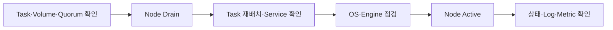

# 4. Docker Swarm mode Node 다루기

## Node Availability

Availability는 Node가 Scheduler로부터 새 Service Task를 받을 수 있는지를 결정한다. Node의 `Ready`·`Down` 같은 통신 상태나 Manager Role과는 별개의 값이다.

| Availability | 새 Task | 기존 Task | 주요 용도 |
| --- | --- | --- | --- |
| `Active` | 배치 가능 | 계속 실행 | 정상 운영 |
| `Pause` | 배치하지 않음 | 계속 실행 | 새 배치만 잠시 차단 |
| `Drain` | 배치하지 않음 | 종료 후 다른 Node에 재배치 | Host 점검·교체 |

### Active

```bash
docker node update --availability active worker-1
docker node inspect --pretty worker-1
```

Node를 다시 `Active`로 바꿔도 기존 Service Task가 자동으로 균등 재배치되지는 않는다. 불필요한 Task 이동을 막기 위한 동작이다.

### Pause

```bash
docker node update --availability pause worker-1
docker node ls
```

`Pause`는 기존 Task를 유지하면서 새 Task만 막는다. Host Reboot나 기존 Workload 이동이 필요한 점검에는 `Drain`이 더 적합하다.

### Drain

먼저 관찰용 Service를 준비했다고 가정한다.

```bash
docker service create \
  --name availability-web \
  --replicas 3 \
  --publish published=8086,target=80 \
  nginx:stable-alpine

docker service ps availability-web
```

Node를 Drain하고 Task 이동을 확인한다.

```bash
docker node update --availability drain worker-1
docker service ps availability-web
curl http://10.0.10.11:8086
```

`curl`은 Service 전체 접근 가능성을 확인하고, 실제로 어느 Task가 이동했는지는 `docker service ps`가 보여준다. 가용 Node가 부족하거나 Constraint·Resource 조건을 만족하지 못하면 대체 Task는 `Pending` 상태가 될 수 있다.

Global Service도 Drain Node의 Task를 제거한다. Local Volume이나 Bind Mount를 쓰는 Stateful Task는 다른 Node에서 같은 데이터를 사용할 수 없을 수 있으므로 Drain 전에 반드시 확인한다.

## Node Label 추가

Node Label은 Manager가 관리하는 Cluster Metadata다. Region, Zone, Rack, Storage와 Workload 등 Scheduling에 필요한 사실을 표현한다.

```bash
docker node update \
  --label-add region=kr \
  --label-add zone=seoul-a \
  --label-add disk=nvme \
  worker-1
```

```bash
docker node inspect \
  --format '{{json .Spec.Labels}}' \
  worker-1
```

Label을 제거할 때는 Key를 지정한다.

```bash
docker node update --label-rm disk worker-1
```

Label 이름과 허용 값을 문서화한다. `ssd`, `SSD`, `nvme=true`처럼 같은 의미가 여러 표기로 흩어지면 Placement 정책을 신뢰하기 어렵다.

## Service Placement Constraint

Constraint는 조건을 모두 만족하는 Node에만 Task를 배치한다. 여러 Constraint는 `AND`로 결합되며 만족하는 Node가 없으면 Task는 실패한 Node로 임의 배치되지 않고 `Pending`으로 남는다.

### node.labels Constraint

```bash
docker service create \
  --name zone-web \
  --replicas 2 \
  --constraint 'node.labels.region==kr' \
  --constraint 'node.labels.disk==nvme' \
  nginx:stable-alpine
```

Node Label은 Manager만 변경할 수 있으므로 보안·규정 준수처럼 신뢰가 필요한 배치에 우선 사용한다.

### node.id Constraint

```bash
docker service create \
  --name pinned-web \
  --constraint 'node.id==<node-id>' \
  nginx:stable-alpine
```

정확한 Node 하나에 고정하므로 해당 Node가 Down·Drain되면 다른 Node로 복구할 수 없다. 일시적인 진단 외에는 역할을 나타내는 Node Label이 더 유지보수하기 쉽다.

### node.hostname과 node.role Constraint

```bash
docker service create \
  --name hostname-web \
  --constraint 'node.hostname==worker-1' \
  nginx:stable-alpine

docker service create \
  --name worker-agent \
  --mode global \
  --constraint 'node.role==worker' \
  nginx:stable-alpine
```

Hostname 변경·Node 교체 가능성이 있으면 Hostname보다 의미 기반 Label을 사용한다. Manager 전용 Service는 `node.role==manager`로 제한할 수 있지만, Docker Socket이나 Cluster Credential을 전달하는 Container는 Cluster 전체 권한을 얻을 수 있으므로 별도의 최소 권한 설계가 필요하다.

### engine.labels Constraint

Engine Label은 각 Host의 Docker Daemon 설정에 선언하는 Metadata다. 예를 들어 `/etc/docker/daemon.json`에 다음처럼 구성할 수 있다.

```json
{
  "labels": [
    "disk=nvme",
    "accelerator=false"
  ]
}
```

Daemon 설정 변경과 재시작의 영향은 해당 OS의 운영 절차로 관리한다. Service에서는 다음처럼 참조한다.

```bash
docker service create \
  --name engine-web \
  --constraint 'engine.labels.disk==nvme' \
  nginx:stable-alpine
```

- `node.labels.*`: Manager가 Cluster에서 관리
- `engine.labels.*`: 각 Docker Daemon이 스스로 보고

보안에 민감한 Workload 격리는 Worker가 직접 설정할 수 없는 Node Label을 우선한다. Engine Label은 Hardware 특성처럼 분산 관리가 필요한 정보에 사용할 수 있지만 실제 상태와 일치하는지 별도로 관리한다.

## Constraint와 Placement Preference

Constraint는 반드시 만족해야 하는 제한이고 Preference는 가능한 범위에서 분산하려는 선호다.

```bash
docker service create \
  --name spread-web \
  --replicas 6 \
  --constraint 'node.labels.region==kr' \
  --placement-pref 'spread=node.labels.zone' \
  nginx:stable-alpine
```

이 예시는 `region=kr`인 Node만 허용하고, 그 안에서 `zone` 값별로 Task를 가능한 고르게 분산한다. Preference는 강제 조건이 아니며 현재 `spread` 전략을 사용한다. Global Service에는 Placement Preference가 적용되지 않는다.

## Pending Task 진단

Constraint, Availability와 Resource Reservation이 충돌하면 Task가 배치되지 않는다.

```bash
docker service ps --no-trunc zone-web
docker service inspect --pretty zone-web
docker node ls
docker node inspect --pretty worker-1
```

다음 순서로 확인한다.

1. 조건을 만족하는 Node Label·Hostname·Role이 실제로 존재하는가?
2. 해당 Node가 `Ready`이면서 `Active`인가?
3. CPU·Memory Reservation을 만족할 여유가 있는가?
4. Bind Source, Network, Image Pull과 Plugin 조건이 준비되었는가?
5. 여러 Constraint가 동시에 만족 가능한가?

Constraint를 무작정 제거하기보다 Service가 왜 해당 Node 특성을 요구했는지 먼저 확인한다.

## Manager Role과 Availability의 차이

Manager를 `Drain`해도 Raft Manager Role과 Quorum 참여는 유지된다. 반대로 `demote`는 Manager Role을 제거하지만 Availability가 `Active`라면 Worker로서 Task를 받을 수 있다.

```text
Role         → Cluster 관리·Raft 참여 여부
Availability → Service Task Scheduling 허용 여부
```

Control Plane 전용 Manager는 `manager + Drain` 조합을 사용할 수 있다. Manager를 Demote·Remove하기 전에는 항상 남은 Quorum을 계산한다.

## 안전한 Node 점검 절차



```bash
docker node update --availability drain worker-1
docker node ls
docker service ls
docker service ps --no-trunc <service-name>

# Host 점검과 재시작 후
docker node update --availability active worker-1
docker node inspect --pretty worker-1
curl http://<swarm-node-ip>:<published-port>
```

다시 `Active`로 바꾼 뒤 강제 Rebalance를 위해 무조건 Service를 재시작하지 않는다. 정말 재분산이 필요하면 영향 범위와 Update 정책을 확인하고 `docker service update --force`를 Service별로 수행한다.

## 학습 환경 정리

```bash
docker service rm \
  availability-web zone-web pinned-web hostname-web \
  worker-agent engine-web spread-web
```

Service를 제거해도 Host Label과 Host에 준비한 Bind Source는 남는다. 다른 Workload가 사용하지 않는지 확인한 뒤 Label·파일을 별도로 정리한다.

## 참고 자료

- [Swarm Node 관리](https://docs.docker.com/engine/swarm/manage-nodes/)
- [Swarm Service 배치 제어](https://docs.docker.com/engine/swarm/services/#control-service-placement)
- [`docker service create` Constraint](https://docs.docker.com/reference/cli/docker/service/create/#specify-service-constraints---constraint)
- [Swarm 관리와 Quorum](https://docs.docker.com/engine/swarm/admin_guide/)
