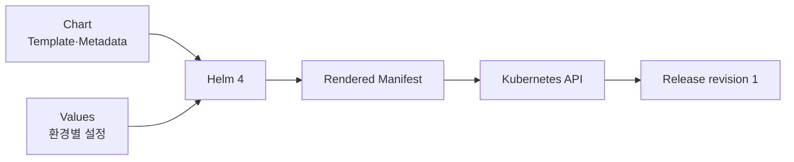

# 1. Helm 4 기본 개념

## Helm이 해결하는 문제

Kubernetes Application은 Deployment 하나가 아니라 Service, ConfigMap, ServiceAccount 같은 여러 Manifest로 구성되는 경우가 많다. Helm은 이 파일을 `Chart`로 묶고 설정을 합쳐 하나의 `Release`로 설치·변경·삭제한다.



Helm은 Kubernetes Cluster 자체를 설치하지 않는다. 이미 접근 가능한 Cluster에 Application Resource를 배포하고 그 이력을 관리한다.

## Chart, Values, Release와 Revision

| 개념 | 의미 |
|---|---|
| Chart | Kubernetes Resource Template과 기본 설정을 묶은 Package |
| Values | Template에 주입하는 사용자 설정 |
| Release | Chart와 Values를 특정 Namespace에 설치한 Instance |
| Revision | Install·Upgrade·Rollback으로 증가하는 Release 이력 번호 |

같은 Chart를 서로 다른 Release 이름과 Values로 여러 번 설치할 수 있다.

```bash
helm install shop-api ./shop-chart -n production
helm install shop-api-canary ./shop-chart -n production -f values-canary.yaml
```

## Helm Client와 Library

사용자는 `helm` Client를 실행하지만 실제 동작은 Helm Library가 담당한다. Helm 4는 kubeconfig의 Identity로 Kubernetes API와 통신하며 Release 정보는 기본적으로 Cluster의 Secret에 저장한다.

```text
사용자·CI → helm client → Helm library → Kubernetes API
                                      ├─ Workload Resource
                                      └─ Release Secret
```

별도 Cluster 내부 Server였던 Helm 2의 Tiller는 사용하지 않는다. 따라서 Helm 권한은 실행 주체의 Kubernetes RBAC 권한과 직접 연결된다.

## kubectl, Kustomize와 Operator의 경계

| 도구 | 중심 역할 |
|---|---|
| kubectl | Kubernetes API Resource 조회·변경 |
| Kustomize | Template 없이 YAML Overlay 조합 |
| Helm | Package, Values Rendering과 Release Lifecycle |
| Operator | 실행 중 Domain 상태를 지속적으로 Reconcile |

Helm은 설치 후 Application의 내부 장애를 계속 복구하는 Controller가 아니다. Pod 복구는 Kubernetes Controller가, Database Failover 같은 Domain 운영은 Application이나 Operator가 담당한다.

## 신규 도입 기준

- Helm 4를 Client와 CI의 기본 Version으로 고정한다.
- Chart API는 안정된 v2를 사용한다.
- Image와 Chart Version을 분리해 추적한다.
- 배포 전 Rendered Manifest와 권한을 검토한다.
- Helm Release 성공과 Application Readiness를 같은 의미로 보지 않는다.

## 참고 자료

- [Introduction to Helm](https://helm.sh/docs/intro/introduction/)
- [Helm Architecture](https://helm.sh/docs/topics/architecture/)
- [Helm 4 Overview](https://helm.sh/docs/overview/)
