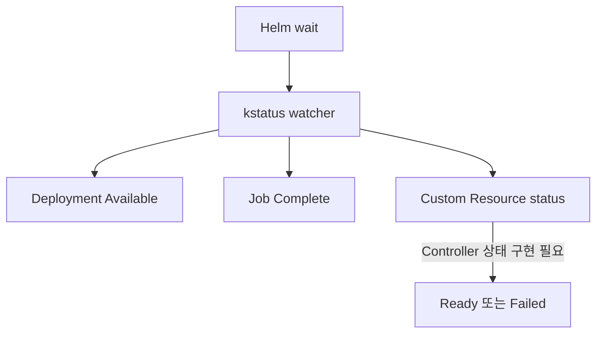

# 10. Release 상태와 kstatus

## Helm 관점의 상태 확인

```bash
helm list -n apps
helm status api -n apps
helm history api -n apps
helm get values api -n apps --all
helm get manifest api -n apps
```

| 명령 | 확인 대상 |
|---|---|
| `list` | Namespace의 Release 목록과 현재 상태 |
| `status` | 한 Release의 상태·Revision·Resource |
| `history` | Upgrade와 Rollback 이력 |
| `get values` | 해당 Revision에 적용된 Values |
| `get manifest` | Helm이 저장한 Rendered Manifest |

Helm 상태가 `deployed`여도 Pod가 나중에 CrashLoop에 들어갈 수 있다. Release 기록과 현재 Kubernetes 상태는 서로 다른 관찰면이다.

## Helm 4와 kstatus

Helm 4의 대기 로직은 kstatus 기반 Resource 상태 관찰을 사용한다. 단순히 존재 여부만 보는 대신 Resource별 상태를 관찰하지만, Custom Resource가 자신의 상태를 올바르게 보고하는지는 해당 Controller 구현에 달려 있다.



## 실패 진단 순서

```bash
helm status api -n apps
kubectl get deploy,pod,svc -n apps
kubectl describe pod -n apps <pod-name>
kubectl logs -n apps <pod-name> --all-containers
kubectl get events -n apps --sort-by=.lastTimestamp
```

1. Release가 Render·Apply 단계에서 실패했는지 확인한다.
2. 원하는 Replica와 Ready Replica를 비교한다.
3. Event에서 Image Pull, Scheduling, Mount와 Probe 실패를 찾는다.
4. Container Log와 외부 의존성을 확인한다.
5. Rendered Manifest와 실제 Resource의 차이를 비교한다.

## 운영 기록

장애 분석에는 Release 이름, Namespace, Revision, Chart Version, Application Image Digest와 배포 시각을 함께 남긴다. `helm get values` 출력에는 민감정보가 있을 수 있으므로 Ticket이나 CI Log에 그대로 첨부하지 않는다.

## 참고 자료

- [Helm 4 Overview](https://helm.sh/docs/overview/)
- [helm status](https://helm.sh/docs/helm/helm_status/)
- [Kubernetes Debugging](https://kubernetes.io/docs/tasks/debug/debug-application/)

