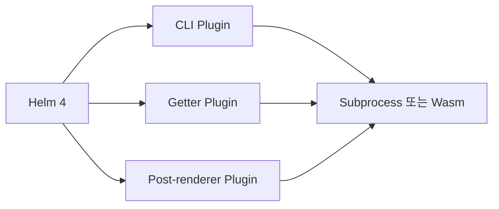

# 14. Helm 4 Plugin과 Post-renderer

## Helm 4 Plugin 구조

Helm 4는 Plugin SDK를 중심으로 CLI, Getter와 Post-renderer Plugin Type을 제공한다. Plugin은 기본적으로 별도 Process로 실행되며, 지원되는 경우 선택적으로 Wasm Runtime을 사용할 수 있다.



| Type | 사용 예 |
|---|---|
| CLI | 조직용 검사·배포 보조 명령 |
| Getter | 별도 Protocol에서 Chart 획득 |
| Post-renderer | Render된 Manifest를 최종 적용 전에 변환 |

## Post-renderer

Helm 4에서는 Post-renderer에 임의 실행 파일 경로가 아니라 설치된 Plugin 이름을 사용한다. 개발자 PC와 CI에 동일한 Plugin 및 Version이 있어야 같은 Manifest를 얻는다.

```text
Chart + Values → Helm Render → Post-renderer Plugin → 최종 Manifest → API Server
```

Post-renderer가 Label, Policy 또는 Sidecar를 추가한다면 Render 전후 결과를 모두 검토할 수 있어야 한다. Chart만 보고 실제 배포 결과를 판단할 수 없기 때문이다.

## Plugin 공급망

Plugin은 Helm Process의 Credential과 kubeconfig에 접근할 수 있다. 설치 전에 Source, Release Digest, 권한과 Update 정책을 검증한다.

```bash
helm plugin list
```

예시는 설치 상태 확인 명령이며 실제 Plugin 설치는 조직에서 검증한 Source와 고정 Version을 사용한다.

## Helm 3 Plugin 전환

Helm 3 Plugin은 Helm 4 SDK와 Manifest 구조 변화에 맞춘 Migration이 필요할 수 있다. 다음을 확인한다.

1. Helm 4 대응 Release가 있는가?
2. CLI Flag와 환경변수 의존성이 바뀌었는가?
3. Post-renderer가 이름 기반 Plugin으로 제공되는가?
4. Subprocess와 Wasm 중 어떤 실행 방식인가?
5. Failure와 Timeout이 Helm Release에 어떻게 전달되는가?

## 현재 운영 기준

- Plugin 이름과 Version을 Toolchain Manifest에 고정한다.
- Plugin 없이도 원본 Chart를 Render하고 비교할 수 있게 한다.
- Production kubeconfig로 출처 불명 Plugin을 실행하지 않는다.
- Plugin Update는 Chart 변경과 같은 수준으로 Review한다.

## 참고 자료

- [Helm 4 Overview](https://helm.sh/docs/overview/)
- [Migrating Helm Plugins](https://helm.sh/docs/plugins/migrate/)

