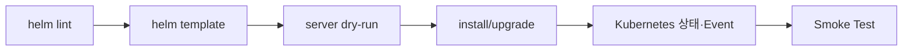

# 15. Chart 검증과 Debugging

## 단계별 검증



```bash
helm lint ./api-chart -f values-prod.yaml
helm template api ./api-chart -n apps -f values-prod.yaml --debug
helm upgrade --install api ./api-chart -n apps \
  -f values-prod.yaml --dry-run=server --debug
```

`lint` 통과는 Chart 품질의 시작점일 뿐이다. Template 결과가 조직 정책, Kubernetes Version과 실제 Controller 요구를 만족하는지 별도로 확인한다.

## 오류 범주

| 증상 | 우선 확인 |
|---|---|
| `nil pointer`·잘못된 Type | Values 경로, `with` Scope, Schema |
| YAML Parse 오류 | 들여쓰기, `nindent`, 빈 Block |
| API Validation 오류 | apiVersion, Field 이름, Cluster Version |
| Forbidden | 실행 주체의 RBAC |
| Timeout | Pod Event, Hook Job, PVC, Image Pull, Readiness |
| Upgrade 충돌 | Server-Side Apply Field Ownership |

## Render 결과 비교

```bash
helm get manifest api -n apps > released.yaml
helm template api ./api-chart -n apps -f values-prod.yaml > candidate.yaml
diff -u released.yaml candidate.yaml
```

위 비교는 학습용 흐름이다. Server Defaulting, Mutating Admission과 Controller 변경 때문에 실제 Cluster Object는 Render 결과와 다를 수 있다.

```bash
kubectl get deployment api -n apps -o yaml
kubectl get events -n apps --sort-by=.lastTimestamp
```

## Deprecated API 점검

Chart가 Render된다고 다음 Kubernetes Upgrade에서도 동작하는 것은 아니다. 대상 Cluster의 API Version과 폐기 일정을 기준으로 검사하고, CRD가 제공하는 API는 해당 Operator Version과 함께 점검한다.

## 현재 운영 기준

- Pull Request에서 대표 Values 조합을 모두 Render한다.
- Rendered Manifest를 Schema·Policy 도구로 검사한다.
- Production Apply 전에 동일 Chart Artifact와 Values Digest를 검증한다.
- Debug 출력에 Secret 값이 포함되지 않도록 Artifact 접근을 제한한다.

## 참고 자료

- [Debugging Templates](https://helm.sh/docs/chart_template_guide/debugging/)
- [helm lint](https://helm.sh/docs/helm/helm_lint/)

