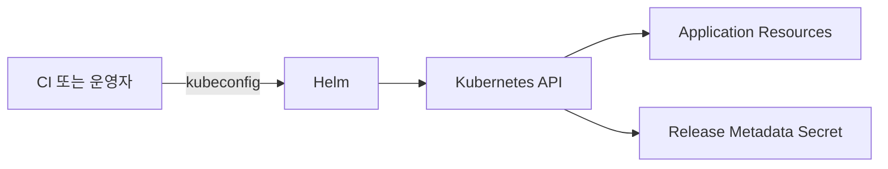

# 17. 운영 보안과 GitOps

## Helm의 권한 범위

Helm은 kubeconfig의 사용자 권한으로 Kubernetes API를 호출한다. Release Metadata는 보통 대상 Namespace의 Secret에 저장되므로 해당 Secret을 읽을 수 있는 주체는 Values와 Manifest의 민감정보에 접근할 수 있다.



- 배포 계정에는 필요한 Namespace와 Resource만 허용한다.
- Cluster-scoped CRD·ClusterRole 설치 권한은 일반 Application 배포와 분리한다.
- `helm get values`와 Debug Log를 민감 Artifact로 다룬다.

## Secret 처리

평문 Secret을 `values-prod.yaml`에 저장하면 Git, CI Workspace와 Release Metadata에 남을 수 있다. External Secrets Operator, SOPS 같은 암호화 Workflow 또는 조직의 Secret Manager를 사용해 배포 시점에 참조하거나 복호화한다.

```text
Git: Secret 이름·암호화된 값
Secret Store: 실제 값
Cluster: 최소 범위의 Kubernetes Secret
```

Chart가 Secret을 생성하는 경우에도 값의 유입 경로, Rotation과 폐기 절차가 필요하다.

## CI/CD와 GitOps의 책임

| 방식 | Apply 주체 | 기준 상태 |
|---|---|---|
| 직접 Helm 배포 | CI 또는 운영자 | Pipeline 입력과 Release |
| GitOps | Cluster Controller | Git에 선언된 Chart·Values |

GitOps에서는 CI가 Image와 Chart를 발행하고 Git의 Version/Digest를 갱신하며, Controller가 Cluster와 지속적으로 Reconcile한다. 같은 Release를 CI의 `helm upgrade`와 GitOps Controller가 동시에 관리하지 않는다.

## 추적해야 할 Version

- Source Commit
- Chart 이름·Version·OCI Digest
- Values Commit 또는 Digest
- Container Image Digest
- Helm Release Revision
- Cluster와 Helm Client Version

## 현재 운영 기준

- Render와 Apply 권한을 분리할 수 있으면 분리한다.
- Production 변경에는 Review와 승인 기록을 둔다.
- Rollback도 이전의 검증된 Artifact와 Values를 사용한다.
- Drift를 수동 명령으로 덮지 않고 선언 원본에 반영한다.

## 참고 자료

- [Role-Based Access Control](https://kubernetes.io/docs/reference/access-authn-authz/rbac/)
- [Helm Security](https://helm.sh/docs/topics/advanced/)

