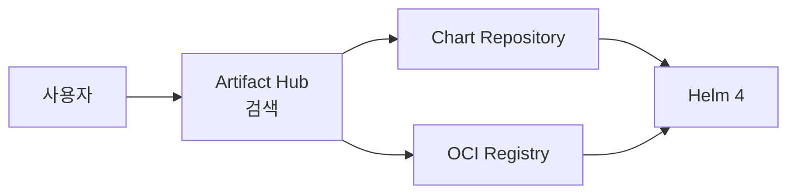

# 3. 기존 Chart 탐색과 검토

## Chart를 찾는 위치

Artifact Hub는 여러 Repository의 Package를 검색하는 Catalog다. Chart 자체는 Classic HTTP Repository나 OCI Registry에 저장된다.



검색 결과의 인기보다 Maintainer, 최근 Release, Source Repository, 지원 Kubernetes Version과 보안 공지를 우선한다.

## Metadata와 Values 확인

```bash
helm search hub ingress
helm repo add example https://charts.example.com
helm repo update
helm search repo example/api --versions

helm show chart example/api --version 2.3.1
helm show values example/api --version 2.3.1
helm show crds example/api --version 2.3.1
```

OCI Chart도 설치 전에 내려받거나 Render할 수 있다.

```bash
helm pull oci://registry.example.com/charts/api --version 2.3.1
helm show all oci://registry.example.com/charts/api --version 2.3.1
```

## Version 구분

`Chart.yaml`의 두 Version은 목적이 다르다.

| Field | 의미 |
|---|---|
| `version` | Chart Package의 SemVer Version |
| `appVersion` | 포함된 Application의 표시 Version |
| `kubeVersion` | 지원하는 Kubernetes Version 범위 |

`appVersion`은 정보용 문자열이며 Image Tag를 자동 고정하지 않는다. 실제 `values.yaml`의 Image Repository·Tag·Digest를 따로 확인한다.

## 설치 전 Render 검토

```bash
helm template api example/api \
  --version 2.3.1 \
  --namespace apps \
  -f values-prod.yaml > rendered.yaml
```

다음을 확인한다.

- ClusterRole·ClusterRoleBinding과 CRD 생성 여부
- Privileged, HostPath, HostNetwork와 HostPort
- LoadBalancer, Ingress·Gateway와 공개 Port
- PVC·StorageClass·Reclaim 영향
- Hook Job과 외부 Migration
- 기본 관리자 Password와 Secret 처리
- Image Registry, Tag·Digest와 Pull Policy

## Chart 신뢰 경계

Chart는 단순 YAML이 아니라 Cluster 권한으로 실행될 Resource Package다. 출처를 모르는 Chart를 Production에 바로 설치하지 않고 Package Digest·Provenance, Source와 Render 결과를 함께 검토한다.

## 참고 자료

- [Artifact Hub](https://artifacthub.io/)
- [Helm Commands](https://helm.sh/docs/helm/)
- [Charts](https://helm.sh/docs/topics/charts/)
