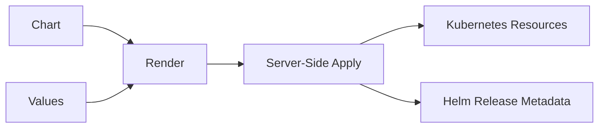

# 8. Install과 Server-Side Apply

## Release 생성 흐름

`helm install`은 Chart와 Values를 Render한 뒤 Kubernetes API에 Resource를 생성하고 Release Revision 1을 저장한다.



```bash
helm install api ./api-chart \
  --namespace apps \
  --create-namespace \
  --wait \
  --timeout 5m
```

`--wait`는 주요 Resource가 준비될 때까지 기다리지만 Application의 모든 Business Readiness를 보장하지는 않는다. 배포 뒤 별도 Smoke Test가 필요하다.

## Helm 4의 Server-Side Apply

Helm 4에서 새 Release는 기본적으로 Kubernetes Server-Side Apply를 사용한다. API Server가 Field Manager별 소유권을 관리하므로 Helm, Controller와 관리자가 같은 Field를 바꾸면 충돌이 드러날 수 있다.

```text
Helm이 소유한 spec.replicas ← 다른 도구가 변경
                     ↓
Upgrade 시 Field Ownership 충돌 가능
```

충돌을 단순히 강제 덮어쓰기 전에 해당 Field의 실제 관리 주체를 하나로 정한다. 예를 들어 HPA가 Replica 수를 관리하면 Chart와 배포 Pipeline이 `spec.replicas`를 계속 덮어쓰지 않도록 설계한다.

## 사전 확인

```bash
helm lint ./api-chart
helm template api ./api-chart -n apps -f values-prod.yaml
helm install api ./api-chart -n apps -f values-prod.yaml --dry-run=server
```

Client Render는 문법과 결과 확인에 유용하고, Server Dry Run은 Cluster의 API·Admission·권한 조건까지 더 가깝게 확인한다. 실제 Resource를 만들지 않는다고 해도 Hook이나 외부 연동의 동작 범위는 사용 중인 Version에서 확인한다.

## 설치 후 확인

```bash
helm status api -n apps
helm get values api -n apps --all
kubectl get all -n apps -l app.kubernetes.io/instance=api
kubectl get events -n apps --sort-by=.lastTimestamp
```

Release 성공과 Application 응답 성공을 구분한다. Service Endpoint, Readiness Probe, 외부 DB 연결도 확인해야 한다.

## 현재 운영 기준

- Release 이름과 Namespace를 배포 식별자로 고정한다.
- Production에서는 적용 전에 Render 결과를 Artifact로 남긴다.
- Field 충돌은 소유권 설계 문제로 보고 원인을 확인한다.
- `--timeout`을 무작정 늘리기 전에 Pending 원인을 조사한다.

## 참고 자료

- [Helm 4 Overview](https://helm.sh/docs/overview/)
- [helm install](https://helm.sh/docs/helm/helm_install/)

