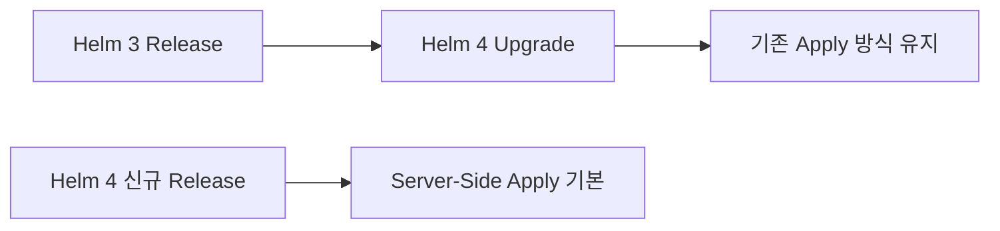

# 9. Upgrade와 Rollback

## Revision 증가

```bash
helm upgrade api ./api-chart \
  --namespace apps \
  -f values-prod.yaml \
  --wait \
  --timeout 5m

helm history api -n apps
```

Upgrade는 같은 Release에 새 Revision을 추가한다. Chart, Values와 Render 결과는 Revision에 기록되지만 Database Migration이나 외부 시스템 변경까지 되돌려 주지는 않는다.

## Values 재사용 기준

`--reuse-values`는 이전 Release의 값 위에 새 값을 합치므로 삭제된 Chart 기본값이 계속 남을 수 있다. 일반적으로 Git에 보관한 완전한 환경 Values를 매번 전달하는 편이 재현하기 쉽다.

```bash
helm get values api -n apps --all > current-values.yaml
helm upgrade api ./api-chart -n apps -f values-prod.yaml
```

첫 명령의 파일은 비교용 예시다. Secret이 포함될 수 있으므로 그대로 Git에 추가하지 않는다.

## 실패 시 Rollback

Helm 4에서는 이전 `--atomic`을 더 명확한 `--rollback-on-failure` 이름으로 사용한다.

```bash
helm upgrade api ./api-chart -n apps \
  -f values-prod.yaml \
  --rollback-on-failure \
  --timeout 5m

helm rollback api 3 -n apps --wait --timeout 5m
```

`--force-replace`는 이전 `--force`에 대응하며 Resource 교체가 필요한 경우에만 사용한다. 교체는 일시 중단, 새 ClusterIP 또는 불변 Field 관련 영향을 만들 수 있으므로 일반적인 오류 회피 수단이 아니다.

## Apply 방식 Latching

Helm 4는 기존 Revision의 Apply 방식을 이어받는다. Helm 3에서 생성한 Release를 Helm 4로 Upgrade하면 명시적으로 전환하지 않는 한 기존 Client-Side 방식이 유지될 수 있다. 따라서 CLI Version만 바뀌었다고 모든 Release가 즉시 Server-Side Apply로 전환된다고 가정하지 않는다.



## Rollback 가능 조건

- 이전 Image가 Registry에 남아 있어야 한다.
- Config·Secret Version이 다시 참조 가능해야 한다.
- DB Schema와 Message 형식이 이전 Application과 호환되어야 한다.
- Rollback 뒤 상태 확인과 Smoke Test가 자동화되어야 한다.

## 참고 자료

- [Helm 4 Overview](https://helm.sh/docs/overview/)
- [helm upgrade](https://helm.sh/docs/helm/helm_upgrade/)
- [helm rollback](https://helm.sh/docs/helm/helm_rollback/)

