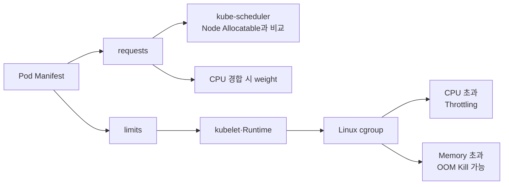
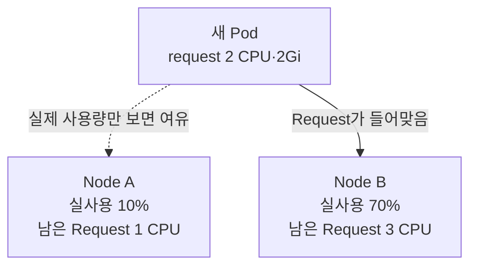

# 1. Requests와 Limits

## 두 값의 역할

Kubernetes의 `requests`와 `limits`는 모두 자원 값을 적지만 사용되는 시점이 다르다.

| 항목 | 주로 사용하는 구성 요소 | 의미 |
|---|---|---|
| `requests` | kube-scheduler, cgroup CPU weight | 배치에 필요한 기준량과 경합 시 상대적 보장 |
| `limits` | kubelet, Container Runtime, Linux cgroup | 실행 중 넘지 못하게 하는 상한 |



Request는 자원을 미리 떼어 놓는 전용 파티션과 완전히 같지 않다. Node에 여유가 있으면 Container는 CPU Request보다 더 사용할 수 있고, Memory도 Limit까지 사용할 수 있다.

## Container 단위 YAML

```yaml
apiVersion: v1
kind: Pod
metadata:
  name: resource-demo
  namespace: apps
spec:
  containers:
    - name: api
      image: ghcr.io/example/api:1.0.0
      resources:
        requests:
          cpu: 250m
          memory: 256Mi
        limits:
          cpu: 500m
          memory: 512Mi
```

- `cpu: 250m`은 CPU 0.25개에 해당한다.
- `cpu: 1`은 환경에 따라 물리 Core 하나 또는 vCPU 하나다.
- `memory: 256Mi`는 2진 단위 256 Mebibyte다.
- Memory에서 `400m`은 400MB가 아니라 0.4byte에 가까운 잘못된 값이므로 `400Mi`와 대소문자를 구분한다.

## Pod 전체 자원량

안정적으로 널리 사용하는 Container 단위 설정에서는 일반 Container의 Request와 Limit 합계가 Pod의 유효 자원량이 된다.

```yaml
spec:
  containers:
    - name: app
      resources:
        requests:
          cpu: 400m
          memory: 384Mi
        limits:
          cpu: 800m
          memory: 768Mi
    - name: log-agent
      resources:
        requests:
          cpu: 100m
          memory: 128Mi
        limits:
          cpu: 200m
          memory: 256Mi
```

이 Pod의 합계는 Request `500m / 512Mi`, Limit `1 CPU / 1Gi`다. Init Container가 있으면 Scheduling 계산은 일반 Container 합계와 Init Container별 값 중 더 큰 쪽 등 별도 규칙을 적용한다.

## Pod-level Resources

Kubernetes 1.36의 `spec.resources`는 CPU·Memory·HugePages에 사용할 수 있는 Beta 기능이며 `PodLevelResources` Feature Gate가 필요하다.

```yaml
spec:
  resources:
    requests:
      cpu: "1"
      memory: 512Mi
    limits:
      cpu: "2"
      memory: 1Gi
  containers:
    - name: app
      image: ghcr.io/example/api:1.0.0
    - name: sidecar
      image: ghcr.io/example/log-agent:1.0.0
```

Pod 안에서 여유 자원을 공유할 수 있지만 Cluster Version, Runtime, Monitoring과 Admission Policy의 지원 여부를 먼저 확인한다. 이 노트의 기본 예시는 호환성이 넓은 Container 단위 설정을 사용한다.

## Limits

CPU와 Memory Limit의 동작은 같지 않다.

| 초과 자원 | 일반적인 결과 |
|---|---|
| CPU | Process를 죽이지 않고 CPU 실행 시간을 Throttling |
| Memory | 즉시 예약 차단이 아니라 압력 시 OOM Kill하는 반응형 제한 |

Limit만 쓰고 Request를 생략하면 Admission 단계에서 다른 Default가 주입되지 않은 경우 Kubernetes가 Limit 값을 Request로 복사한다.

## Requests와 Scheduling

Scheduler는 현재 실제 사용량이 아니라 이미 배치된 Pod들의 Request 합계와 Node `allocatable`을 비교한다.



Node A의 실제 CPU가 한가해도 Request 여유가 부족하면 Filter 단계에서 제외될 수 있다. 이 보수적인 계산이 Peak 시 자원 부족을 줄인다.

## Overcommit

Overcommit은 Node의 물리 자원보다 Limit 합계 또는 잠재 사용량을 더 크게 배치해 평균 사용률을 높이는 방식이다.

```text
Node: 4 CPU

Pod A request 1 / limit 3
Pod B request 1 / limit 3
Pod C request 1 / limit 2

Request 합계 = 3 CPU → 배치 가능
Limit 합계   = 8 CPU → 동시에 Peak면 경합
```

CPU는 압축 가능한 자원이므로 경합하면 느려지는 형태로 Overcommit하기 쉽다. Memory는 압축할 수 없으므로 실제 사용량이 커지면 OOM과 Eviction으로 이어진다. 평균만 보고 과도하게 Overcommit하지 않고 Peak, Startup, Sidecar와 Node System Daemon 여유를 포함한다.

## 확인 명령과 예상 결과

```bash
kubectl get pod resource-demo -n apps \
  -o jsonpath='{.spec.containers[0].resources}{"\n"}'

kubectl describe pod resource-demo -n apps
kubectl describe node worker-1
kubectl top pod resource-demo -n apps --containers
```

예시 출력:

```text
Requests:
  cpu:     250m
  memory:  256Mi
Limits:
  cpu:     500m
  memory:  512Mi
```

`kubectl top`은 Metrics API가 있을 때만 현재 사용량을 보여준다. Request·Limit은 `describe`나 Manifest로 확인하고, 실제 사용량은 시간대별 Monitoring으로 관찰한다.

## 현재 운영 기준

- 측정 없이 Request와 Limit을 복사하지 않는다.
- CPU Request는 정상 부하에 필요한 Scheduling 기준으로 잡는다.
- Memory Request에는 정상 Working Set과 Startup Peak를 반영한다.
- Memory Limit은 OOM이 발생해도 안전하게 복구 가능한 범위인지 확인한다.
- HPA의 CPU Utilization을 사용하면 모든 대상 Container에 CPU Request가 필요하다.
- 변경은 Deployment Pod Template에 반영해 재현 가능하게 관리한다.

## 참고 자료

- [Resource Management for Pods and Containers](https://kubernetes.io/docs/concepts/configuration/manage-resources-containers/)
- [Node Allocatable](https://kubernetes.io/docs/tasks/administer-cluster/reserve-compute-resources/)

