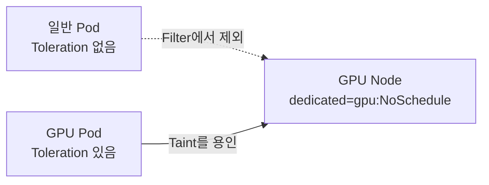
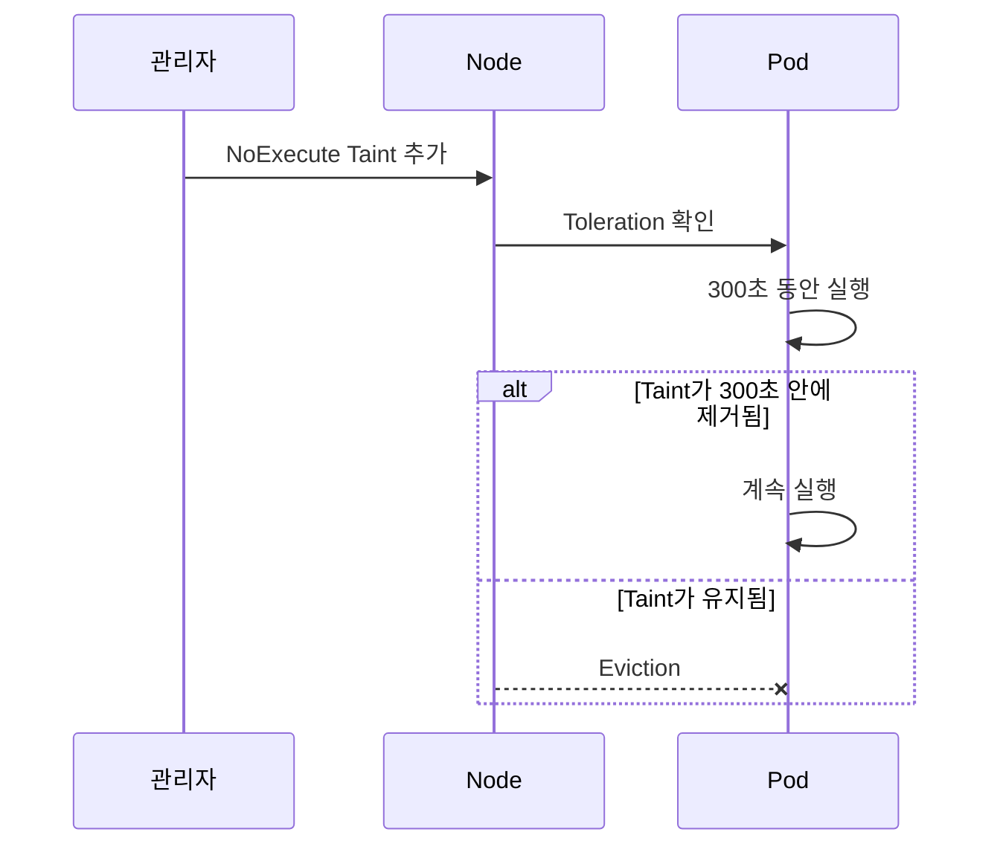

# 10. Taints와 Tolerations

## 기본 개념

Taint는 Node가 특정 Pod를 밀어내는 조건이고, Toleration은 Pod가 그 Taint를 견딜 수 있다는 선언이다.



Toleration이 있다고 해당 Node를 반드시 선택하는 것은 아니다. Node Affinity나 GPU Resource Request를 함께 사용해 “갈 수 있음”과 “가야 함”을 모두 표현한다.

## Taint 구성

```bash
kubectl taint nodes gpu-worker-1 \
  dedicated=gpu:NoSchedule

kubectl describe node gpu-worker-1
```

Node Manifest 형태:

```yaml
apiVersion: v1
kind: Node
metadata:
  name: gpu-worker-1
spec:
  taints:
    - key: dedicated
      value: gpu
      effect: NoSchedule
```

관리형 Kubernetes에서는 Node Object를 직접 관리하기보다 Node Pool 설정과 Provider API로 Taint가 재생성되게 한다.

## Taint Effect

| Effect | 새 Pod | 이미 실행 중인 Pod |
|---|---|---|
| `NoSchedule` | Toleration이 없으면 배치하지 않음 | 그대로 실행 |
| `PreferNoSchedule` | 가능하면 피함 | 그대로 실행 |
| `NoExecute` | 배치하지 않음 | Toleration이 없으면 Eviction |

`PreferNoSchedule`은 Soft 조건이므로 Cluster가 부족하면 해당 Node에 배치될 수 있다.

## Toleration YAML

```yaml
apiVersion: v1
kind: Pod
metadata:
  name: gpu-worker
spec:
  tolerations:
    - key: dedicated
      operator: Equal
      value: gpu
      effect: NoSchedule
  nodeSelector:
    workload.example.com/tier: gpu
  containers:
    - name: trainer
      image: ghcr.io/example/trainer:1.0.0
      resources:
        limits:
          nvidia.com/gpu: "1"
```

Operator:

- `Equal`: Key, Value와 Effect가 일치해야 한다.
- `Exists`: Value 없이 같은 Key의 Taint를 용인한다.
- 빈 Key와 `Exists`는 모든 Key를 용인하므로 일반 Workload에 사용하지 않는다.

## NoExecute와 tolerationSeconds

```yaml
spec:
  tolerations:
    - key: maintenance.example.com/drain
      operator: Equal
      value: planned
      effect: NoExecute
      tolerationSeconds: 300
```

Pod는 Taint가 추가된 뒤 최대 300초 동안 실행을 유지한 후 아직 Taint가 있으면 Eviction된다.



`tolerationSeconds`는 `NoExecute`에서만 의미가 있다.

## 자동 Node Condition Taint

Control Plane은 Node 상태에 따라 다음과 같은 Taint를 추가할 수 있다.

- `node.kubernetes.io/not-ready`
- `node.kubernetes.io/unreachable`
- `node.kubernetes.io/memory-pressure`
- `node.kubernetes.io/disk-pressure`
- `node.kubernetes.io/pid-pressure`

일반 Pod에는 NotReady·Unreachable에 대한 기본 Toleration이 자동 추가될 수 있다. System Taint를 무조건 용인하면 장애 Node에서 Pod가 오래 남을 수 있으므로 목적을 이해하고 변경한다.

## Taint 제거

```bash
kubectl taint nodes gpu-worker-1 \
  dedicated=gpu:NoSchedule-
```

끝의 `-`는 해당 Taint 삭제를 의미한다. 운영 자동화에서는 적용 전 현재 Taint를 확인해 다른 관리자가 둔 값을 지우지 않는다.

## 흔한 오해

- Taint는 보안 경계가 아니다. 권한이 있는 사용자는 Toleration을 추가할 수 있다.
- Toleration만으로 GPU Node에 고정되지 않는다.
- `NoSchedule`은 기존 Pod를 Eviction하지 않는다.
- `NoExecute` Eviction은 PDB 보호 흐름과 별개로 동작할 수 있으므로 장애 정책을 시험한다.
- Control Plane Taint를 일반 앱이 용인하게 해 관리 Node를 소비하지 않는다.

## 참고 자료

- [Taints and Tolerations](https://kubernetes.io/docs/concepts/scheduling-eviction/taint-and-toleration/)
- [Well-Known Taints](https://kubernetes.io/docs/reference/labels-annotations-taints/#taints)

