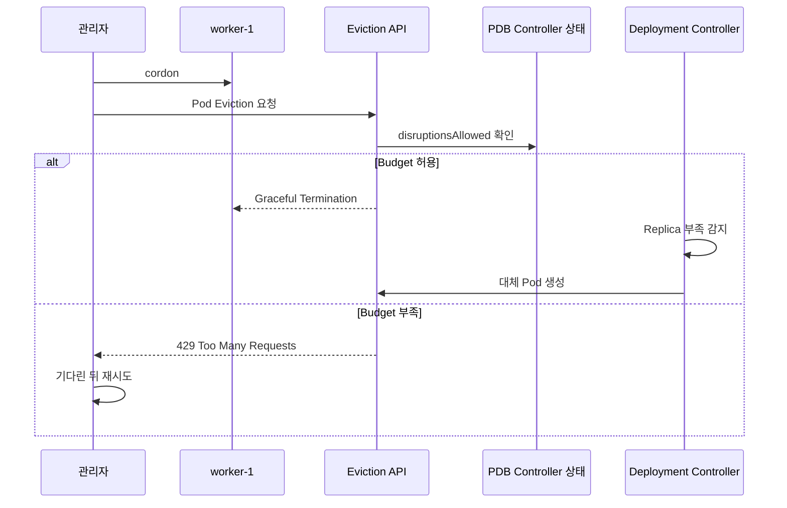

# 11. Cordon, Drain과 PodDisruptionBudget

## Cordon

Cordon은 Node를 `unschedulable`로 표시해 일반적인 새 Pod Scheduling을 막는다. 실행 중인 Pod는 건드리지 않는다.

```bash
kubectl cordon worker-1
kubectl get nodes
```

예상 결과:

```text
NAME       STATUS                     ROLES    AGE
worker-1   Ready,SchedulingDisabled   <none>   90d
```

API Object에서는 다음 Field가 바뀐다.

```yaml
spec:
  unschedulable: true
```

DaemonSet Pod는 Cordon된 Node에도 Controller 동작에 따라 배치될 수 있다.

## Drain

Drain은 먼저 Node를 Cordon하고 Eviction API를 사용해 대상 Pod를 Graceful하게 퇴거한다.

```bash
kubectl drain worker-1 \
  --ignore-daemonsets \
  --timeout=15m
```



`--ignore-daemonsets`는 DaemonSet Pod를 삭제한다는 뜻이 아니라 Drain 대상에서 제외한다. `emptyDir` Data가 있는 Pod를 지우려면 `--delete-emptydir-data`가 필요하지만 Data 손실을 승인하는 Option이므로 먼저 대상 Pod를 확인한다.

Static Pod와 Controller가 없는 Pod는 자동 복원되지 않는다. `--force`를 습관적으로 사용하지 않는다.

## PodDisruptionBudget

PDB는 자발적 중단 중 동시에 사용할 수 없는 Pod 수를 제한한다.

```yaml
apiVersion: policy/v1
kind: PodDisruptionBudget
metadata:
  name: api
  namespace: apps
spec:
  maxUnavailable: 1
  unhealthyPodEvictionPolicy: AlwaysAllow
  selector:
    matchLabels:
      app: api
```

또는 최소 가용 수를 지정한다.

```yaml
spec:
  minAvailable: 75%
  selector:
    matchLabels:
      app: api
```

`minAvailable`과 `maxUnavailable`은 동시에 쓰지 않는다.

| Field | 의미 |
|---|---|
| `minAvailable` | Eviction 후에도 Available이어야 하는 최소 Pod |
| `maxUnavailable` | 자발적 중단으로 동시에 Unavailable일 수 있는 최대 Pod |
| `unhealthyPodEvictionPolicy` | Unhealthy Pod가 Drain을 막는 방식 |

Controller가 Replica를 관리하는 Workload에는 변화에 따라 의도가 유지되는 `maxUnavailable`이 운영하기 쉬운 경우가 많다.

## PDB가 보호하는 것과 보호하지 않는 것

PDB가 적용되는 대표적인 자발적 중단:

- `kubectl drain`
- Eviction API를 이용한 Cluster Autoscaler 축소
- 관리자가 시작한 Node 유지보수

PDB가 막을 수 없는 비자발적 중단:

- Node Hardware 장애
- Kernel Panic·Network 단절
- Node-pressure Eviction
- Container 자체 OOM

Deployment RollingUpdate는 PDB에 의해 제한되는 배포 전략이 아니다. RollingUpdate의 가용성은 Deployment `maxUnavailable`과 `maxSurge`로 관리한다.

## AlwaysAllow 정책

기본 정책에서는 이미 Unhealthy인 Pod가 Budget을 막아 Drain이 오래 정지할 수 있다. 현재 Kubernetes 문서는 Node Drain을 지원하기 위해 `unhealthyPodEvictionPolicy: AlwaysAllow`를 권장한다.

AlwaysAllow는 Running이지만 Ready가 아닌 Pod의 Eviction을 허용한다. 애플리케이션이 정상 Pod 수를 복구할 수 있고 Readiness Probe가 정확하다는 전제에서 사용한다.

## 확인 명령

```bash
kubectl get pdb -n apps
kubectl describe pdb api -n apps

kubectl get pod -n apps -l app=api -o wide
kubectl get node worker-1
```

예시:

```text
NAME   MIN AVAILABLE   MAX UNAVAILABLE   ALLOWED DISRUPTIONS
api    N/A             1                 1
```

`ALLOWED DISRUPTIONS`가 0이면 Replica Ready 상태, Selector, 다른 진행 중 중단을 확인한다.

## 안전한 Node 유지보수 절차

1. Node와 실행 중인 Workload·Local Data를 Inventory한다.
2. 관련 PDB와 `disruptionsAllowed`를 확인한다.
3. Cordon해 새 배치를 막는다.
4. Drain하고 PDB에 막히면 원인을 해결한다.
5. Node Patch·Reboot·Upgrade를 수행한다.
6. kubelet, CNI, CSI와 Node Condition을 확인한다.
7. Uncordon한다.
8. Pod 분산, Error Rate와 PDB 상태를 재확인한다.

```bash
kubectl uncordon worker-1
```

PDB를 삭제하거나 `--disable-eviction`으로 우회하기 전에 서비스 중단 영향을 명시적으로 승인받는다. 이 Option은 PDB를 우회하는 Delete를 사용할 수 있다.

## 참고 자료

- [Safely Drain a Node](https://kubernetes.io/docs/tasks/administer-cluster/safely-drain-node/)
- [Disruptions and PDB](https://kubernetes.io/docs/concepts/workloads/pods/disruptions/)
- [kubectl drain](https://kubernetes.io/docs/reference/kubectl/generated/kubectl_drain/)
