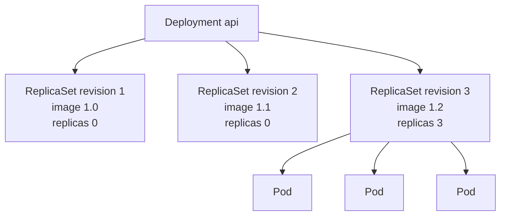
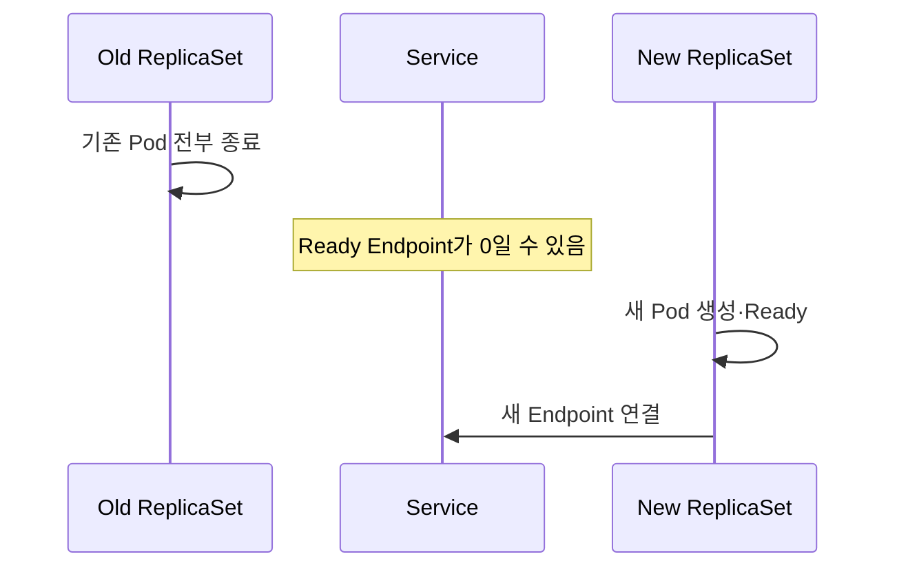
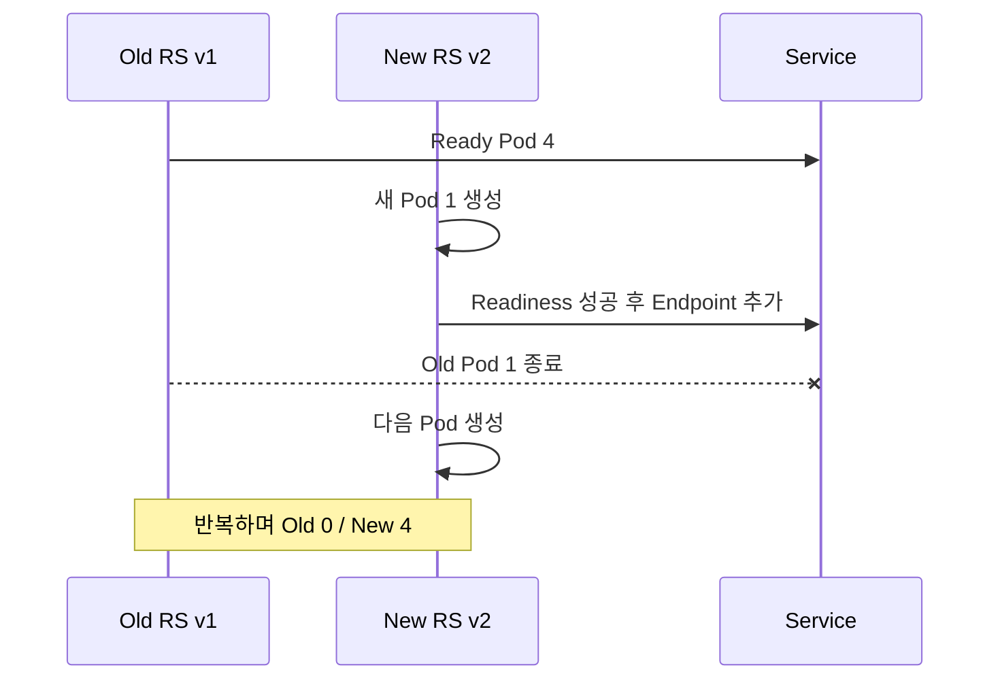
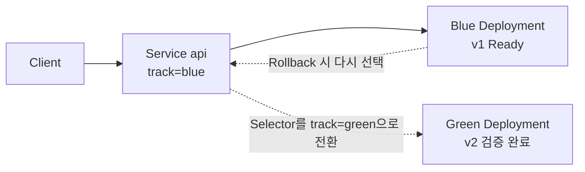
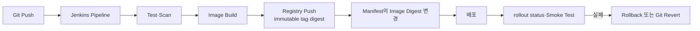

# 12. Deployment 배포 전략과 Jenkins

## Deployment의 Version 관리

Deployment는 Pod Template이 바뀔 때 새 ReplicaSet을 만들고 Replica 수를 이전 ReplicaSet에서 새 ReplicaSet으로 이동한다.



이전 ReplicaSet은 Rollback을 위해 Replica 0 상태로 남을 수 있다. `revisionHistoryLimit`으로 보존 개수를 제한한다.

```yaml
apiVersion: apps/v1
kind: Deployment
metadata:
  name: api
  namespace: apps
spec:
  replicas: 4
  revisionHistoryLimit: 5
  progressDeadlineSeconds: 600
  selector:
    matchLabels:
      app: api
  template:
    metadata:
      labels:
        app: api
    spec:
      containers:
        - name: api
          image: ghcr.io/example/api:1.2.0
          readinessProbe:
            httpGet:
              path: /ready
              port: 8080
```

## Recreate

```yaml
spec:
  strategy:
    type: Recreate
```



동시에 두 Version이 실행되면 안 되는 Workload에 사용할 수 있지만 중단 시간이 생길 수 있다. Stateful App이라고 무조건 Recreate가 정답은 아니며 Data Migration과 Compatibility를 별도로 설계한다.

## RollingUpdate

```yaml
spec:
  strategy:
    type: RollingUpdate
    rollingUpdate:
      maxUnavailable: 1
      maxSurge: 1
```

Replica 4개라면 Update 중 Ready Pod는 최소 3개를 유지하고 총 Pod는 최대 5개까지 늘어날 수 있다.



| Field | 의미 | Percentage 반올림 |
|---|---|---|
| `maxUnavailable` | Update 중 사용할 수 없어도 되는 최대 Pod | 내림 |
| `maxSurge` | Desired Replica보다 추가 생성 가능한 최대 Pod | 올림 |

둘을 모두 0으로 설정할 수 없다. Readiness Probe가 실제 Traffic 처리 가능 시점을 반영해야 RollingUpdate의 가용성 계산도 의미가 있다.

## 상태 확인과 Rollback

```bash
kubectl rollout status deployment/api -n apps --timeout=5m
kubectl rollout history deployment/api -n apps
kubectl get rs -n apps -l app=api
kubectl describe deployment api -n apps

kubectl rollout undo deployment/api -n apps
```

Rollback은 Manifest와 Image만 되돌린다. 이미 변경된 Database Schema, Queue Message와 외부 API Contract는 자동 복원하지 않는다. Expand-and-contract Migration과 이전 Version 호환성을 배포 전에 설계한다.

## Blue-Green 배포

Kubernetes Deployment 자체에 Blue-Green Strategy Type은 없다. 두 Deployment를 동시에 만들고 Service Selector를 전환해 구현한다.



Blue:

```yaml
apiVersion: apps/v1
kind: Deployment
metadata:
  name: api-blue
spec:
  replicas: 4
  selector:
    matchLabels:
      app: api
      track: blue
  template:
    metadata:
      labels:
        app: api
        track: blue
    spec:
      containers:
        - name: api
          image: ghcr.io/example/api:1.1.0
```

Green은 이름, `track`과 Image Version만 `green`·`1.2.0`으로 둔다. Service가 Traffic Switch를 담당한다.

```yaml
apiVersion: v1
kind: Service
metadata:
  name: api
spec:
  selector:
    app: api
    track: green
  ports:
    - port: 80
      targetPort: 8080
```

진행 순서:

1. Blue가 Production Traffic을 처리한다.
2. Green을 별도 배포해 Readiness와 Smoke Test를 통과시킨다.
3. Database와 API의 양방향 Version 호환성을 확인한다.
4. Service Selector를 Green으로 바꾼다.
5. Error Rate·Latency를 관찰한다.
6. 문제가 있으면 Selector를 Blue로 복원한다.
7. 안정화 시간 후 Blue를 축소하거나 삭제한다.

Service 전환은 새 Connection에 적용된다. 기존 Keep-alive Connection과 외부 Cache 때문에 모든 Traffic이 한 순간에 완전히 바뀐다고 가정하지 않는다.

## Jenkins 중심 CI/CD 흐름



직접 배포 Pipeline의 간단한 구조:

```groovy
pipeline {
  agent any
  environment {
    IMAGE = 'ghcr.io/example/api'
  }
  stages {
    stage('Test') {
      steps {
        sh 'make test'
      }
    }
    stage('Build and Push') {
      steps {
        sh 'make image IMAGE=$IMAGE TAG=$GIT_COMMIT'
        sh 'make push IMAGE=$IMAGE TAG=$GIT_COMMIT'
      }
    }
    stage('Deploy') {
      steps {
        withKubeConfig([credentialsId: 'apps-deployer']) {
          sh '''
            kubectl -n apps set image deployment/api \
              api=$IMAGE:$GIT_COMMIT
            kubectl -n apps rollout status deployment/api --timeout=5m
          '''
        }
      }
    }
  }
}
```

Pipeline 예시의 실제 Plugin 문법은 설치된 Jenkins Plugin Version에 맞춰 확인한다. 장기 ServiceAccount Token을 Jenkins Credential에 넣기보다 Cloud Workload Identity, OIDC 또는 짧은 Credential Broker를 우선한다.

## 현재 유지보수 방향

규모가 커지면 Jenkins는 Build·Test·Image 서명과 Manifest Git 변경까지만 수행하고, Argo CD나 Flux 같은 GitOps Controller가 Cluster 상태를 Reconcile하는 구조를 검토한다.

```text
Jenkins → Image Registry + Manifest Git
                         ↓
                   GitOps Controller
                         ↓
                    Kubernetes
```

- Image는 Mutable Tag보다 Commit SHA와 Digest로 추적한다.
- Jenkins 계정에는 대상 Namespace·Deployment만 수정하는 최소 RBAC을 부여한다.
- kubeconfig와 Token을 Console Log에 출력하지 않는다.
- Production 배포에는 승인, Audit와 Rollback 기준을 둔다.
- HPA가 관리하는 Deployment의 `spec.replicas`를 Pipeline이 반복 덮어쓰지 않는다.
- `kubectl rollout status` 실패를 Pipeline 실패로 처리한다.

## 참고 자료

- [Deployments](https://kubernetes.io/docs/concepts/workloads/controllers/deployment/)
- [Update a Deployment Without Downtime](https://kubernetes.io/docs/tasks/run-application/update-deployment-rolling/)
