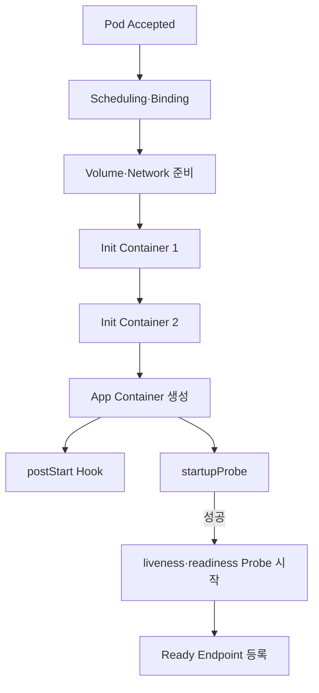
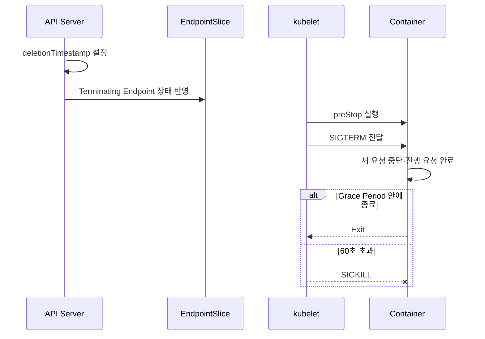

# 13. Pod 생애주기와 상태 검사

## Pod Phase와 kubectl STATUS

공식 Pod Phase는 다음 다섯 가지다.

| Phase | 의미 |
|---|---|
| `Pending` | Cluster가 Pod를 받았지만 Scheduling·Image Pull·Container 준비 중 |
| `Running` | Node에 Binding되고 하나 이상 Container가 실행·시작·재시작 중 |
| `Succeeded` | 모든 Container가 성공 종료하고 재시작하지 않음 |
| `Failed` | 모든 Container가 종료했으며 하나 이상 실패 종료 |
| `Unknown` | Node 통신 문제 등으로 상태를 알 수 없음 |

`Completed`, `Error`, `CrashLoopBackOff`와 `Terminating`은 `kubectl get pods`가 보여주는 STATUS 표현이지 Pod `status.phase` 값이 아니다.

```bash
kubectl get pod job-pod \
  -o jsonpath='{.status.phase}{"\n"}'
kubectl get pod job-pod
```

```text
API phase: Succeeded
kubectl STATUS: Completed
```

## restartPolicy

Pod의 `restartPolicy`는 `Always`, `OnFailure`, `Never` 중 하나이며 모든 일반 Container에 적용된다.

```yaml
apiVersion: v1
kind: Pod
metadata:
  name: one-shot
spec:
  restartPolicy: OnFailure
  containers:
    - name: task
      image: ghcr.io/example/task:1.0.0
```

| Policy | Exit 0 | Exit != 0 |
|---|---|---|
| `Always` | 재시작 | 재시작 |
| `OnFailure` | 재시작하지 않음 | 재시작 |
| `Never` | 재시작하지 않음 | 재시작하지 않음 |

재시작은 같은 Pod·Node에서 kubelet이 Container를 다시 만드는 것이다. Deployment가 Pod를 교체하는 것과 다르다. 반복 실패하면 Backoff가 적용되고 kubectl STATUS에 `CrashLoopBackOff`가 보일 수 있다.

## Running까지의 흐름



## Init Containers

Init Container는 순서대로 실행되고 각각 성공해야 다음 단계로 진행한다.

```yaml
spec:
  initContainers:
    - name: wait-db
      image: busybox:1.37
      command:
        - sh
        - -c
        - until nc -z db 5432; do sleep 2; done
  containers:
    - name: api
      image: ghcr.io/example/api:1.0.0
```

DB Migration처럼 한 번만 실행되어야 하는 작업은 Replica마다 실행되는 Init Container보다 별도의 Job과 배포 순서로 관리하는 편이 안전할 수 있다.

## postStart Hook

`postStart`는 Container 생성 직후 호출되지만 Container ENTRYPOINT보다 먼저 실행된다는 보장은 없다. Hook이 완료되기 전에는 Container가 정상 Running 상태로 다뤄지지 않으며 Hook 실패 시 Container가 종료될 수 있다.

Exec:

```yaml
lifecycle:
  postStart:
    exec:
      command:
        - sh
        - -c
        - /app/warm-cache
```

HTTP:

```yaml
lifecycle:
  postStart:
    httpGet:
      path: /internal/warmup
      port: 8080
```

Lifecycle Hook에는 `exec`, `httpGet`과 `sleep` Handler를 사용할 수 있다. 긴 초기화는 postStart에 숨기기보다 앱 상태와 startupProbe로 관찰 가능하게 만드는 편이 좋다.

## 세 가지 Probe

| Probe | 실패 시 결과 | 목적 |
|---|---|---|
| `startupProbe` | Container 재시작 | 느린 시작 완료 확인 |
| `livenessProbe` | Container 재시작 | 복구 불가능한 Hang 감지 |
| `readinessProbe` | Service Endpoint에서 제외 | 현재 Traffic 처리 가능 여부 |

startupProbe가 성공하기 전에는 liveness와 readiness Probe가 시작되지 않는다.

```yaml
containers:
  - name: api
    image: ghcr.io/example/api:1.0.0
    ports:
      - containerPort: 8080
    startupProbe:
      httpGet:
        path: /startup
        port: 8080
      periodSeconds: 5
      failureThreshold: 30
    livenessProbe:
      httpGet:
        path: /live
        port: 8080
      periodSeconds: 10
      timeoutSeconds: 2
      failureThreshold: 3
    readinessProbe:
      httpGet:
        path: /ready
        port: 8080
      periodSeconds: 5
      timeoutSeconds: 2
      successThreshold: 2
      failureThreshold: 2
```

Probe Handler는 `httpGet`, `tcpSocket`, `exec`와 `grpc`를 지원한다.

## Probe 세부 Option

| Option | 의미 |
|---|---|
| `initialDelaySeconds` | Container 시작 후 첫 검사까지 대기 |
| `periodSeconds` | 검사 주기 |
| `timeoutSeconds` | 한 번 검사 Timeout |
| `successThreshold` | 실패 후 Ready 복귀 등에 필요한 연속 성공 |
| `failureThreshold` | 실패로 판정할 연속 실패 |

liveness와 startup Probe의 `successThreshold`는 1이어야 한다. 느린 시작을 liveness의 큰 `initialDelaySeconds`로만 처리하기보다 startupProbe를 사용한다.

Liveness Endpoint에서 외부 DB·다른 API 장애를 검사하면 연쇄 재시작으로 장애를 키울 수 있다. Liveness는 Process 자체가 복구 불가능한지, Readiness는 지금 Traffic을 받아도 되는지를 분리한다.

## Terminating과 Graceful Shutdown

```yaml
spec:
  terminationGracePeriodSeconds: 60
  containers:
    - name: api
      image: ghcr.io/example/api:1.0.0
      lifecycle:
        preStop:
          httpGet:
            path: /shutdown
            port: 8080
```



Termination Grace Period Countdown은 preStop 실행 전에 시작한다. preStop과 앱 종료 시간을 합쳐 Grace Period 안에 끝나도록 한다. App은 SIGTERM을 처리하고 새 요청을 거절하며 Connection·Queue 작업을 안전하게 마무리해야 한다.

## 확인 명령

```bash
kubectl get pod api -n apps -o wide
kubectl describe pod api -n apps
kubectl get pod api -n apps \
  -o jsonpath='{.status.phase}{"\n"}'
kubectl get pod api -n apps \
  -o jsonpath='{.status.containerStatuses[*]}{"\n"}'
kubectl get events -n apps --sort-by=.lastTimestamp
```

Probe 실패, Container Last State, Exit Code, Restart Count와 Event를 함께 확인한다.

## 참고 자료

- [Pod Lifecycle](https://kubernetes.io/docs/concepts/workloads/pods/pod-lifecycle/)
- [Init Containers](https://kubernetes.io/docs/concepts/workloads/pods/init-containers/)
- [Container Lifecycle Hooks](https://kubernetes.io/docs/concepts/containers/container-lifecycle-hooks/)
- [Liveness, Readiness and Startup Probes](https://kubernetes.io/docs/concepts/workloads/pods/probes/)

