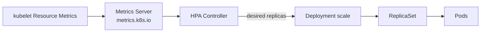

# 14. HPA를 이용한 오토스케일링

## HPA의 역할

HorizontalPodAutoscaler는 Metrics를 보고 Deployment·StatefulSet처럼 `scale` Subresource를 제공하는 Workload의 Replica 수를 조절한다.



Metrics Server는 보통 별도로 설치하는 Add-on이다. 장기 Monitoring 저장소가 아니라 HPA와 `kubectl top`에 필요한 Resource Metrics API를 제공한다.

## 기본 계산

HPA의 기본 비율 계산은 다음과 같다.

```text
desiredReplicas =
  ceil(currentReplicas × currentMetricValue / desiredMetricValue)
```

현재 Replica 4개, 평균 CPU 80%, 목표 40%라면 계산상 8개를 원한다. 최종 값은 min·max, Missing Metrics, Ready 상태, Tolerance와 Behavior 정책의 영향을 받는다.

## 사전 조건

CPU `Utilization` Target은 사용량을 Container CPU Request로 나눠 계산한다. 대상 Container에 CPU Request가 없으면 해당 Metric이 정의되지 않아 Scaling이 동작하지 않을 수 있다.

```yaml
resources:
  requests:
    cpu: 250m
    memory: 256Mi
  limits:
    cpu: "1"
    memory: 512Mi
```

Startup CPU Spike가 HPA를 흔들지 않도록 startupProbe와 readinessProbe가 실제 초기화 완료 시점을 표현해야 한다.

## autoscaling/v2 YAML

```yaml
apiVersion: autoscaling/v2
kind: HorizontalPodAutoscaler
metadata:
  name: api
  namespace: apps
spec:
  scaleTargetRef:
    apiVersion: apps/v1
    kind: Deployment
    name: api
  minReplicas: 2
  maxReplicas: 20
  metrics:
    - type: Resource
      resource:
        name: cpu
        target:
          type: Utilization
          averageUtilization: 60
```

Memory Utilization도 사용할 수 있지만 Cache나 Heap 특성상 Replica를 줄여도 Memory가 즉시 줄지 않는 애플리케이션에는 Request Rate·Queue Length 같은 Custom 또는 External Metric이 더 적합할 수 있다.

## 상태 확인

```bash
kubectl top pod -n apps
kubectl get hpa -n apps
kubectl describe hpa api -n apps
kubectl get --raw /apis/metrics.k8s.io/v1beta1/nodes
```

예시:

```text
NAME   REFERENCE          TARGETS   MINPODS   MAXPODS   REPLICAS
api    Deployment/api     72%/60%   2         20        6
```

`<unknown>/60%`이면 Metrics API, Pod Request, Container 이름과 HPA Condition을 확인한다.

## behavior

Scaling 속도와 Flapping을 제어한다.

```yaml
spec:
  behavior:
    scaleUp:
      stabilizationWindowSeconds: 0
      selectPolicy: Max
      policies:
        - type: Percent
          value: 100
          periodSeconds: 60
        - type: Pods
          value: 4
          periodSeconds: 60
    scaleDown:
      stabilizationWindowSeconds: 300
      selectPolicy: Min
      policies:
        - type: Percent
          value: 10
          periodSeconds: 60
        - type: Pods
          value: 2
          periodSeconds: 60
```

| Field | 의미 |
|---|---|
| `stabilizationWindowSeconds` | 과거 Recommendation을 고려해 급격한 변동 완화 |
| `policies.type: Pods` | 기간당 고정 Pod 수만큼 변경 |
| `policies.type: Percent` | 기간당 현재 Replica 비율만큼 변경 |
| `selectPolicy: Max` | 허용 변화량이 가장 큰 Policy 선택 |
| `selectPolicy: Min` | 허용 변화량이 가장 작은 Policy 선택 |
| `selectPolicy: Disabled` | 해당 방향 Scaling 중지 |

Scale Down Window에서 HPA는 지정 기간의 Recommendation 중 높은 값을 사용해 급격한 축소를 늦춘다.

## 여러 Metrics

```yaml
spec:
  metrics:
    - type: Resource
      resource:
        name: cpu
        target:
          type: Utilization
          averageUtilization: 60
    - type: External
      external:
        metric:
          name: queue_messages_ready
        target:
          type: AverageValue
          averageValue: "20"
```

여러 Metric은 각각 원하는 Replica 수를 계산하고 가장 큰 값을 선택한다. 일부 Metric 조회가 실패하고 나머지가 Scale Down을 제안하면 안전을 위해 축소가 건너뛰어질 수 있지만 Scale Up은 가능하다.

Custom·External Metrics는 Metrics Adapter가 필요하며 Metric 이름, Label Cardinality, 누락과 지연에 대한 실패 정책을 운영해야 한다.

## Container Resource Metric

Sidecar 사용량을 제외하고 App Container CPU만 기준으로 확장할 수 있다.

```yaml
metrics:
  - type: ContainerResource
    containerResource:
      name: cpu
      container: api
      target:
        type: Utilization
        averageUtilization: 60
```

Container Resource Metric은 Kubernetes 1.30부터 Stable이다. Rollout에서 Container 이름을 바꾸면 HPA도 함께 변경하고 구·신 Pod가 섞인 기간을 고려한다.

## Deployment·Jenkins와의 관계

HPA가 Deployment의 `spec.replicas`를 관리할 때 Jenkins Manifest Apply나 GitOps가 고정 Replica 값을 반복 적용하면 서로 값을 덮어쓸 수 있다.

- HPA를 적용한 뒤 Deployment Manifest에서 `spec.replicas` 관리 주체를 명확히 한다.
- 배포 직후 HPA가 새 Pod의 Startup Metric을 오해하지 않도록 Probe를 구성한다.
- `maxReplicas`까지 늘어날 CPU·Memory Request가 ResourceQuota와 Node에 들어가는지 확인한다.
- HPA는 Node를 만들지 않으므로 Cluster Autoscaler 또는 Node Autoscaling과 별도로 연동한다.

## HPA가 해결하지 않는 것

- 느린 Database나 외부 API 병목
- Pod 하나가 처리할 수 없는 Single-thread 병목
- Stateful Sharding
- Scale-up보다 긴 Image Pull·Startup 시간
- 너무 낮은 ResourceQuota
- Traffic 분산이 되지 않는 Service 구조

부하 시험으로 Replica 증가가 실제 Throughput 증가로 이어지는지 검증한다.

## 현재 운영 기준

- 새 구성은 `autoscaling/v2`를 사용한다.
- CPU Utilization에는 Request 누락을 Admission Policy로 방지한다.
- Scale Down은 Stabilization Window로 보수적으로 설정한다.
- Business Load와 가까운 Metric을 선택하고 Missing Metric Alert를 둔다.
- HPA Condition, Desired/Current Replica와 Workload Latency를 함께 관찰한다.
- Metrics Server는 지원되는 Release와 TLS 설정으로 유지한다.

## 참고 자료

- [Horizontal Pod Autoscaling](https://kubernetes.io/docs/concepts/workloads/autoscaling/horizontal-pod-autoscale/)
- [Resource Metrics Pipeline](https://kubernetes.io/docs/tasks/debug/debug-cluster/resource-metrics-pipeline/)
- [HPA Walkthrough](https://kubernetes.io/docs/tasks/run-application/horizontal-pod-autoscale-walkthrough/)
