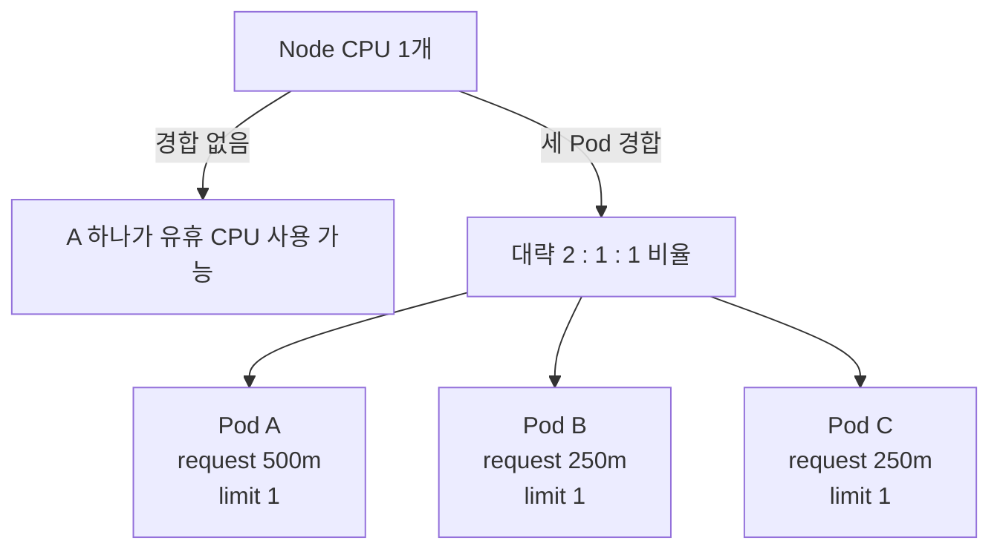
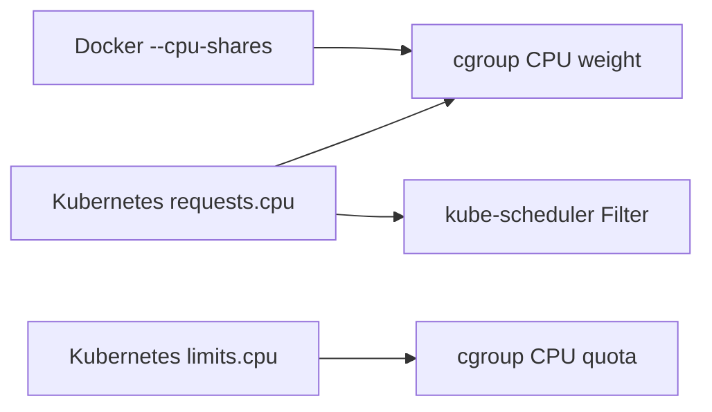
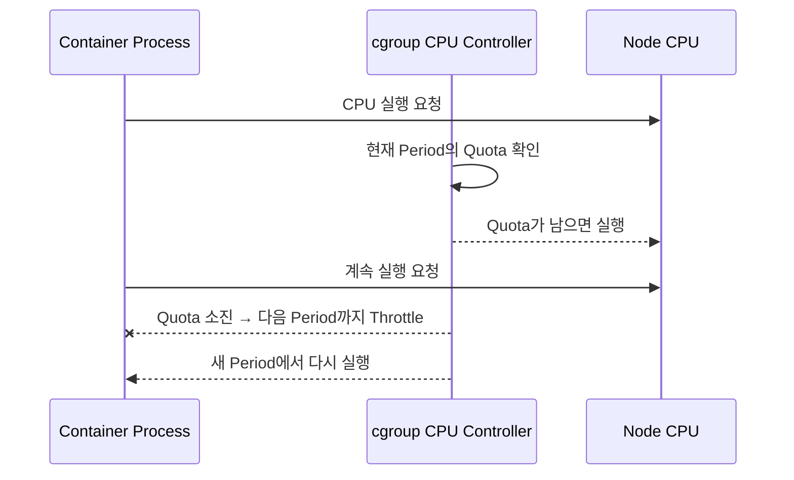
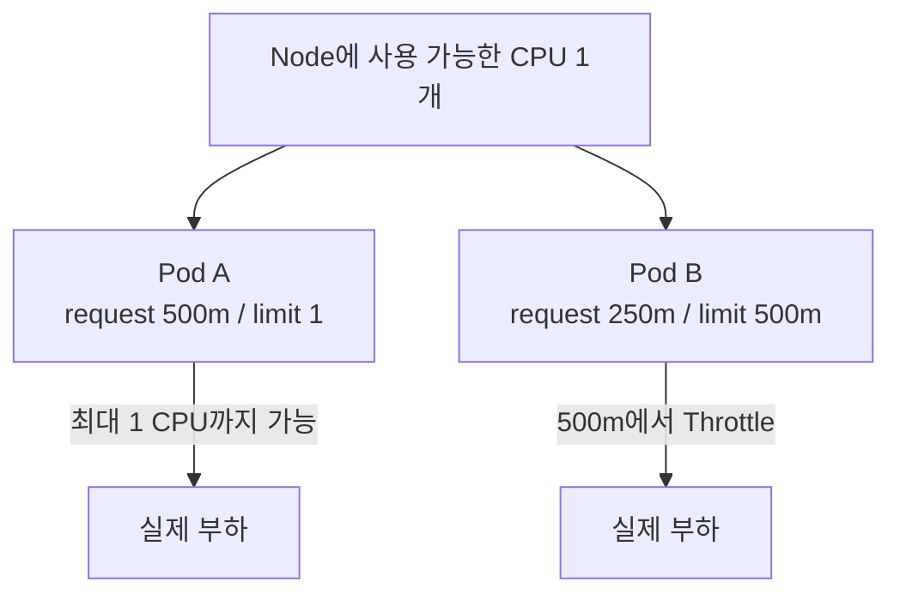

# 2. CPU 제한과 경합

## CPU Request의 원리

Linux Node에서 Kubernetes는 Container의 CPU Request를 cgroup CPU Weight로 변환해 경합 시 상대적인 실행 기회를 정한다. CPU가 남아 있을 때 Request는 절대 상한이 아니다.



실제 비율은 cgroup 구성, 다른 Process와 Kernel Scheduling의 영향을 받지만 Request가 경합 시 가중치라는 핵심은 같다.

## Docker의 cpu-shares와 비교

| Docker | Kubernetes | 공통점과 차이 |
|---|---|---|
| `--cpu-shares` | `resources.requests.cpu` | 경합 시 상대적 CPU Weight |
| `--cpus` | `resources.limits.cpu` | 일정 기간에 사용할 CPU 시간 상한 |
| 직접 Container 실행 기준 | Scheduling과 Runtime 정책을 함께 표현 | Kubernetes Request는 Node 배치에도 사용 |



Docker의 Share 값과 Kubernetes millicpu가 같은 숫자로 직접 대응하는 것은 아니다. 둘 다 상대 Weight로 귀결되지만 Orchestrator가 Scheduling에 사용하는지는 다르다.

## CPU Limit과 Throttling

CPU Limit은 cgroup이 일정 시간 구간에 허용하는 CPU 실행량을 제한한다. 예를 들어 `500m`은 긴 시간 평균으로 CPU 절반에 해당하는 실행 시간을 허용한다.



CPU Limit 초과는 OOM처럼 Container를 종료하지 않는다. Latency가 커지고 처리량이 떨어지며 `container_cpu_cfs_throttled_seconds_total` 같은 Runtime Metric에 나타날 수 있다.

## 두 Pod가 경합하는 상황

```yaml
apiVersion: v1
kind: Pod
metadata:
  name: cpu-a
spec:
  containers:
    - name: app
      image: ghcr.io/example/cpu-demo:1.0.0
      resources:
        requests:
          cpu: 500m
        limits:
          cpu: "1"
---
apiVersion: v1
kind: Pod
metadata:
  name: cpu-b
spec:
  containers:
    - name: app
      image: ghcr.io/example/cpu-demo:1.0.0
      resources:
        requests:
          cpu: 250m
        limits:
          cpu: 500m
```



- Pod B는 Node CPU가 남아도 Limit 500m 때문에 그 이상 지속 사용하지 못한다.
- 둘이 경합하면 Request가 A에 더 큰 Weight를 준다.
- A도 Limit 1을 넘는 실행 시간은 얻지 못한다.
- Scheduler는 두 Request 합계 750m를 배치 판단에 사용한다.

## CPU Limit을 항상 써야 하는가

하나의 정답은 없다.

| 전략 | 장점 | 주의점 |
|---|---|---|
| Request와 Limit 모두 설정 | 폭주한 Workload가 CPU를 독점하지 못함 | 너무 낮은 Limit은 정상 Peak도 Throttle |
| Request만 설정 | 유휴 CPU를 적극 활용하고 Latency 감소 | 폭주 시 같은 Node의 다른 Workload에 영향 |
| Request=Limit의 정수 CPU | Guaranteed QoS와 Static CPU Manager에서 전용 CPU 가능 | 활용률과 배치 유연성 감소 |

멀티 테넌트, 비용 보호와 신뢰하기 어려운 Workload에는 Limit의 가치가 크다. Latency에 민감하고 잘 관찰되는 서비스는 CPU Request를 정확히 두고 CPU Limit을 생략하는 전략도 검토한다. 정책은 Cluster 전체에서 일관되게 정하고 부하 시험으로 확인한다.

## 확인 항목

```bash
kubectl top pod -n apps --containers
kubectl describe pod cpu-a -n apps
kubectl get pod cpu-a -n apps -o yaml
```

Monitoring에서는 다음을 함께 본다.

- CPU Usage와 Request 대비 Utilization
- CPU Limit 대비 Usage
- Throttled Period와 Throttled Seconds
- 애플리케이션 P95·P99 Latency
- Node CPU Saturation과 Run Queue

Usage가 Limit보다 낮아 보여도 짧은 Burst 구간에 Throttling이 발생할 수 있다. 평균 CPU만으로 Limit이 충분하다고 단정하지 않는다.

## 참고 자료

- [CPU Requests and Limits](https://kubernetes.io/docs/concepts/configuration/manage-resources-containers/#meaning-of-cpu)
- [Assign CPU Resources](https://kubernetes.io/docs/tasks/configure-pod-container/assign-cpu-resource/)

