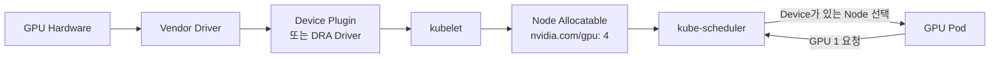
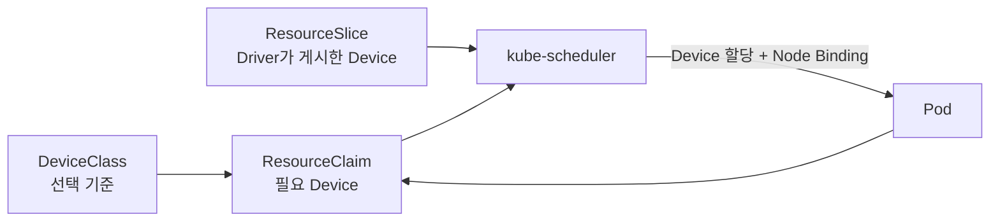

# 3. GPU와 확장 리소스

## Kubernetes가 GPU를 인식하는 구조

Kubernetes Core가 GPU Driver를 직접 설치하지 않는다. Node에 Vendor Driver와 Device Plugin 또는 DRA Driver가 있어야 사용 가능한 Device가 Node Resource로 게시된다.



Driver, Container Runtime Integration, Plugin과 Monitoring Exporter의 Version Compatibility를 함께 관리한다.

## Device Plugin 방식

Vendor Device Plugin이 `nvidia.com/gpu` 같은 Extended Resource를 게시한다고 가정한다.

```yaml
apiVersion: v1
kind: Pod
metadata:
  name: gpu-worker
  namespace: ml
spec:
  restartPolicy: Never
  containers:
    - name: trainer
      image: ghcr.io/example/trainer:1.0.0
      resources:
        limits:
          nvidia.com/gpu: "1"
```

Extended Resource는 정수 단위이며 Overcommit할 수 없다.

- GPU는 `limits`에 지정한다.
- `requests`도 함께 쓰면 같은 값이어야 한다.
- Request를 생략하면 Limit이 Scheduling Request로 사용된다.
- `0.5` GPU 같은 공유는 기본 Extended Resource 모델이 제공하지 않는다.

MIG, Time Slicing과 vGPU는 Vendor Plugin 기능이다. 같은 `nvidia.com/gpu: 1`이라도 실제 격리와 성능 보장은 Plugin 설정에 따라 달라진다.

## GPU Node 선택

GPU Resource 요청만으로도 GPU가 없는 Node는 Filter에서 제외된다. 특정 모델이나 Node Pool까지 고르려면 관리자가 신뢰할 수 있는 Label을 추가하고 Node Affinity를 사용한다.

```yaml
spec:
  affinity:
    nodeAffinity:
      requiredDuringSchedulingIgnoredDuringExecution:
        nodeSelectorTerms:
          - matchExpressions:
              - key: accelerator.example.com/model
                operator: In
                values:
                  - h100
  containers:
    - name: trainer
      image: ghcr.io/example/trainer:1.0.0
      resources:
        limits:
          nvidia.com/gpu: "1"
```

전용 GPU Node에는 Taint를 두고 GPU Workload에만 Toleration을 부여하면 일반 Pod가 고가의 Node를 점유하는 일을 줄일 수 있다.

## Dynamic Resource Allocation

Kubernetes 1.36에서 DRA 핵심 기능은 Stable이며 `DeviceClass`, `ResourceClaim`과 Driver를 통해 Device 속성, 선택과 할당 상태를 더 구조적으로 표현한다.



```yaml
apiVersion: resource.k8s.io/v1
kind: DeviceClass
metadata:
  name: gpu.example.com
spec:
  selectors:
    - cel:
        expression: device.driver == "gpu.example.com"
```

DRA Core API가 Stable이어도 실제 사용 가능 여부는 Vendor DRA Driver의 지원 범위에 달려 있다. Device Health Monitoring, Consumable Capacity와 Extended Resource 연동 같은 Kubernetes 1.36의 일부 확장 기능은 Beta이므로 각각의 Feature State도 확인한다. 현재 운영 중인 Device Plugin을 무조건 교체하지 않고, 새 Cluster나 Device 요구사항에서 Driver 성숙도·Upgrade·RBAC·관측성을 검증한 뒤 선택한다.

## Scheduling과 실패 원인

```bash
kubectl describe node gpu-worker-1
kubectl get pod gpu-worker -n ml -o wide
kubectl describe pod gpu-worker -n ml
```

예시 Node Resource:

```text
Capacity:
  nvidia.com/gpu: 4
Allocatable:
  nvidia.com/gpu: 4
Allocated resources:
  nvidia.com/gpu  3  75%
```

Pending Event 예시:

```text
0/3 nodes are available:
2 Insufficient nvidia.com/gpu,
1 node(s) didn't match Pod's node affinity.
```

GPU가 `Capacity`에 없다면 Pod YAML보다 먼저 Node Driver와 Plugin 상태를 확인한다. Allocatable은 있지만 Container에서 Device가 보이지 않으면 Runtime Integration과 Plugin Allocate 결과를 확인한다.

## GPU 운영 체크리스트

- Kubernetes, OS Kernel, GPU Driver, Runtime과 Plugin Version Matrix를 고정한다.
- Plugin DaemonSet Image는 `latest` 대신 Version 또는 Digest로 고정한다.
- GPU Utilization뿐 아니라 Memory, Temperature, ECC Error와 Device Health를 수집한다.
- Job 실패 후 Device가 정상 반환되는지 확인한다.
- Node Upgrade 전 Drain 가능 여부와 장시간 Training Checkpoint 전략을 정한다.
- Fractional GPU는 이름만 보고 격리를 가정하지 말고 Vendor 구현을 검증한다.
- DRA Driver에는 ResourceClaim Status용 최소 RBAC만 부여한다.

## 참고 자료

- [Schedule GPUs](https://kubernetes.io/docs/tasks/manage-gpus/scheduling-gpus/)
- [Device Plugins](https://kubernetes.io/docs/concepts/extend-kubernetes/compute-storage-net/device-plugins/)
- [Dynamic Resource Allocation](https://kubernetes.io/docs/concepts/scheduling-eviction/dynamic-resource-allocation/)
