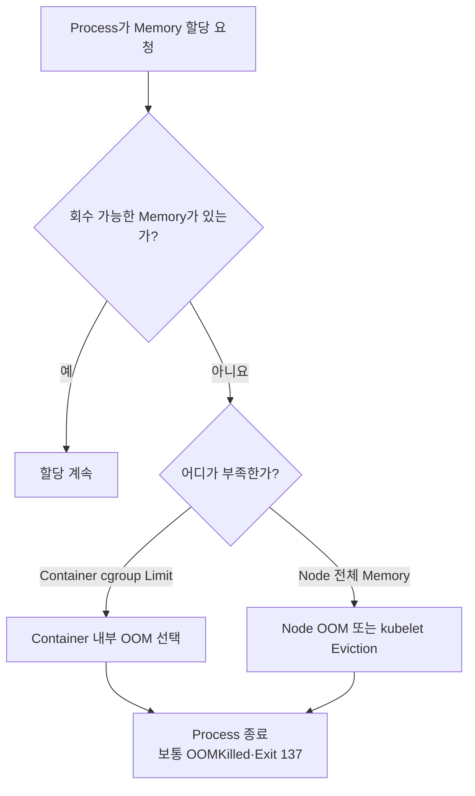
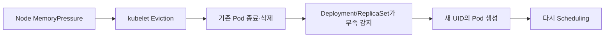

# 4. QoS와 메모리 OOM

## QoS란?

QoS, Quality of Service Class는 Pod의 CPU·Memory Request와 Limit 관계를 바탕으로 Kubernetes가 자동 분류하는 등급이다. 사용자가 `qosClass`를 직접 적는 방식이 아니다.

| QoS Class | 조건 | Node Memory 압력 시 상대적 보호 |
|---|---|---|
| `Guaranteed` | 모든 Container의 CPU·Memory Request와 Limit이 존재하고 각각 동일 | 가장 높음 |
| `Burstable` | Guaranteed가 아니며 하나 이상의 Request 또는 Limit 존재 | 중간 |
| `BestEffort` | 모든 Container에 CPU·Memory Request와 Limit 없음 | 가장 낮음 |

```bash
kubectl get pod -n apps \
  -o custom-columns=NAME:.metadata.name,QOS:.status.qosClass
```

## Guaranteed Class

Pod의 모든 Container에 CPU와 Memory를 빠짐없이 동일하게 지정한다. Sidecar가 하나라도 조건을 만족하지 못하면 Pod 전체가 Guaranteed가 아니다.

```yaml
apiVersion: v1
kind: Pod
metadata:
  name: guaranteed-api
  namespace: apps
spec:
  containers:
    - name: api
      image: ghcr.io/example/api:1.0.0
      resources:
        requests:
          cpu: "1"
          memory: 1Gi
        limits:
          cpu: "1"
          memory: 1Gi
```

예상 결과:

```text
NAME             QOS
guaranteed-api   Guaranteed
```

Guaranteed는 “절대로 종료되지 않는다”는 뜻이 아니다. 자신의 Memory Limit을 넘으면 OOM Kill될 수 있고, Node에 더 이상 회수할 자원이 없으면 Eviction 대상이 될 수도 있다.

## BestEffort Class

```yaml
apiVersion: v1
kind: Pod
metadata:
  name: best-effort-worker
spec:
  containers:
    - name: worker
      image: ghcr.io/example/worker:1.0.0
```

Scheduling을 위한 자원 보장이 없고 Node Memory 압력 시 먼저 Eviction될 가능성이 높다. 중요한 Production Service에는 일반적으로 적합하지 않다.

## Burstable Class

```yaml
apiVersion: v1
kind: Pod
metadata:
  name: burstable-api
spec:
  containers:
    - name: api
      image: ghcr.io/example/api:1.0.0
      resources:
        requests:
          cpu: 250m
          memory: 256Mi
        limits:
          cpu: "1"
          memory: 512Mi
```

정상 사용량을 Request로 예약하고 여유가 있을 때 Limit까지 Burst하는 가장 일반적인 형태다.

## Linux OOM Killer

Linux는 Memory를 더 확보할 수 없을 때 OOM Killer로 Process를 종료해 System 전체 정지를 피한다. cgroup의 Memory Limit을 넘는 경우에는 해당 cgroup 안에서 OOM이 발생할 수 있다.



Kubernetes는 QoS와 Request를 바탕으로 Linux `oom_score_adj`에 영향을 주어 어떤 Process를 보호할지 조정한다. 그래도 Kernel의 최종 선택에는 실제 Memory 사용량과 System 상태가 함께 반영된다.

## OOM 재시작과 Eviction의 차이

### Container OOM

Memory Limit을 넘겨 Main Process가 종료되면 Container 상태에 `OOMKilled`가 나타난다. Pod의 `restartPolicy`가 허용하면 kubelet이 같은 Pod 안에서 Container를 재시작한다.

```text
Last State:  Terminated
Reason:      OOMKilled
Exit Code:   137
Restart Count: 4
```

### Node-pressure Eviction

kubelet이 Node Memory 압력을 감지하면 Pod 전체를 Eviction한다. 같은 Pod가 다른 Node로 이동하는 것이 아니라 기존 Pod가 삭제되고 Deployment 같은 Controller가 새 UID의 Pod를 만든다.



`restartPolicy`는 Container 재시작 정책이지 Evicted Pod를 복원하는 Controller가 아니다.

## Memory 압력에서의 순서

단순히 QoS 이름만으로 고정 순서가 결정되지는 않는다. Node-pressure Eviction은 Resource 사용이 Request를 초과했는지, Priority와 사용량 등을 함께 평가한다. 일반적으로 BestEffort, Request를 초과한 Burstable, Guaranteed 순으로 보호가 커진다.

QoS는 Scheduler의 일반 Node 선택 점수나 PriorityClass를 대체하지 않는다. 높은 Priority의 BestEffort Pod와 낮은 Priority의 Guaranteed Pod가 섞이면 Priority도 Eviction 결정에 영향을 준다.

## 자원 Overcommit의 필요성과 위험

모든 서비스의 Peak만큼 Memory를 Request로 잡으면 Cluster 활용률과 비용이 낮아진다. 평균과 Peak의 차이를 이용해 Overcommit하되 다음 안전장치를 둔다.

- 서비스별 실제 Working Set과 Peak를 장기간 측정한다.
- Memory Request를 지나치게 낮춰 QoS 보호를 잃지 않는다.
- OOM 후 안전하게 재시작할 수 있도록 Stateless와 Checkpoint를 설계한다.
- Node System Reserved와 Eviction Threshold 여유를 남긴다.
- PDB는 Node-pressure 같은 비자발적 중단을 막지 못한다.
- Memory Leak Alert와 Restart 증가를 함께 관찰한다.

## 확인 순서

```bash
kubectl get pod burstable-api \
  -o jsonpath='{.status.qosClass}{"\n"}'

kubectl describe pod burstable-api
kubectl get pod burstable-api \
  -o jsonpath='{.status.containerStatuses[*].lastState}{"\n"}'

kubectl describe node worker-1
kubectl get events --sort-by=.lastTimestamp
```

`OOMKilled`인지 `Evicted`인지 먼저 구분하고, Memory Limit·실제 Working Set·Node `MemoryPressure`·애플리케이션 Heap 설정을 함께 확인한다.

## 참고 자료

- [Pod Quality of Service Classes](https://kubernetes.io/docs/concepts/workloads/pods/pod-qos/)
- [Node-pressure Eviction](https://kubernetes.io/docs/concepts/scheduling-eviction/node-pressure-eviction/)
- [Memory Requests and Limits](https://kubernetes.io/docs/concepts/configuration/manage-resources-containers/#meaning-of-memory)

