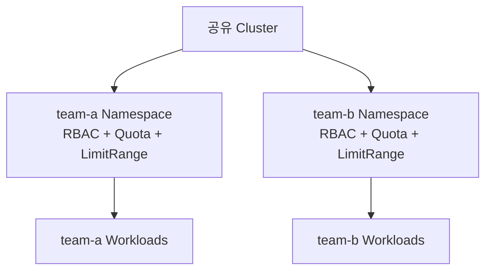

# 5. ResourceQuota와 LimitRange

## Namespace 공유 Cluster에서 필요한 이유

개발팀마다 Cluster를 분리하면 격리는 쉽지만 Provisioning·Upgrade·Monitoring 비용이 커진다. 공유 Cluster에서는 Namespace와 RBAC으로 API 접근 범위를 나누고, ResourceQuota와 LimitRange로 자원 소비 범위를 제한한다.



Namespace는 강한 보안 경계가 아니므로 NetworkPolicy, Pod Security, Secret·Node 격리도 별도로 설계한다.

## ResourceQuota와 LimitRange 비교

| Resource | 범위 | 목적 |
|---|---|---|
| ResourceQuota | Namespace 전체 합계 | CPU·Memory·Storage 총량과 Object 개수 제한 |
| LimitRange | 개별 Container·Pod·PVC | Default 주입, 최소·최대와 Limit/Request 비율 제한 |

Quota만 두면 한 Container가 Namespace 총량을 독점할 수 있다. LimitRange만 두면 작은 Pod를 매우 많이 만들어 총량을 초과할 수 있다. 보통 둘을 함께 사용한다.

## ResourceQuota로 자원 총합 제한

```yaml
apiVersion: v1
kind: ResourceQuota
metadata:
  name: team-a-compute
  namespace: team-a
spec:
  hard:
    requests.cpu: "8"
    requests.memory: 16Gi
    limits.cpu: "16"
    limits.memory: 32Gi
    requests.storage: 500Gi
    persistentvolumeclaims: "20"
```

Namespace에 CPU·Memory Quota가 있으면 새 Pod가 해당 Request나 Limit을 명시하지 않아 거부될 수 있다. LimitRange Default를 함께 사용하거나 팀 Manifest에 명시하도록 정책화한다.

```bash
kubectl get resourcequota -n team-a
kubectl describe resourcequota team-a-compute -n team-a
```

예시 결과:

```text
Resource          Used    Hard
requests.cpu      3500m   8
requests.memory   6Gi     16Gi
limits.cpu        8       16
limits.memory     12Gi    32Gi
```

ResourceQuota Controller의 사용량 반영에는 짧은 지연이 있을 수 있지만 Admission은 동시 생성으로 Quota가 초과되지 않도록 관리한다.

## Object 개수 제한

```yaml
apiVersion: v1
kind: ResourceQuota
metadata:
  name: team-a-objects
  namespace: team-a
spec:
  hard:
    count/deployments.apps: "20"
    count/pods: "80"
    count/services: "30"
    count/configmaps: "100"
    count/secrets: "100"
    count/persistentvolumeclaims: "20"
    services.nodeports: "5"
    services.loadbalancers: "3"
```

`pods` 같은 전용 이름과 `count/<resource>.<group>` 형식이 있다. PersistentVolume은 Cluster-scoped이므로 Namespace ResourceQuota로 팀별 PV 개수를 직접 제한할 수 없다. 대신 PVC 개수·Storage Request·StorageClass별 Quota와 Storage Provisioning Policy로 통제한다.

Object 수가 많으면 etcd, Controller와 API Server에도 부담이 된다. Secret과 ConfigMap 개수 Quota는 무제한 Object 생성 방지에도 도움이 된다.

## BestEffort Pod 개수 제한

```yaml
apiVersion: v1
kind: ResourceQuota
metadata:
  name: best-effort-pods
  namespace: team-a
spec:
  scopes:
    - BestEffort
  hard:
    pods: "5"
```

이 Quota는 QoS가 BestEffort인 Pod만 계산한다. 중요한 Workload에 Request를 쓰도록 유도하면서 실험용 BestEffort Pod를 소수 허용할 때 사용할 수 있다.

## LimitRange Default와 제약

```yaml
apiVersion: v1
kind: LimitRange
metadata:
  name: team-a-container-limits
  namespace: team-a
spec:
  limits:
    - type: Container
      defaultRequest:
        cpu: 100m
        memory: 128Mi
      default:
        cpu: 500m
        memory: 512Mi
      min:
        cpu: 50m
        memory: 64Mi
      max:
        cpu: "2"
        memory: 2Gi
      maxLimitRequestRatio:
        cpu: "10"
        memory: "4"
```

| Field | 의미 |
|---|---|
| `defaultRequest` | Request가 없을 때 Admission이 주입 |
| `default` | Limit이 없을 때 Admission이 주입 |
| `min` | 개별 대상이 가져야 하는 최소 Request 또는 Limit |
| `max` | 개별 대상이 가질 수 있는 최대 Request 또는 Limit |
| `maxLimitRequestRatio` | `limit / request`가 넘을 수 없는 최대 비율 |
| `type` | `Container`, `Pod` 또는 `PersistentVolumeClaim` |

LimitRange는 이미 실행 중인 Pod를 소급 변경하지 않는다. 여러 LimitRange에서 Default를 중복 정의하면 어떤 Default가 적용되는지 비결정적일 수 있으므로 Namespace별 책임을 하나로 정리한다.

## PVC LimitRange 예시

```yaml
apiVersion: v1
kind: LimitRange
metadata:
  name: pvc-size
  namespace: team-a
spec:
  limits:
    - type: PersistentVolumeClaim
      min:
        storage: 1Gi
      max:
        storage: 100Gi
```

PVC 하나의 요청 크기는 제한하지만 Namespace 전체 Storage 합계는 ResourceQuota `requests.storage`가 담당한다.

## 거부 결과 확인

```bash
kubectl apply --dry-run=server -f workload.yaml
kubectl get limitrange,resourcequota -n team-a
kubectl describe limitrange team-a-container-limits -n team-a
kubectl describe resourcequota team-a-compute -n team-a
```

제약을 넘으면 API Server가 다음과 비슷한 오류를 반환한다.

```text
Error from server (Forbidden): pods "large-api" is forbidden:
maximum cpu usage per Container is 2, but limit is 4
```

Client-side Dry Run은 Admission을 거치지 않으므로 정책 검증에는 `--dry-run=server`를 사용한다.

## 현재 운영 기준

- Default는 안전망이며 실제 서비스 값은 측정해 Manifest에 명시한다.
- 팀별 Quota를 Cluster Allocatable 총량과 동일하게 합산하지 않고 System·장애 여유를 둔다.
- HPA의 `maxReplicas`가 Quota 안에서 실제로 확장 가능한지 계산한다.
- 새 API Resource를 도입하면 Object Count Quota 대상도 검토한다.
- Quota 사용률을 Alert하고 배포 직전에 처음 알게 하지 않는다.
- Platform Team과 개발팀이 Quota 상향 절차와 비용 책임을 합의한다.

## 참고 자료

- [Resource Quotas](https://kubernetes.io/docs/concepts/policy/resource-quotas/)
- [Limit Ranges](https://kubernetes.io/docs/concepts/policy/limit-range/)

