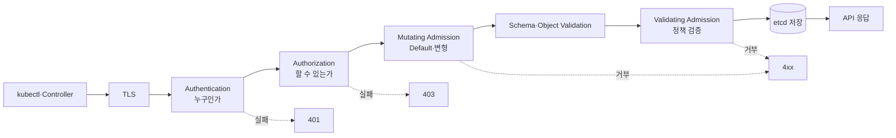
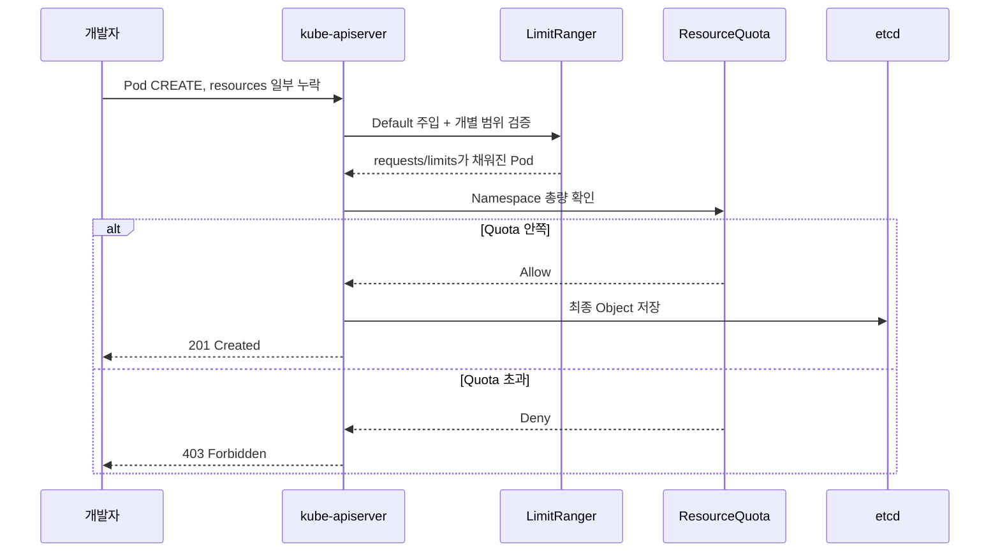

# 6. Admission 과정과 AdmissionPolicy

## API 요청이 저장되기까지

Admission은 인증·인가가 끝난 뒤 Object를 저장하기 전에 실행된다.



Mutating 단계에서 Object가 바뀔 수 있으므로 Validating 단계는 최종 형태를 검사한다. 정확한 내부 순서는 요청 종류와 Plugin에 따라 세부 차이가 있지만 “인증 → 인가 → Admission → 저장”의 경계가 중요하다.

## ResourceQuota와 LimitRange의 원리

- `LimitRanger` Admission Plugin은 누락된 Default Request·Limit을 주입하고 min·max·ratio를 검증한다.
- `ResourceQuota` Admission Plugin은 새 Object가 Namespace Quota를 넘는지 검증한다.
- 두 정책은 API Server가 요청을 받아들이는 시점에 적용된다.
- 기존 Pod를 나중에 자동 변경하거나 종료하지 않는다.



## Admission Controller와 AdmissionPolicy

`ValidatingAdmissionPolicy`가 모든 Admission Controller를 대체하는 것은 아니다.

| 방식 | 적합한 역할 |
|---|---|
| Built-in Admission Plugin | ResourceQuota, LimitRanger, NamespaceLifecycle 같은 Kubernetes 내장 기능 |
| ValidatingAdmissionPolicy | CEL로 표현 가능한 Custom 검증 |
| MutatingAdmissionPolicy | CEL 기반 Custom 변형이 필요한 경우, Cluster Version 지원 확인 |
| Admission Webhook | 외부 조회나 복잡한 로직이 꼭 필요한 검증·변형 |

ValidatingAdmissionPolicy는 Kubernetes 1.30부터 Stable인 In-process 대안이므로 단순 검증이라면 외부 Webhook보다 운영 구성 요소가 적다.

## Resource를 요구하는 ValidatingAdmissionPolicy

다음 정책은 `apps` Namespace에 생성·수정하는 Pod의 모든 일반 Container가 CPU·Memory Request를 갖도록 검증한다.

```yaml
apiVersion: admissionregistration.k8s.io/v1
kind: ValidatingAdmissionPolicy
metadata:
  name: require-container-requests.example.com
spec:
  failurePolicy: Fail
  matchConstraints:
    resourceRules:
      - apiGroups:
          - ""
        apiVersions:
          - v1
        operations:
          - CREATE
          - UPDATE
        resources:
          - pods
  validations:
    - expression: >-
        object.spec.containers.all(c,
          has(c.resources) &&
          has(c.resources.requests) &&
          has(c.resources.requests.cpu) &&
          has(c.resources.requests.memory))
      message: 모든 Container에 CPU와 Memory requests를 지정해야 합니다.
```

Policy만 만들면 적용되지 않는다. Binding이 대상과 Enforcement 동작을 연결한다.

```yaml
apiVersion: admissionregistration.k8s.io/v1
kind: ValidatingAdmissionPolicyBinding
metadata:
  name: require-container-requests-apps
spec:
  policyName: require-container-requests.example.com
  validationActions:
    - Deny
    - Audit
  matchResources:
    namespaceSelector:
      matchLabels:
        policy.example.com/resource-requests: required
```

`validationActions`에는 `Deny`, `Warn`과 `Audit`을 목적에 맞게 사용한다. 새 정책은 먼저 Audit 또는 Warn으로 영향 범위를 확인한 뒤 Deny로 전환하는 단계적 배포가 안전하다.

## 정책 확인

```bash
kubectl get validatingadmissionpolicy
kubectl get validatingadmissionpolicybinding
kubectl describe validatingadmissionpolicy \
  require-container-requests.example.com

kubectl apply --dry-run=server -f pod-without-requests.yaml
```

예상 거부:

```text
The pods "api" is invalid:
ValidatingAdmissionPolicy 'require-container-requests.example.com'
denied request: 모든 Container에 CPU와 Memory requests를 지정해야 합니다.
```

Policy의 `status.typeChecking`과 Binding 대상 Namespace Label도 함께 확인한다.

## 유지보수 원칙

- Built-in 기능을 CEL로 다시 구현하지 않는다.
- Webhook보다 VAP로 충분한 검증인지 먼저 평가한다.
- `failurePolicy: Fail`은 보호가 강하지만 잘못된 정책이 배포를 막을 수 있으므로 Emergency 절차를 둔다.
- Controller·System Namespace와 Break-glass 경로를 명확히 Scope에서 제외한다.
- CREATE뿐 아니라 UPDATE와 Pod를 직접 만드는 Controller 흐름을 시험한다.
- Server-side Dry Run, Audit, Warn, Deny 순으로 Rollout한다.
- Policy와 Binding에 대한 RBAC을 제한하고 Audit Log를 남긴다.

Kubernetes 1.36의 Manifest 기반 Admission Control은 Alpha이므로 일반 운영 기본값으로 가정하지 않는다. API Object 기반 VAP를 기본으로 설명하고, 삭제 불가능한 Bootstrap 정책이 필요한 특별한 환경에서만 Feature Gate와 Upgrade 영향을 검토한다.

## 참고 자료

- [Admission Control](https://kubernetes.io/docs/reference/access-authn-authz/admission-controllers/)
- [Validating Admission Policy](https://kubernetes.io/docs/reference/access-authn-authz/validating-admission-policy/)
- [Validating and Mutating Admission Policies](https://kubernetes.io/docs/tutorials/cluster-management/admission-policies/)
