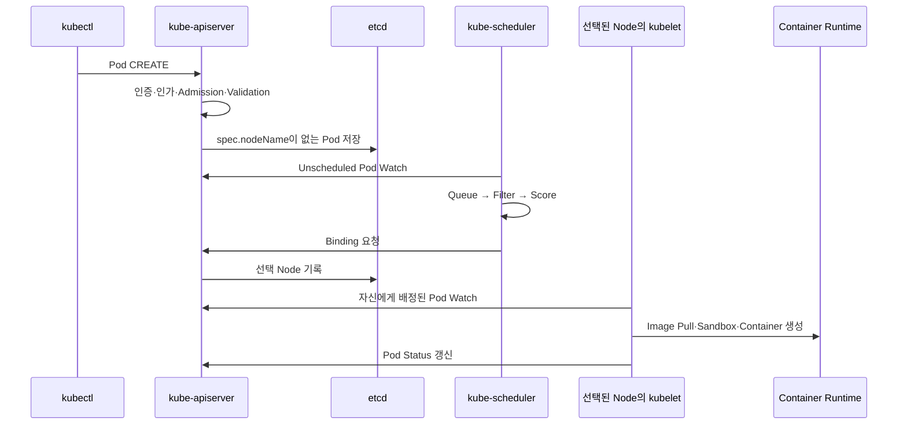
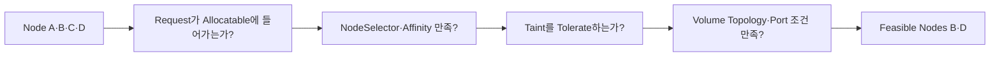
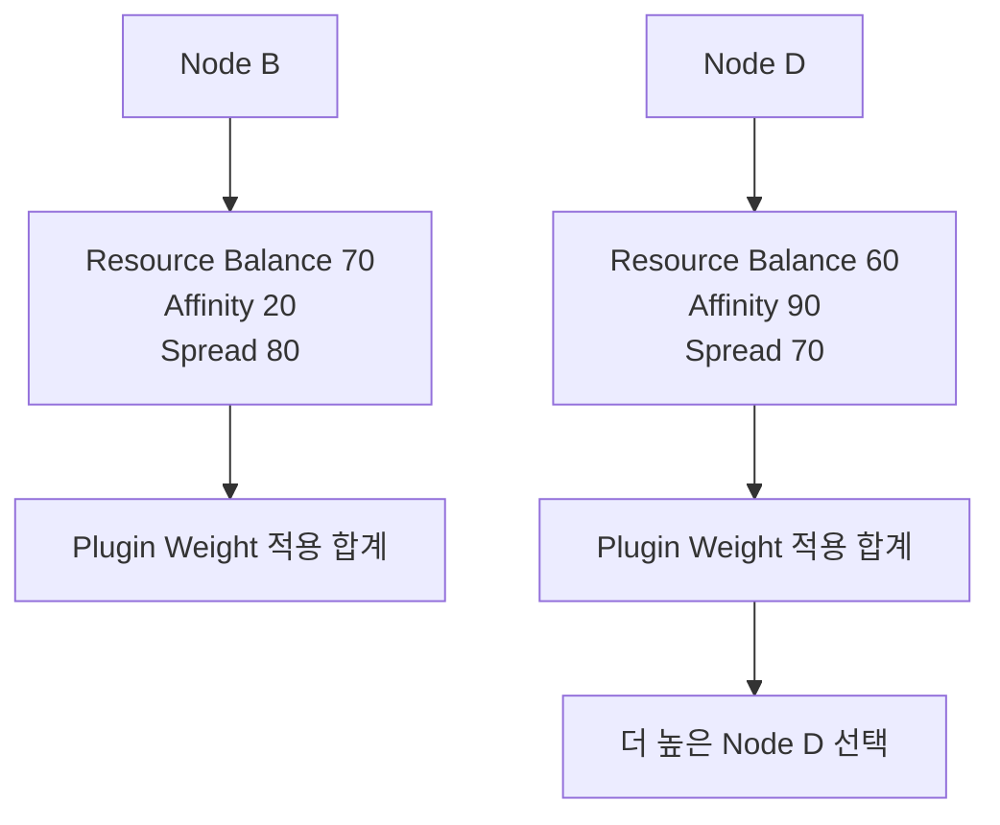

# 7. Pod 스케줄링 과정

## Pod가 Node에서 실행되기까지

Client와 Control Plane 구성 요소는 etcd를 직접 읽고 쓰지 않는다. kube-apiserver를 통해 원하는 상태를 저장하고 Watch한다.



etcd는 상태 저장소이고 Scheduler가 직접 Query하는 Scheduling Database가 아니다. 모든 상태 변경은 API Server의 Validation과 일관성 경계를 지난다.

## Scheduling Queue

새 Pod의 `spec.nodeName`이 비어 있으면 Scheduler 대상이다. Scheduler는 Pod를 Queue에서 꺼내 Scheduling Cycle을 수행한다.

- Active Queue: 지금 Scheduling을 시도할 Pod
- Backoff Queue: 실패 후 일정 시간 기다리는 Pod
- Unschedulable 상태: 조건이 바뀔 때 다시 Queue로 이동할 Pod

Node 추가, Label 변경, 다른 Pod 삭제나 PVC Binding 조건 변화가 Pending Pod의 재시도를 유발할 수 있다.

## Node Filtering

Filter 단계는 “실행 가능한 Node인가?”를 판정한다. 하나라도 필수 조건을 만족하지 않으면 후보에서 제외한다.



Filter 결과가 0개면 Pod는 Pending으로 남는다. Event의 `FailedScheduling` 메시지가 제외 이유를 요약한다.

## Node Scoring

Score 단계는 Filter를 통과한 Node 중 더 적합한 Node를 순위화한다.



실제 점수는 활성화된 Scheduler Plugin과 Profile 설정에 따라 달라진다. 같은 최고 점수 Node가 여러 개면 그중 하나를 선택한다.

## Scheduling Framework 단계

기본 이해에는 Filter와 Score가 핵심이지만 Scheduler 내부는 Plugin Extension Point로 나뉜다.

```text
QueueSort
  → PreFilter
  → Filter
  → PostFilter(필요하면 Preemption)
  → PreScore
  → Score
  → NormalizeScore
  → Reserve
  → Permit
  → PreBind
  → Bind
  → PostBind
```

Custom Scheduler Profile을 운영할 때는 Plugin 순서와 실패 정책이 Cluster 전체 배치에 영향을 주므로 Version 관리와 부하 시험이 필요하다.

## Binding 이후

Binding은 Pod와 Node의 연결을 API Server에 기록한다. kubelet은 자신의 Node에 배정된 Pod를 보고 다음을 수행한다.

1. Volume 준비와 Mount
2. Pod Sandbox와 Network 구성
3. Image Pull
4. Init Container 실행
5. App Container와 Sidecar 시작
6. Probe와 Status 갱신

Scheduling 성공은 Container 실행 성공을 뜻하지 않는다. `ContainerCreating`, `ImagePullBackOff`와 Volume Mount 오류는 Binding 이후 kubelet 단계의 문제다.

## 확인 방법

```bash
kubectl get pod api -n apps -o wide
kubectl get pod api -n apps \
  -o jsonpath='{.spec.nodeName}{"\n"}'
kubectl describe pod api -n apps
kubectl get events -n apps \
  --field-selector involvedObject.name=api \
  --sort-by=.lastTimestamp
```

Pending 예시:

```text
Warning  FailedScheduling  default-scheduler
0/3 nodes are available:
1 Insufficient cpu,
1 node(s) had untolerated taint,
1 node(s) didn't match Pod's node affinity.
```

이 메시지는 후보 Node별 원인을 압축한 것이며 모든 Node가 모든 원인을 가진다는 뜻은 아니다.

## 문제 해결 순서

1. `spec.nodeName`과 Scheduler Name을 확인한다.
2. Pod Event의 `FailedScheduling`을 읽는다.
3. Request와 Node Allocatable·Allocated Request를 비교한다.
4. Node Label, Affinity, Taint·Toleration을 비교한다.
5. PVC, StorageClass와 Volume Topology를 확인한다.
6. Priority·Preemption과 Namespace Quota를 확인한다.
7. Binding 후 문제라면 kubelet·Runtime·CNI·CSI 단계로 전환한다.

실제 CPU 사용률이 낮다는 이유만으로 Scheduling 실패가 이상한 것은 아니다. Scheduler는 Resource Request를 사용한다.

## 참고 자료

- [Kubernetes Scheduler](https://kubernetes.io/docs/concepts/scheduling-eviction/kube-scheduler/)
- [Scheduling Framework](https://kubernetes.io/docs/concepts/scheduling-eviction/scheduling-framework/)

