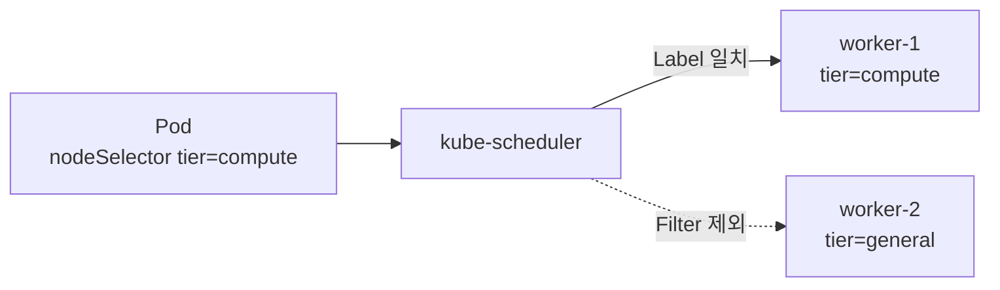

# 8. nodeSelector와 Node Affinity

## 선택 방법 비교

| 방법 | 특징 | 권장 사용 |
|---|---|---|
| `nodeName` | Scheduler를 우회해 정확한 Node 이름 지정 | 진단·특수 Controller 외에는 지양 |
| `nodeSelector` | Label의 정확한 Key=Value 일치 | 단순한 필수 조건 |
| Node Affinity `required...` | 표현식 기반 필수 조건 | 여러 값·연산자가 필요한 필수 조건 |
| Node Affinity `preferred...` | Weight 기반 선호 조건 | 조건이 없어도 실행해야 하는 선호 |

## Node Label

```bash
kubectl label node worker-1 \
  workload.example.com/tier=compute

kubectl get nodes \
  -L workload.example.com/tier,topology.kubernetes.io/zone
```

보안·규제 격리에 사용하는 Label은 손상된 kubelet이 스스로 바꾸지 못하는 Key를 사용한다. Node Authorizer와 NodeRestriction Admission Plugin을 활성화한 환경에서는 `example.com.node-restriction.kubernetes.io/fips=true` 같은 Prefix를 고려한다.

## nodeName

```yaml
spec:
  nodeName: worker-1
  containers:
    - name: debug
      image: registry.k8s.io/pause:3.10
```

`nodeName`은 Label Selector가 아니다. Scheduler의 Filter·Score를 건너뛰고 kubelet에 직접 배정한다. Node가 없거나 자원·Taint 조건이 맞지 않으면 Pod가 실행되지 않을 수 있으므로 일반 배포에는 사용하지 않는다.

## nodeSelector

```yaml
apiVersion: v1
kind: Pod
metadata:
  name: compute-api
spec:
  nodeSelector:
    workload.example.com/tier: compute
  containers:
    - name: api
      image: ghcr.io/example/api:1.0.0
```



`nodeSelector`의 여러 Key는 모두 일치해야 한다.

## required Node Affinity

```yaml
spec:
  affinity:
    nodeAffinity:
      requiredDuringSchedulingIgnoredDuringExecution:
        nodeSelectorTerms:
          - matchExpressions:
              - key: topology.kubernetes.io/zone
                operator: In
                values:
                  - ap-northeast-2a
                  - ap-northeast-2b
              - key: workload.example.com/tier
                operator: In
                values:
                  - compute
```

- 하나의 `nodeSelectorTerm` 안의 Expression은 AND다.
- 여러 `nodeSelectorTerms`는 OR다.
- 충족하는 Node가 없으면 Pod는 Pending이다.
- `IgnoredDuringExecution`은 Scheduling 후 Label이 바뀌어도 실행 중인 Pod를 자동 퇴거하지 않는다는 뜻이다.

## preferred Node Affinity

```yaml
spec:
  affinity:
    nodeAffinity:
      preferredDuringSchedulingIgnoredDuringExecution:
        - weight: 80
          preference:
            matchExpressions:
              - key: workload.example.com/cost
                operator: In
                values:
                  - spot
        - weight: 20
          preference:
            matchExpressions:
              - key: topology.kubernetes.io/zone
                operator: In
                values:
                  - ap-northeast-2a
```

선호 조건은 Score에 더해지며 만족하는 Node가 없어도 다른 필수 조건을 통과한 Node에 배치할 수 있다. Weight는 1~100 범위이며 다른 Score Plugin 결과와 합산된다.

## Affinity Operator

| Operator | 의미 |
|---|---|
| `In` | Label 값이 목록 안에 있음 |
| `NotIn` | Label 값이 목록에 없음 |
| `Exists` | 해당 Key가 존재 |
| `DoesNotExist` | 해당 Key가 없음 |
| `Gt` | Label의 정수 값이 기준보다 큼 |
| `Lt` | Label의 정수 값이 기준보다 작음 |

`Gt`와 `Lt`는 Node Affinity에서만 사용하고 Label 값이 정수로 Parse되어야 한다.

## 필수와 선호를 함께 사용

```yaml
spec:
  nodeSelector:
    kubernetes.io/os: linux
  affinity:
    nodeAffinity:
      requiredDuringSchedulingIgnoredDuringExecution:
        nodeSelectorTerms:
          - matchExpressions:
              - key: workload.example.com/tier
                operator: In
                values:
                  - compute
      preferredDuringSchedulingIgnoredDuringExecution:
        - weight: 100
          preference:
            matchExpressions:
              - key: workload.example.com/cost
                operator: In
                values:
                  - spot
```

`nodeSelector`와 required Affinity는 둘 다 만족해야 한다. 이 예시는 Linux Compute Node만 허용하고 그중 Spot Node를 우선한다.

## 확인과 실패 진단

```bash
kubectl get nodes --show-labels
kubectl get pod compute-api -o wide
kubectl describe pod compute-api
```

예시 Event:

```text
0/4 nodes are available:
4 node(s) didn't match Pod's node affinity/selector.
```

Label 오타, 실제 Cluster에 없는 Zone 값, required 조건의 과도한 결합을 확인한다. Hardware나 Zone이 없을 때도 서비스가 실행되어야 한다면 preferred 조건으로 완화한다.

## 참고 자료

- [Assigning Pods to Nodes](https://kubernetes.io/docs/concepts/scheduling-eviction/assign-pod-node/)
- [Well-Known Labels](https://kubernetes.io/docs/reference/labels-annotations-taints/)

