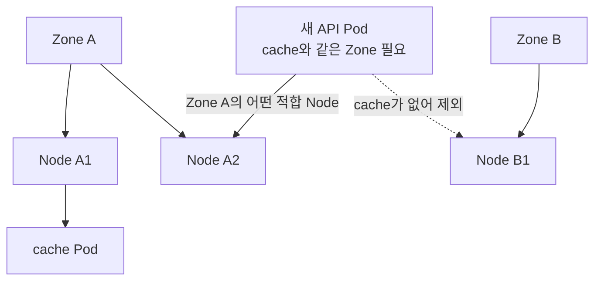
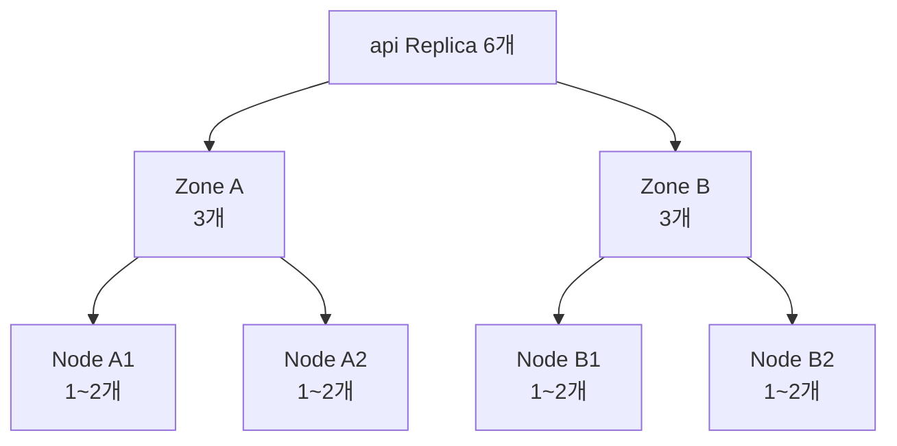

# 9. Pod Affinity와 Topology Spread

## Node Affinity와의 차이

- Node Affinity는 Node Label을 기준으로 선택한다.
- Pod Affinity는 이미 실행 중인 Pod Label과 같은 Topology에 배치한다.
- Pod Anti-Affinity는 특정 Pod와 같은 Topology를 피한다.
- Topology Spread Constraints는 Replica 수의 편차를 직접 제한한다.

Topology는 Node Label Key로 정의한다. 대표적으로 `kubernetes.io/hostname`은 Node, `topology.kubernetes.io/zone`은 Zone을 뜻한다.

## Pod Affinity

Cache Pod가 있는 Zone에 API Pod를 배치하는 예시다.

```yaml
spec:
  affinity:
    podAffinity:
      requiredDuringSchedulingIgnoredDuringExecution:
        - labelSelector:
            matchLabels:
              app: cache
          topologyKey: topology.kubernetes.io/zone
  containers:
    - name: api
      image: ghcr.io/example/api:1.0.0
```



Pod가 반드시 같은 Node에 있어야 한다면 `kubernetes.io/hostname`을 사용한다. 같은 Zone 조건은 같은 Node를 의미하지 않는다.

## Pod Anti-Affinity

같은 앱 Replica를 서로 다른 Node에 배치하는 예시다.

```yaml
spec:
  affinity:
    podAntiAffinity:
      requiredDuringSchedulingIgnoredDuringExecution:
        - labelSelector:
            matchLabels:
              app: api
          topologyKey: kubernetes.io/hostname
```

Replica가 Node 수보다 많거나 Label이 빠진 Node가 있으면 새 Pod가 Pending될 수 있다. 대규모 Cluster의 Inter-pod Affinity는 Scheduling 계산 비용이 크므로 필요한 범위에만 사용한다.

## required와 preferred

| 유형 | Scheduling 단계 | 조건 불충족 |
|---|---|---|
| `requiredDuringSchedulingIgnoredDuringExecution` | Filter | Pending |
| `preferredDuringSchedulingIgnoredDuringExecution` | Score | 다른 Node에도 배치 가능 |

Availability를 위한 분산이 중요해도 Cluster Autoscaler와 장애 상황에서 Pod가 전혀 뜨지 않는 위험을 고려해 preferred 또는 Topology Spread를 선택할 수 있다.

## Namespace 범위

Pod Affinity의 `namespaces`와 `namespaceSelector`를 생략하면 현재 Pod의 Namespace가 대상이다. 빈 `namespaceSelector: {}`는 모든 Namespace를 선택하므로 의도치 않은 Cross-namespace 결합에 주의한다.

## Topology Spread Constraints

Replica를 Zone과 Node에 균등하게 분산하려면 Anti-Affinity보다 `topologySpreadConstraints`가 의도를 더 직접 표현한다.

```yaml
apiVersion: apps/v1
kind: Deployment
metadata:
  name: api
spec:
  replicas: 6
  selector:
    matchLabels:
      app: api
  template:
    metadata:
      labels:
        app: api
    spec:
      topologySpreadConstraints:
        - maxSkew: 1
          topologyKey: topology.kubernetes.io/zone
          whenUnsatisfiable: DoNotSchedule
          labelSelector:
            matchLabels:
              app: api
        - maxSkew: 1
          topologyKey: kubernetes.io/hostname
          whenUnsatisfiable: ScheduleAnyway
          labelSelector:
            matchLabels:
              app: api
      containers:
        - name: api
          image: ghcr.io/example/api:1.0.0
```



| Field | 의미 |
|---|---|
| `maxSkew` | Topology Domain 사이 허용 편차 |
| `topologyKey` | Zone·Node 같은 Domain Key |
| `whenUnsatisfiable` | `DoNotSchedule` 또는 `ScheduleAnyway` |
| `labelSelector` | 분산 계산에 포함할 Pod |

Pod Template Label이 `labelSelector`와 일치하지 않으면 새 Pod 자신이 계산에 포함되지 않는 Ghost Pod 문제가 생길 수 있다.

## 선택 기준

- 특정 Backend와 가까워야 한다: Pod Affinity
- 같은 앱을 절대 같은 Node에 두지 않는다: required Pod Anti-Affinity
- Replica를 Zone·Node에 고르게 편다: Topology Spread
- 장애 시에도 Scheduling을 우선한다: preferred 또는 `ScheduleAnyway`

Topology Spread는 Scale Down 후 자동으로 기존 Pod를 재배치하지 않는다. 지속적인 불균형 교정이 필요하면 Descheduler를 별도 검토한다.

## 확인

```bash
kubectl get pod -n apps \
  -l app=api \
  -o custom-columns=NAME:.metadata.name,NODE:.spec.nodeName

kubectl get nodes \
  -L topology.kubernetes.io/zone

kubectl describe pod -n apps -l app=api
```

모든 Node가 사용하는 `topologyKey` Label을 일관되게 가지고 있는지 먼저 확인한다.

## 참고 자료

- [Inter-pod Affinity and Anti-affinity](https://kubernetes.io/docs/concepts/scheduling-eviction/assign-pod-node/#inter-pod-affinity-and-anti-affinity)
- [Pod Topology Spread Constraints](https://kubernetes.io/docs/concepts/scheduling-eviction/topology-spread-constraints/)

