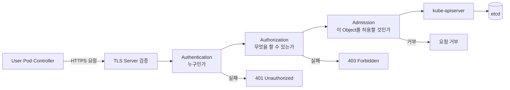
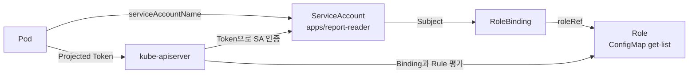

# 1. Kubernetes 보안과 RBAC

## API 접근 보안의 전체 구조

Kubernetes의 Control plane 변경은 대부분 kube-apiserver를 통과한다. 요청은 TLS 연결, Authentication, Authorization과 Admission 단계를 거친 뒤 etcd에 반영된다.



### Authentication

요청자가 누구인지 확인한다.

- Pod와 Controller: ServiceAccount의 짧은 수명 Token
- 사람: OIDC·외부 Identity와 exec credential plugin을 우선 검토
- 관리용 Client: 짧은 수명의 X.509 Client 인증서를 제한적으로 사용
- Node: Kubelet 인증서와 Node 전용 인증 흐름

### Authorization

인증된 User, Group 또는 ServiceAccount가 특정 API 동작을 수행할 수 있는지 판단한다. 이 문서에서는 Kubernetes에서 가장 일반적인 RBAC을 중심으로 한다.

### Admission

Authorization을 통과한 생성·변경 요청의 Object 내용을 Mutating·Validating Admission이 검사한다. RBAC은 “Pod를 생성할 수 있는가”를 판단하고 Admission은 “이 설정의 Pod를 생성해도 되는가”를 판단한다.

## ServiceAccount와 RBAC

ServiceAccount는 Workload의 Identity이고 RBAC은 그 Identity에 권한을 연결한다.



Token 자체에 Role을 넣는 것이 아니다. Token은 ServiceAccount Identity를 증명하고 API Server가 현재 RoleBinding·ClusterRoleBinding을 조회해 권한을 판단한다. 따라서 Binding 변경은 새 Token을 발급하지 않아도 다음 요청부터 영향을 줄 수 있다.

## RBAC의 네 리소스

| 리소스 | 범위 | 역할 |
|---|---|---|
| Role | Namespace | 해당 Namespace 안의 권한 Rule |
| ClusterRole | Cluster | Cluster Resource 또는 재사용 가능한 Namespaced Rule |
| RoleBinding | Namespace | Role·ClusterRole을 한 Namespace 안에서 부여 |
| ClusterRoleBinding | Cluster | ClusterRole을 Cluster 전체 범위로 부여 |

RBAC Rule은 허용 권한만 더하는 Additive 구조다. 명시적인 Deny Rule은 없으며 어떤 Authorizer도 허용하지 않으면 기본적으로 요청이 거부된다.

## 최소 권한 예시

다음 예시는 `apps` Namespace의 특정 ConfigMap만 읽는 권한이다.

```yaml
apiVersion: v1
kind: ServiceAccount
metadata:
  name: report-reader
  namespace: apps
---
apiVersion: rbac.authorization.k8s.io/v1
kind: Role
metadata:
  name: report-config-reader
  namespace: apps
rules:
  - apiGroups:
      - ""
    resources:
      - configmaps
    resourceNames:
      - report-config
    verbs:
      - get
---
apiVersion: rbac.authorization.k8s.io/v1
kind: RoleBinding
metadata:
  name: report-config-reader
  namespace: apps
subjects:
  - kind: ServiceAccount
    name: report-reader
    namespace: apps
roleRef:
  apiGroup: rbac.authorization.k8s.io
  kind: Role
  name: report-config-reader
```

`resourceNames`로 특정 Object를 제한할 수 있지만 `create`처럼 아직 이름이 결정되지 않은 요청이나 일반적인 `list` 제한에는 그대로 적용되지 않는다. 실제 API 동작을 `kubectl auth can-i`로 검증한다.

## 권한 부여 확인

```bash
kubectl auth can-i get configmap/report-config \
  -n apps \
  --as=system:serviceaccount:apps:report-reader

kubectl auth can-i delete secrets \
  -n apps \
  --as=system:serviceaccount:apps:report-reader
```

예상 결과는 각각 `yes`와 `no`다.

## 보안 원칙

### Workload마다 ServiceAccount 분리

`default` ServiceAccount에 여러 애플리케이션 권한을 모으지 않는다. API 접근이 필요한 Workload만 전용 ServiceAccount와 최소 권한을 사용한다.

### Token이 필요하지 않으면 Mount하지 않기

```yaml
spec:
  serviceAccountName: no-api-access
  automountServiceAccountToken: false
```

API를 호출하지 않는 Pod에 Token을 넣지 않으면 Container 침해 시 Cluster API Credential 노출 범위를 줄일 수 있다.

### Wildcard 피하기

`apiGroups: ["*"]`, `resources: ["*"]`, `verbs: ["*"]`는 앞으로 추가되는 API까지 자동으로 허용할 수 있다. 필요한 Group, Resource와 Verb를 명시한다.

### Secret과 권한을 함께 보호

Secret 읽기 권한은 ServiceAccount Token, Registry Credential과 애플리케이션 Credential 탈취로 이어질 수 있다. Pod 생성 권한도 해당 Namespace의 Secret·PVC·ServiceAccount를 간접 이용할 수 있으므로 강한 권한으로 취급한다.

### 사람과 Workload Identity 분리

- 사람: 조직 Identity Provider, MFA, Group 기반 RBAC와 짧은 Session
- Cluster 내부 Workload: ServiceAccount Projected Token
- Cloud API 접근: 가능하면 Workload Identity Federation
- 장기 자동화: 정적 Token보다 외부 Credential Broker·exec plugin 또는 환경 전용 Identity

## 운영 점검 항목

1. Anonymous Authentication이 필요한 범위로 제한되어 있는가?
2. API Server가 Private Network와 Firewall로 보호되는가?
3. Cluster-admin Binding을 정기적으로 검토하는가?
4. ServiceAccount Token 자동 Mount가 불필요한 Pod에서 꺼져 있는가?
5. RBAC 변경과 민감 API 호출을 Audit Log로 추적하는가?
6. Admission Policy와 Pod Security 기준이 함께 적용되는가?
7. Break-glass Credential의 보관·승인·회수 절차가 있는가?

## 참고 자료

- [Kubernetes API Access Control](https://kubernetes.io/docs/reference/access-authn-authz/)
- [Kubernetes RBAC](https://kubernetes.io/docs/reference/access-authn-authz/rbac/)
- [Kubernetes ServiceAccount](https://kubernetes.io/docs/concepts/security/service-accounts/)
- [Kubernetes Authorization](https://kubernetes.io/docs/reference/access-authn-authz/authorization/)

