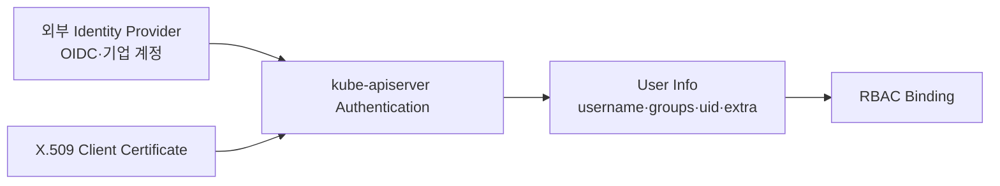
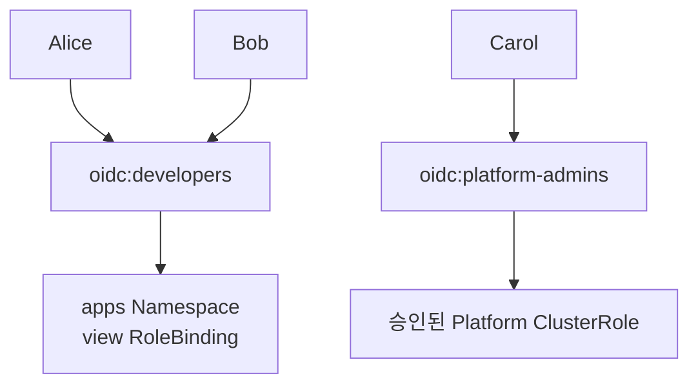
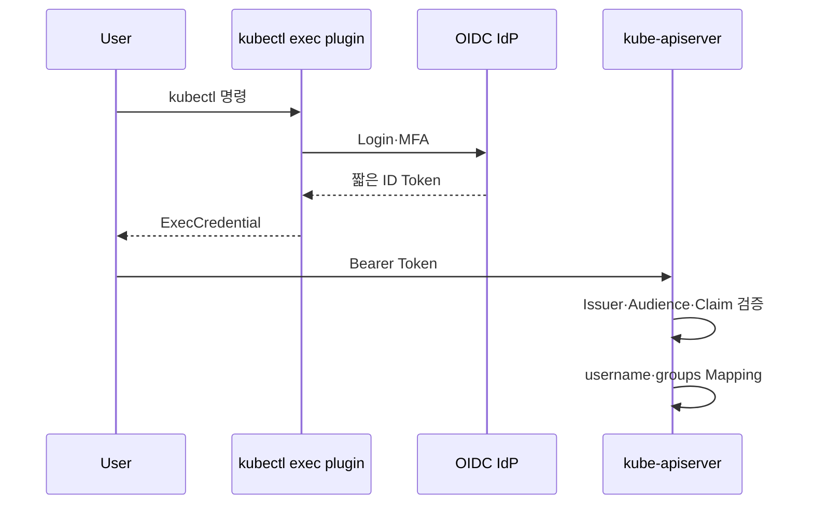

# 10. User와 Group

## Kubernetes에는 User Object가 없다

Kubernetes API는 ServiceAccount Object를 관리하지만 일반 사람을 나타내는 User·Group Object는 제공하지 않는다.



사용자의 생성, Password, MFA, 퇴사와 Group Membership은 외부 Identity System이나 인증서 발급 시스템이 관리한다. Kubernetes는 인증 결과로 전달된 문자열을 RBAC Subject와 비교한다.

## User

User는 Authentication 결과의 `username` 문자열이다.

```yaml
subjects:
  - kind: User
    name: oidc:alice@example.test
    apiGroup: rbac.authorization.k8s.io
```

RoleBinding에 User를 적는다고 그 사용자가 생성되는 것은 아니다. 실제 Authenticator가 정확히 같은 username을 반환해야 한다.

## Group

Group은 여러 User에게 같은 권한을 관리하기 위한 문자열 목록이다.

```yaml
apiVersion: rbac.authorization.k8s.io/v1
kind: RoleBinding
metadata:
  name: developers
  namespace: apps
subjects:
  - kind: Group
    name: oidc:developers
    apiGroup: rbac.authorization.k8s.io
roleRef:
  apiGroup: rbac.authorization.k8s.io
  kind: ClusterRole
  name: view
```

User마다 Binding을 만드는 것보다 조직 Group과 RBAC을 연결하면 입사·이동·퇴사 시 Identity Provider의 Group Membership으로 권한을 회수하기 쉽다.

## 인증 방식별 User와 Group Mapping

| 인증 방식 | username | groups |
|---|---|---|
| X.509 Client Certificate | Subject CN | Subject O 값들 |
| OIDC | 설정한 Username Claim | 설정한 Groups Claim |
| ServiceAccount Token | `system:serviceaccount:<ns>:<name>` | ServiceAccount System Groups |
| Authentication Webhook | Webhook 응답의 User | Webhook 응답의 Groups |

OIDC Username과 Group에는 `oidc:` 같은 Prefix를 사용해 Kubernetes의 `system:` 이름과 충돌하지 않게 한다.

## 기본 System Group

| Group | 의미 |
|---|---|
| `system:authenticated` | 인증에 성공한 모든 요청 |
| `system:unauthenticated` | Anonymous 등 인증되지 않은 요청 |
| `system:serviceaccounts` | 모든 ServiceAccount |
| `system:serviceaccounts:<namespace>` | 특정 Namespace의 ServiceAccount |

이 Group에 Binding하면 영향 범위가 매우 넓다. 특히 `system:authenticated`에 쓰기 권한을 부여하지 않는다.

`system:masters`는 일반 조직 관리자 Group으로 사용하지 않는다. 이 Group은 Authorization을 우회하는 Superuser 의미를 가질 수 있어 세밀한 RBAC 검토와 회수가 어렵다. 일상 관리자도 감사 가능한 별도 Group과 최소 ClusterRoleBinding을 사용한다.

## Group 기반 권한 설계



- 팀과 직무 단위 Group을 사용한다.
- Environment별로 `developers-dev`와 `developers-prod`처럼 분리한다.
- Production Write 권한은 별도 승인 Group으로 둔다.
- Cluster Admin과 일상 Read-only 계정을 분리한다.
- Group 변경, Binding 변경과 실제 API 사용을 Audit한다.

## OIDC를 이용한 현재 사용자 인증

사람의 지속적인 접근에는 외부 OIDC Identity Provider와 짧은 수명의 Token을 우선 검토한다.



Kubernetes는 OIDC Provider를 포함하지 않으므로 조직 IdP를 별도로 운영하거나 Cloud Provider의 Identity Integration을 사용한다.

## User와 Group 확인

```bash
kubectl auth whoami
kubectl auth can-i get deployments -n apps
kubectl auth can-i --list -n apps
```

권한이 있는 관리자는 Impersonation으로 RBAC 결과를 시험할 수 있다.

```bash
kubectl auth can-i get deployments \
  -n apps \
  --as=oidc:alice@example.test \
  --as-group=oidc:developers
```

`--as`는 Authentication을 시험하는 Login 기능이 아니다. 현재 User가 `impersonate` 권한으로 다른 Identity의 Authorization 결과를 시험하는 기능이다.

## Identity Lifecycle

1. IdP에서 사용자와 Group을 생성한다.
2. Group에 최소 RBAC Binding을 연결한다.
3. 사용자가 exec plugin으로 짧은 Credential을 받는다.
4. 정기적으로 Group과 Binding을 검토한다.
5. 이동·퇴사 시 IdP Session과 Group Membership을 회수한다.
6. Audit Log로 마지막 사용과 민감 작업을 확인한다.

Client Certificate는 발급 후 Group이 인증서 안에 고정되고 Kubernetes가 인증서 폐기 목록을 지원하지 않으므로 사람의 빈번한 Lifecycle 관리에는 OIDC가 더 적합하다.

## 참고 자료

- [Kubernetes User Authentication](https://kubernetes.io/docs/reference/access-authn-authz/authentication/)
- [RBAC Subject](https://kubernetes.io/docs/reference/access-authn-authz/rbac/#referring-to-subjects)
- [Impersonation](https://kubernetes.io/docs/reference/access-authn-authz/authentication/#user-impersonation)
- [kubectl auth whoami](https://kubernetes.io/docs/reference/kubectl/generated/kubectl_auth/kubectl_auth_whoami/)

