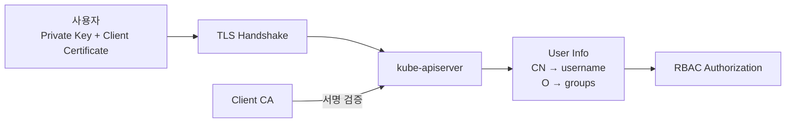
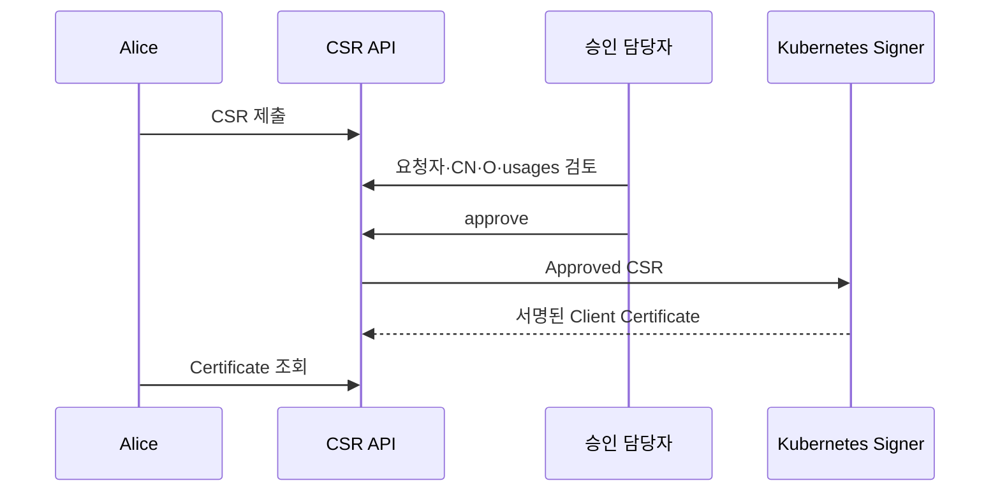
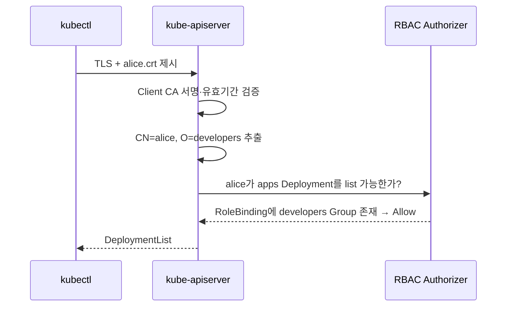

# 11. X.509 인증서를 이용한 사용자 인증

## 현재 사용 위치

X.509 Client Certificate는 `kube-apiserver`가 신뢰하는 CA로 서명된 인증서를 제시해 사용자를 인증하는 방식이다. Kubernetes에는 User Object가 없으므로 인증서를 발급해도 User Resource가 생성되지는 않는다.



X.509는 단순하고 별도 Identity Provider가 없는 작은 환경이나 자동화된 발급 체계에 유용하다. 다만 Kubernetes는 인증서 폐기 목록을 지원하지 않으므로 사람의 지속적인 접근에는 MFA와 짧은 Token을 제공하는 OIDC를 우선 검토한다.

## 인증서 Subject와 Kubernetes Identity

```text
Subject: CN=alice, O=developers
```

| X.509 Subject | Kubernetes 인증 결과 |
|---|---|
| `CN=alice` | username `alice` |
| `O=developers` | group `developers` |
| 여러 `O` | 여러 group |

`system:` Prefix는 Kubernetes System Identity를 위해 예약되어 있으므로 일반 사용자와 Group에 사용하지 않는다. 특히 `system:masters`는 Authorization을 우회할 수 있는 Superuser Group이므로 일상 관리자 Group으로 사용하지 않는다.

## 1. Private Key와 CSR 생성

다음은 학습용 `alice` 사용자 예시다.

```bash
openssl genrsa -out alice.key 3072
chmod 600 alice.key

openssl req -new \
  -key alice.key \
  -out alice.csr \
  -subj "/CN=alice/O=developers"

openssl req -in alice.csr -noout -subject -text
```

Private Key는 Cluster에 전송하지 않는다. CSR에는 Public Key와 요청한 Subject만 포함된다.

## 2. CertificateSigningRequest 생성

CSR을 Base64로 인코딩한다.

```bash
REQUEST=$(openssl base64 -A -in alice.csr)
```

생성된 값을 `spec.request`에 넣는다.

```yaml
apiVersion: certificates.k8s.io/v1
kind: CertificateSigningRequest
metadata:
  name: alice
spec:
  request: <base64-encoded-csr>
  signerName: kubernetes.io/kube-apiserver-client
  expirationSeconds: 86400
  usages:
    - client auth
```

```bash
kubectl apply -f alice-csr.yaml
kubectl get csr alice
kubectl get csr alice -o yaml
```

- `kubernetes.io/kube-apiserver-client`는 API Client 인증서용 내장 Signer다.
- `client auth`는 이 인증서를 Client Authentication에 사용한다는 뜻이다.
- `expirationSeconds: 86400`은 요청 수명 24시간이다. 실제 발급 수명은 Signer Policy에 따라 더 짧아질 수 있다.
- Kubernetes API가 허용하는 최소 요청 수명은 600초다.

## 3. CSR 검토와 승인

Client CSR은 `kube-controller-manager`가 자동 승인하지 않는다. 승인은 요청한 Identity와 Group에 Cluster 접근을 허용하는 Security Boundary다.



검토가 끝났을 때만 승인한다.

```bash
kubectl certificate approve alice
kubectl get csr alice
```

승인 권한과 RBAC Binding 변경 권한을 분리하면 한 사람이 임의의 Identity와 권한을 동시에 만들기 어려워진다.

## 4. 발급 인증서 추출과 확인

```bash
kubectl get csr alice \
  -o jsonpath='{.status.certificate}' \
  | openssl base64 -d -A > alice.crt

openssl x509 -in alice.crt -noout -subject -issuer -dates
```

`status.certificate`가 비어 있다면 CSR이 아직 승인되지 않았거나 Signer가 발급하지 못한 상태다. CSR의 `status.conditions`와 Control Plane Log를 확인한다.

## 5. RBAC 권한 연결

인증 성공은 API 사용 권한을 뜻하지 않는다. 인증서의 `O=developers`와 같은 이름의 Group을 RoleBinding에 연결한다.

```yaml
apiVersion: rbac.authorization.k8s.io/v1
kind: Role
metadata:
  name: workload-reader
  namespace: apps
rules:
  - apiGroups:
      - apps
    resources:
      - deployments
    verbs:
      - get
      - list
      - watch
---
apiVersion: rbac.authorization.k8s.io/v1
kind: RoleBinding
metadata:
  name: developers-read-workloads
  namespace: apps
subjects:
  - kind: Group
    name: developers
    apiGroup: rbac.authorization.k8s.io
roleRef:
  apiGroup: rbac.authorization.k8s.io
  kind: Role
  name: workload-reader
```

개별 `User: alice`보다 Group Binding을 사용하면 사용자마다 RoleBinding을 추가하지 않고 인증서의 Group과 조직 정책을 연결할 수 있다.

## 6. kubeconfig 사용자와 Context 연결

기존 Cluster 항목 이름이 `study`라고 가정한다. 기본 kubeconfig를 건드리지 않으려면 모든 명령에 별도 파일을 지정한다.

```bash
KUBECONFIG_FILE=./alice.kubeconfig

kubectl --kubeconfig="$KUBECONFIG_FILE" config set-cluster study \
  --server=https://api.example.test:6443 \
  --certificate-authority=cluster-ca.crt \
  --embed-certs=true

kubectl --kubeconfig="$KUBECONFIG_FILE" config set-credentials alice \
  --client-certificate=alice.crt \
  --client-key=alice.key \
  --embed-certs=true

kubectl --kubeconfig="$KUBECONFIG_FILE" config set-context alice@study \
  --cluster=study \
  --user=alice \
  --namespace=apps

kubectl --kubeconfig="$KUBECONFIG_FILE" config use-context alice@study
chmod 600 "$KUBECONFIG_FILE"
```

실제 API Server 주소와 Cluster CA는 관리자에게 안전하게 전달받는다. `--insecure-skip-tls-verify`로 CA 검증을 생략하지 않는다.

## 요청과 예상 결과

```bash
kubectl --kubeconfig=./alice.kubeconfig auth whoami
kubectl --kubeconfig=./alice.kubeconfig auth can-i list deployments -n apps
kubectl --kubeconfig=./alice.kubeconfig auth can-i delete secrets -n apps
kubectl --kubeconfig=./alice.kubeconfig get deployments -n apps
```

예상되는 핵심 결과는 다음과 같다.

```text
Username: alice
Groups: [developers system:authenticated]

yes   # list deployments
no    # delete secrets
```



## 갱신과 회수 시 주의점

Kubernetes 1.36 기준 Client Certificate 인증에는 인증서 폐기 확인 기능이 없다. RBAC Binding을 제거하면 요청의 Authorization은 막을 수 있지만 인증서 자체는 만료 전까지 유효한 Identity다.

- 수명이 짧은 인증서를 발급하고 만료 전에 재발급한다.
- Private Key와 kubeconfig 권한을 `0600`으로 제한하고 공유하지 않는다.
- 퇴사나 사고 시 관련 User·Group Binding을 즉시 제거하고 Audit Log를 확인한다.
- Client CA나 Signer가 손상되면 CA Rotation과 모든 Client Certificate 재발급을 검토한다.
- 지속적인 사람 접근은 OIDC·MFA·짧은 Token 기반 접근을 우선 검토한다.

CSR Object를 삭제해도 이미 발급된 인증서가 폐기되지는 않는다. 아래 정리는 학습 파일과 API Object를 지우는 작업일 뿐이다.

```bash
kubectl delete csr alice
rm alice.csr alice.crt alice.key alice.kubeconfig
```

실제 Private Key 삭제는 대상 경로와 Backup 정책을 확인한 뒤 수행한다.

## 참고 자료

- [Kubernetes X.509 Client Certificates](https://kubernetes.io/docs/reference/access-authn-authz/authentication/#x509-client-certs)
- [Certificate Signing Requests](https://kubernetes.io/docs/reference/access-authn-authz/certificate-signing-requests/)
- [Issue a Certificate for a Kubernetes API Client](https://kubernetes.io/docs/tasks/tls/certificate-issue-client-csr/)
- [kubectl config](https://kubernetes.io/docs/reference/kubectl/generated/kubectl_config/)
