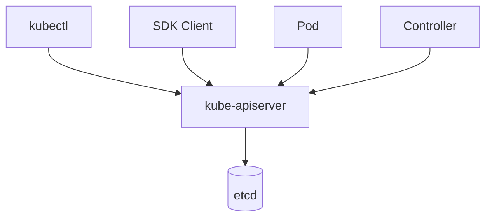
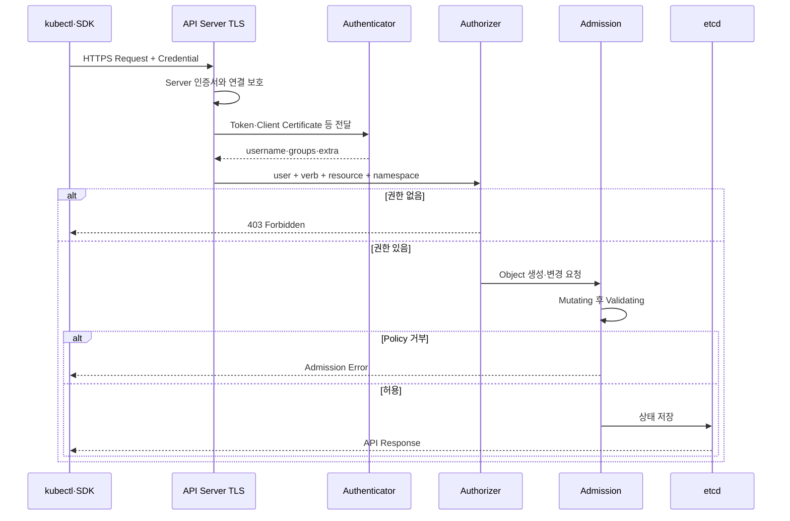
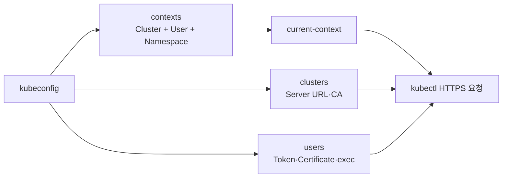

# 2. Kubernetes API 요청의 인증 과정

## kube-apiserver의 역할

kube-apiserver는 Kubernetes API의 Frontend다. kubectl, Controller, Scheduler, Kubelet과 Pod 내부 Client는 모두 API Server에 HTTPS 요청을 보낸다.



Client가 etcd를 직접 수정하지 않는다. API Server가 인증·인가, Validation, Version 변환과 저장을 일관되게 처리한다.

## 전체 인증·인가 과정



### 1. TLS

Client는 kubeconfig의 CA를 사용해 API Server 인증서를 검증한다. `insecure-skip-tls-verify: true`는 중간자 공격을 허용할 수 있으므로 학습 편의를 위해 사용하지 않는다.

### 2. Authentication

Credential을 검증해 다음 User Info를 만든다.

```text
username: 사용자 또는 ServiceAccount 이름
groups:   소속 Group 목록
uid:      선택적인 식별자
extra:    인증기가 제공한 추가 속성
```

ServiceAccount의 username은 다음 형태다.

```text
system:serviceaccount:<namespace>:<serviceaccount-name>
```

### 3. Authorization

API Server는 다음 요청 속성을 평가한다.

- User와 Group
- HTTP Verb가 변환된 Kubernetes Verb
- API Group, Resource와 Subresource
- Namespace와 Resource Name
- `/healthz` 같은 Non-resource URL

### 4. Admission

주로 Create, Update, Delete 요청의 Object를 변경하거나 검증한다. Image 정책, Pod Security, Resource 제한과 조직 Policy는 이 단계에서 적용할 수 있다.

## 401과 403

| 응답 | 의미 | 우선 확인 |
|---|---|---|
| `401 Unauthorized` | Credential이 없거나 유효하지 않아 Authentication 실패 | Token 만료, CA·Client 인증서와 Audience |
| `403 Forbidden` | Identity는 확인됐지만 Authorization 실패 | Role, Binding, Namespace와 Verb |

`Unauthorized`라는 HTTP 이름 때문에 혼동하기 쉽지만 Kubernetes 진단에서는 401을 인증 실패, 403을 권한 부족으로 구분한다.

## kubeconfig에서 가져오는 정보



```yaml
apiVersion: v1
kind: Config
clusters:
  - name: study
    cluster:
      server: https://api.example.test:6443
      certificate-authority: /secure/kube/ca.crt
users:
  - name: study-user
    user:
      exec:
        apiVersion: client.authentication.k8s.io/v1
        command: example-login-plugin
        interactiveMode: IfAvailable
contexts:
  - name: study-user@study
    context:
      cluster: study
      user: study-user
      namespace: apps
current-context: study-user@study
```

현재 사람의 장기 접근은 kubeconfig에 Password나 고정 Token을 넣기보다 OIDC와 exec credential plugin을 통해 짧은 Credential을 받는 구조를 우선한다.

## 주요 인증 방식

| 방식 | 주 사용 대상 | 신규 운영 방향 |
|---|---|---|
| ServiceAccount Token | Pod·Controller | Projected short-lived Token |
| OIDC·JWT | 사람·조직 Identity | MFA·Group 연동과 짧은 Session |
| exec credential plugin | kubectl·SDK | Cloud·기업 Login 도구 연동 |
| X.509 Client Certificate | 관리·Bootstrap·제한된 Client | 짧은 만료와 엄격한 발급 |
| Static Token File | 과거 구성 | 신규 사용 회피 |
| Anonymous | 일부 Health Endpoint | 최소화·명시적 RBAC |

Kubernetes는 OIDC Identity Provider를 직접 제공하지 않는다. 조직의 IdP와 API Server Authentication 설정을 연결한다.

## 요청을 확인하는 명령

```bash
kubectl config current-context
kubectl config view --minify
kubectl auth whoami
kubectl auth can-i list pods -n apps
kubectl get --raw /version
```

`kubectl config view --raw`는 Token과 Client Key 같은 민감 정보를 출력할 수 있으므로 공유 Terminal, Log와 문서에 결과를 남기지 않는다.

## 인증은 정상인데 요청이 실패할 때

1. `kubectl auth whoami`로 현재 User·Group을 확인한다.
2. `kubectl auth can-i`로 Verb·Resource·Namespace를 확인한다.
3. Resource API Group과 Subresource를 확인한다.
4. Admission Error Message와 Event를 확인한다.
5. API Server Audit Log에서 실제 Identity와 요청을 확인한다.

## 참고 자료

- [Kubernetes Authentication](https://kubernetes.io/docs/reference/access-authn-authz/authentication/)
- [Kubernetes Authorization](https://kubernetes.io/docs/reference/access-authn-authz/authorization/)
- [Kubernetes Admission Control](https://kubernetes.io/docs/reference/access-authn-authz/admission-controllers/)
- [kubeconfig 구성](https://kubernetes.io/docs/concepts/configuration/organize-cluster-access-kubeconfig/)

