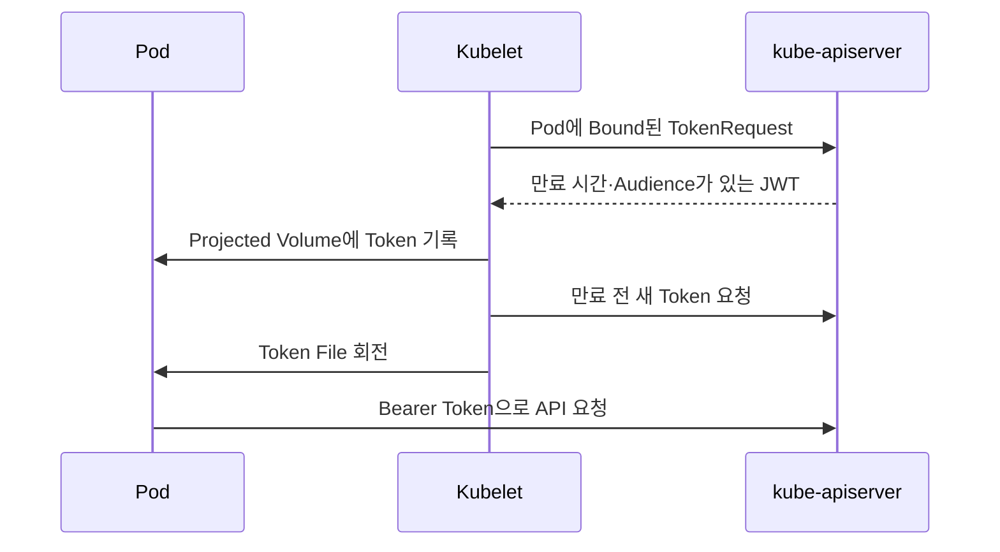

# 3. ServiceAccount

## ServiceAccount란?

ServiceAccount는 Kubernetes Workload가 API Server와 다른 시스템에서 자신을 증명할 때 사용하는 Namespaced Identity다.

```text
사람의 Identity
  → OIDC User·Group 또는 Client Certificate

Pod의 Identity
  → Namespace + ServiceAccount
  → system:serviceaccount:<namespace>:<name>
```

Kubernetes API에 User Object는 없지만 ServiceAccount는 API Object로 존재한다.

## 생성과 Pod 연결

```yaml
apiVersion: v1
kind: ServiceAccount
metadata:
  name: inventory-reader
  namespace: apps
automountServiceAccountToken: true
---
apiVersion: v1
kind: Pod
metadata:
  name: inventory-agent
  namespace: apps
spec:
  serviceAccountName: inventory-reader
  containers:
    - name: agent
      image: example.com/inventory-agent:1.0.0
```

Pod의 `spec.serviceAccountName`은 Pod 생성 후 변경할 수 없다. 생략하면 같은 Namespace의 `default` ServiceAccount가 사용된다.

ServiceAccount를 지정했다고 권한이 자동으로 생기지는 않는다. RoleBinding 또는 ClusterRoleBinding이 연결한 RBAC Rule만 사용할 수 있다.

## ServiceAccount Identity와 Group

`inventory-reader`는 인증 후 다음 Identity로 평가된다.

```text
username:
  system:serviceaccount:apps:inventory-reader

groups:
  system:serviceaccounts
  system:serviceaccounts:apps
  system:authenticated
```

이 Group 이름을 Binding Subject로 사용할 수 있지만, Namespace의 모든 ServiceAccount에 권한을 주는 결과가 될 수 있어 개별 ServiceAccount Binding보다 범위가 넓다.

## 현재 Token 방식

Pod에 자동 Mount되는 Credential은 TokenRequest API로 발급되는 짧은 수명의 Projected ServiceAccount Token이다.



- Token은 Pod Object에 Bound되어 Pod 삭제 후 유효하지 않게 된다.
- `exp`와 `aud` Claim을 가진다.
- Kubelet이 만료 전에 Projected File을 갱신한다.
- Client는 Token 문자열을 시작 시 한 번만 읽고 영구 Cache하지 않아야 한다.

## 기본 Mount Path

일반적으로 다음 파일이 Container에 제공된다.

| 경로 | 내용 |
|---|---|
| `/var/run/secrets/kubernetes.io/serviceaccount/token` | Projected Bearer Token |
| `/var/run/secrets/kubernetes.io/serviceaccount/ca.crt` | API Server 검증용 CA Bundle |
| `/var/run/secrets/kubernetes.io/serviceaccount/namespace` | Pod Namespace |

구현과 Cluster 설정에 따라 세부 내용이 달라질 수 있으므로 SDK의 In-cluster Configuration을 사용하는 편이 안전하다.

## Token 자동 Mount 끄기

API를 사용하지 않는 Workload는 Token을 Mount하지 않는다.

### ServiceAccount 전체

```yaml
apiVersion: v1
kind: ServiceAccount
metadata:
  name: web
  namespace: apps
automountServiceAccountToken: false
```

### 특정 Pod

```yaml
spec:
  serviceAccountName: web
  automountServiceAccountToken: false
```

Pod 설정이 ServiceAccount 설정보다 우선한다.

## Audience와 만료 시간을 지정한 Projected Token

Kubernetes API가 아닌 별도 Service가 ServiceAccount Token을 검증하는 경우 Audience를 제한할 수 있다.

```yaml
apiVersion: v1
kind: Pod
metadata:
  name: external-api-client
  namespace: apps
spec:
  serviceAccountName: inventory-reader
  automountServiceAccountToken: false
  containers:
    - name: client
      image: example.com/api-client:1.0.0
      volumeMounts:
        - name: identity
          mountPath: /var/run/secrets/tokens
          readOnly: true
  volumes:
    - name: identity
      projected:
        sources:
          - serviceAccountToken:
              path: external-api-token
              audience: https://inventory.example.test
              expirationSeconds: 3600
```

이 Token의 Audience는 외부 Inventory API다. 기본 Kubernetes API Audience와 다를 수 있으므로 그대로 kube-apiserver 인증에 사용할 수 있다고 가정하지 않는다.

## 임시 Token 발급

학습·진단이나 제한된 외부 Client에는 TokenRequest 기반 Token을 발급한다.

```bash
kubectl create token inventory-reader \
  --namespace apps \
  --duration 10m
```

출력된 Token은 Credential이다.

- Terminal Log, Shell History, CI Output와 문서에 붙이지 않는다.
- 필요한 시간보다 길게 발급하지 않는다.
- 전달 대신 Client가 승인된 Identity로 직접 발급받게 한다.
- 만료 후 자동화가 중단될 수 있으므로 장기 통합에는 전용 Identity 방식을 설계한다.

## 장기 Token Secret은 예외

과거에는 ServiceAccount를 생성하면 Token Secret이 자동 생성되는 예시가 흔했다. 현재는 자동 생성되지 않으며 TokenRequest와 Projected Token이 기본이다.

수동으로 `kubernetes.io/service-account-token` Secret을 만들면 만료되지 않는 Credential이 API Object로 저장될 수 있다. TokenRequest를 사용할 수 없고 위험을 수용한 특수한 경우 외에는 사용하지 않는다.

```text
신규 기본:
  Projected Token 또는 kubectl create token

예외:
  수동 Long-lived ServiceAccount Token Secret
  → 별도 승인, Secret 암호화, 접근 감사와 회수 절차 필요
```

## 상태 확인

```bash
kubectl get serviceaccount -n apps
kubectl describe serviceaccount inventory-reader -n apps
kubectl get pod inventory-agent -n apps \
  -o jsonpath='{.spec.serviceAccountName}{"\n"}'
kubectl auth can-i --list \
  --as=system:serviceaccount:apps:inventory-reader \
  -n apps
```

## 참고 자료

- [Kubernetes ServiceAccount](https://kubernetes.io/docs/concepts/security/service-accounts/)
- [ServiceAccount 관리와 Bound Token](https://kubernetes.io/docs/reference/access-authn-authz/service-accounts-admin/)
- [Pod ServiceAccount 구성](https://kubernetes.io/docs/tasks/configure-pod-container/configure-service-account/)
- [TokenRequest API](https://kubernetes.io/docs/reference/kubernetes-api/authentication-resources/token-request-v1/)

