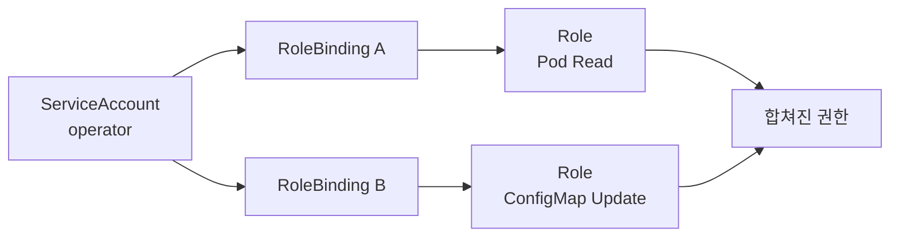

# 4. Role과 ClusterRole

## RBAC Rule 구조

Role과 ClusterRole은 “누가”가 아니라 “어떤 API 동작을 허용할지” 정의한다. Subject 연결은 RoleBinding과 ClusterRoleBinding이 담당한다.

```yaml
rules:
  - apiGroups:
      - ""
    resources:
      - pods
      - pods/log
    verbs:
      - get
      - list
      - watch
```

## apiGroups

API Group은 Resource가 속한 API 영역이다.

| apiGroups 값 | Resource 예시 |
|---|---|
| `""` | pods, services, configmaps, secrets |
| `apps` | deployments, statefulsets, daemonsets |
| `batch` | jobs, cronjobs |
| `rbac.authorization.k8s.io` | roles, rolebindings, clusterroles |
| `gateway.networking.k8s.io` | gateways, httproutes |

Core API Group은 `core`가 아니라 빈 문자열 `""`로 쓴다.

## resources와 Subresource

Resource 이름은 API의 복수형·소문자를 사용한다.

```yaml
resources:
  - pods
  - deployments
```

Pod Log와 상태 변경 같은 Subresource는 Slash로 구분한다.

```yaml
resources:
  - pods/log
  - deployments/scale
```

`kubectl api-resources`와 API Discovery로 정확한 Group과 Resource 이름을 확인한다.

## verbs

| Verb | 대표 동작 |
|---|---|
| `get` | 하나의 Resource 조회 |
| `list` | Resource 목록 조회 |
| `watch` | 변경 Stream 구독 |
| `create` | 새 Resource 생성 |
| `update` | 전체 Object 교체 |
| `patch` | 일부 Field 변경 |
| `delete` | 하나 삭제 |
| `deletecollection` | 여러 Resource 일괄 삭제 |

`bind`, `escalate`와 `impersonate`처럼 보안상 민감한 특수 Verb도 있다. 일반 애플리케이션 Role에 부여하지 않는다.

## Role

Role은 하나의 Namespace 안에서만 적용된다.

```yaml
apiVersion: rbac.authorization.k8s.io/v1
kind: Role
metadata:
  name: deployment-reader
  namespace: apps
rules:
  - apiGroups:
      - apps
    resources:
      - deployments
    verbs:
      - get
      - list
      - watch
```

## RoleBinding

RoleBinding은 Subject와 Role을 같은 Namespace 범위에서 연결한다.

```yaml
apiVersion: rbac.authorization.k8s.io/v1
kind: RoleBinding
metadata:
  name: deployment-reader
  namespace: apps
subjects:
  - kind: ServiceAccount
    name: release-observer
    namespace: apps
roleRef:
  apiGroup: rbac.authorization.k8s.io
  kind: Role
  name: deployment-reader
```

`roleRef`는 Binding 생성 후 변경할 수 없다. 다른 Role로 바꾸려면 Binding을 다시 생성한다.

## ClusterRole

ClusterRole은 Cluster-scoped Resource 권한 또는 여러 Namespace에서 재사용할 Rule을 정의한다.

```yaml
apiVersion: rbac.authorization.k8s.io/v1
kind: ClusterRole
metadata:
  name: node-reader
rules:
  - apiGroups:
      - ""
    resources:
      - nodes
    verbs:
      - get
      - list
      - watch
```

## ClusterRole을 RoleBinding으로 연결

ClusterRole이 Namespaced Resource Rule을 가지고 있다면 RoleBinding으로 특정 Namespace에만 부여할 수 있다.

```yaml
apiVersion: rbac.authorization.k8s.io/v1
kind: ClusterRole
metadata:
  name: workload-reader
rules:
  - apiGroups:
      - ""
    resources:
      - pods
      - services
    verbs:
      - get
      - list
      - watch
---
apiVersion: rbac.authorization.k8s.io/v1
kind: RoleBinding
metadata:
  name: workload-reader
  namespace: apps
subjects:
  - kind: Group
    name: oidc:developers
    apiGroup: rbac.authorization.k8s.io
roleRef:
  apiGroup: rbac.authorization.k8s.io
  kind: ClusterRole
  name: workload-reader
```

같은 ClusterRole을 여러 Namespace의 RoleBinding에서 재사용할 수 있다.

## ClusterRoleBinding

ClusterRoleBinding은 Cluster 전체 범위로 권한을 부여한다.

```yaml
apiVersion: rbac.authorization.k8s.io/v1
kind: ClusterRoleBinding
metadata:
  name: node-readers
subjects:
  - kind: Group
    name: oidc:platform-observers
    apiGroup: rbac.authorization.k8s.io
roleRef:
  apiGroup: rbac.authorization.k8s.io
  kind: ClusterRole
  name: node-reader
```

Namespaced Resource Rule을 ClusterRoleBinding으로 연결하면 모든 Namespace에 적용될 수 있으므로 RoleBinding보다 영향 범위가 크다.

## Role과 ClusterRole 비교

| 정의 | Binding | 결과 |
|---|---|---|
| Role | RoleBinding | 한 Namespace |
| ClusterRole | RoleBinding | ClusterRole Rule을 한 Namespace에 제한 |
| ClusterRole | ClusterRoleBinding | 모든 Namespace 또는 Cluster Resource |
| Role | ClusterRoleBinding | 사용할 수 없음 |

## 여러 권한을 조합하는 방법

RBAC 권한은 Additive이므로 하나의 Subject에 여러 Binding을 연결하면 권한이 합쳐진다.



작은 책임별 Role을 여러 Binding으로 조합하면 검토와 재사용이 쉽다.

## Aggregated ClusterRole

여러 ClusterRole Rule을 Label Selector로 하나의 ClusterRole에 자동 집계할 수도 있다.

```yaml
apiVersion: rbac.authorization.k8s.io/v1
kind: ClusterRole
metadata:
  name: monitoring
aggregationRule:
  clusterRoleSelectors:
    - matchLabels:
        rbac.example.test/aggregate-to-monitoring: "true"
---
apiVersion: rbac.authorization.k8s.io/v1
kind: ClusterRole
metadata:
  name: monitoring-pods
  labels:
    rbac.example.test/aggregate-to-monitoring: "true"
rules:
  - apiGroups:
      - ""
    resources:
      - pods
    verbs:
      - get
      - list
      - watch
```

Aggregation Controller가 `monitoring`의 Rule을 채우므로 집계되는 `monitoring` ClusterRole에 `rules`를 직접 작성하지 않는다. 권한은 Label로 선택되는 `monitoring-pods` 같은 개별 ClusterRole의 `rules`에서 관리한다. 기본 `admin`, `edit`, `view` ClusterRole을 직접 수정하기보다 공식 Aggregation Label이나 별도 Role을 사용한다.

## 권한 검증

```bash
kubectl auth can-i list deployments \
  -n apps \
  --as=system:serviceaccount:apps:release-observer

kubectl auth can-i list nodes \
  --as-group=oidc:platform-observers \
  --as=oidc:test-user

kubectl auth can-i --list \
  -n apps \
  --as=system:serviceaccount:apps:release-observer
```

Impersonation Option을 사용하려면 실행하는 현재 User에게 별도의 `impersonate` 권한이 필요하다.

## 최소 권한 주의점

- Wildcard보다 Resource와 Verb를 명시한다.
- Secret `get·list·watch`는 Credential 읽기 권한으로 취급한다.
- Role·Binding 생성 권한은 Privilege Escalation 가능성을 검토한다.
- Pod 생성 권한은 ServiceAccount와 Volume을 통해 간접 권한을 얻을 수 있다.
- `bind`와 `escalate` 권한을 일반 사용자에게 주지 않는다.
- 변경 전후 `kubectl auth can-i`와 Audit Log로 검증한다.

## 참고 자료

- [Kubernetes RBAC](https://kubernetes.io/docs/reference/access-authn-authz/rbac/)
- [Kubernetes Authorization](https://kubernetes.io/docs/reference/access-authn-authz/authorization/)
- [RBAC API](https://kubernetes.io/docs/reference/kubernetes-api/authorization-resources/)
