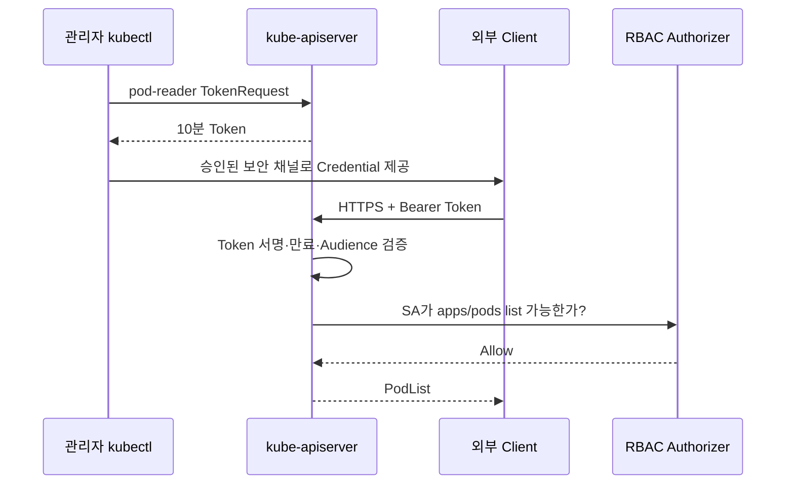
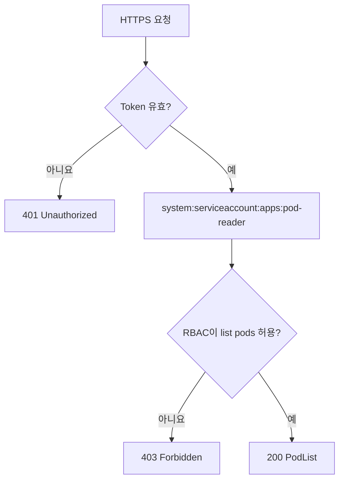

# 5. ServiceAccount로 외부에서 API Server 접근

## 현재 방식으로 수정하기

과거 예시는 ServiceAccount Token Secret을 찾아 장기 Token을 추출했다. 신규 구성에서는 임시 TokenRequest를 사용한다.

```text
과거:
  ServiceAccount → Long-lived Secret → Token 추출

현재:
  ServiceAccount → TokenRequest → 짧은 수명 Token
```

ServiceAccount는 원래 Workload Identity다. 사람의 지속적인 kubectl 접근에는 OIDC·exec credential plugin을 우선하고, 이 방식은 학습·진단이나 제한된 Machine Client에 사용한다.

## 최소 권한 리소스

`apps` Namespace의 Pod 목록만 읽는 ServiceAccount다.

```yaml
apiVersion: v1
kind: ServiceAccount
metadata:
  name: pod-reader
  namespace: apps
---
apiVersion: rbac.authorization.k8s.io/v1
kind: Role
metadata:
  name: pod-reader
  namespace: apps
rules:
  - apiGroups:
      - ""
    resources:
      - pods
    verbs:
      - get
      - list
      - watch
---
apiVersion: rbac.authorization.k8s.io/v1
kind: RoleBinding
metadata:
  name: pod-reader
  namespace: apps
subjects:
  - kind: ServiceAccount
    name: pod-reader
    namespace: apps
roleRef:
  apiGroup: rbac.authorization.k8s.io
  kind: Role
  name: pod-reader
```

## 접근 구조



Token을 사람 사이에서 복사하는 운영보다 Client가 승인된 인증 흐름으로 직접 짧은 Token을 발급받는 구조가 안전하다.

## API Server와 CA 확인

현재 kubeconfig Context에서 Server 주소를 확인한다.

```bash
kubectl config view --minify \
  -o jsonpath='{.clusters[0].cluster.server}{"\n"}'
```

kubeconfig가 CA Data를 Embed한 경우 학습용 임시 CA 파일로 추출할 수 있다.

```bash
kubectl config view --raw --minify --flatten \
  -o jsonpath='{.clusters[0].cluster.certificate-authority-data}' \
  | openssl base64 -d -A > /tmp/study-kube-ca.crt
```

`/tmp/study-kube-ca.crt`는 작업 후 삭제하고 권한을 제한한다. kubeconfig가 `certificate-authority` File Path를 사용한다면 그 File을 직접 참조한다.

## 짧은 수명 Token 발급

```bash
TOKEN=$(kubectl create token pod-reader \
  --namespace apps \
  --duration 10m)
```

API Server가 요청 Duration보다 짧거나 긴 Token을 발급할 수 있으므로 실제 만료 정책은 Cluster 설정에 따른다.

## curl 요청

```bash
SERVER=$(kubectl config view --minify \
  -o jsonpath='{.clusters[0].cluster.server}')

curl --fail-with-body \
  --cacert /tmp/study-kube-ca.crt \
  --header "Authorization: Bearer ${TOKEN}" \
  "${SERVER}/api/v1/namespaces/apps/pods"
```

예상 응답의 형태는 다음과 같다.

```json
{
  "kind": "PodList",
  "apiVersion": "v1",
  "metadata": {},
  "items": []
}
```

Credential을 정리한다.

```bash
unset TOKEN
unset SERVER
rm /tmp/study-kube-ca.crt
```

## 인증과 인가 흐름



## kubectl로 먼저 검증

Token을 만들기 전에 관리자 권한으로 예상 권한을 확인한다.

```bash
kubectl auth can-i list pods \
  --namespace apps \
  --as=system:serviceaccount:apps:pod-reader

kubectl auth can-i list secrets \
  --namespace apps \
  --as=system:serviceaccount:apps:pod-reader
```

첫 결과는 `yes`, 두 번째는 `no`여야 한다.

## 장기 자동화에 사용한다면

10분 Token을 수동으로 갱신하는 구성은 지속적인 자동화에 적합하지 않다.

- Cluster 내부에서 실행할 수 있다면 Pod ServiceAccount와 In-cluster Config를 사용한다.
- 외부 CI는 Cloud·Cluster가 제공하는 Workload Identity 또는 OIDC Federation을 검토한다.
- exec credential plugin이나 Credential Broker로 짧은 Token을 자동 발급한다.
- 불가피한 장기 Credential은 전용 Secret Manager, 회전과 Audit을 적용한다.

## 하지 말아야 할 방식

- Token을 Git, Wiki, Ticket과 CI Log에 저장한다.
- `curl -k` 또는 `--insecure-skip-tls-verify`로 TLS 검증을 끈다.
- 테스트 편의를 위해 `cluster-admin`을 ServiceAccount에 부여한다.
- 자동 생성되지 않는 Token Secret을 강제로 만들고 만료 없이 사용한다.
- 하나의 ServiceAccount Token을 여러 시스템과 팀이 공유한다.

## 참고 자료

- [ServiceAccount Token 관리](https://kubernetes.io/docs/reference/access-authn-authz/service-accounts-admin/)
- [ServiceAccount TokenRequest](https://kubernetes.io/docs/tasks/configure-pod-container/configure-service-account/#manually-create-an-api-token-for-a-serviceaccount)
- [Kubernetes API 접근](https://kubernetes.io/docs/tasks/administer-cluster/access-cluster-api/)
