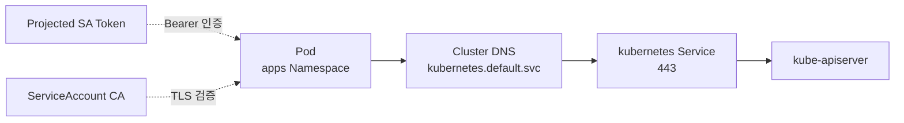
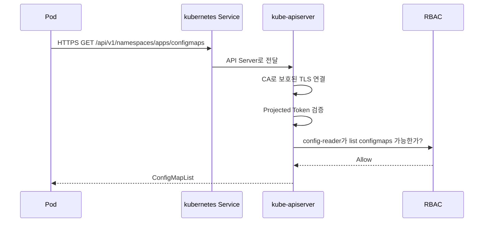

# 6. Cluster 내부에서 API Server 접근

Pod 내부에서는 `kubernetes` Service와 Projected ServiceAccount Credential을 사용해 API Server에 접근한다.

## 내부 접근 구조



Cluster는 일반적으로 `default` Namespace에 `kubernetes` Service를 제공한다. Pod는 `https://kubernetes.default.svc` 또는 Kubernetes Service 환경 변수로 API Endpoint를 찾을 수 있다.

## 최소 권한 YAML

`apps` Namespace의 ConfigMap만 읽는 예시다.

```yaml
apiVersion: v1
kind: ServiceAccount
metadata:
  name: config-reader
  namespace: apps
---
apiVersion: rbac.authorization.k8s.io/v1
kind: Role
metadata:
  name: config-reader
  namespace: apps
rules:
  - apiGroups:
      - ""
    resources:
      - configmaps
    verbs:
      - get
      - list
      - watch
---
apiVersion: rbac.authorization.k8s.io/v1
kind: RoleBinding
metadata:
  name: config-reader
  namespace: apps
subjects:
  - kind: ServiceAccount
    name: config-reader
    namespace: apps
roleRef:
  apiGroup: rbac.authorization.k8s.io
  kind: Role
  name: config-reader
```

## curl Pod 예시

```yaml
apiVersion: v1
kind: Pod
metadata:
  name: api-curl
  namespace: apps
spec:
  serviceAccountName: config-reader
  containers:
    - name: curl
      image: curlimages/curl:latest
      command:
        - sh
        - -c
        - sleep 3600
```

학습 문서에서는 흐름에 집중하기 위해 Image Tag를 단순화했다. 운영 Manifest에서는 검증된 Version 또는 Digest를 고정하고 Update 절차를 둔다.

## 기본 Credential File

```bash
SERVICEACCOUNT=/var/run/secrets/kubernetes.io/serviceaccount

cat "${SERVICEACCOUNT}/namespace"
ls -l "${SERVICEACCOUNT}"
```

Token 내용을 `cat`으로 출력하지 않는다. File 존재와 권한만 확인한다.

## API 호출

```bash
APISERVER=https://kubernetes.default.svc
SERVICEACCOUNT=/var/run/secrets/kubernetes.io/serviceaccount
NAMESPACE=$(cat "${SERVICEACCOUNT}/namespace")
TOKEN=$(cat "${SERVICEACCOUNT}/token")
CACERT="${SERVICEACCOUNT}/ca.crt"

curl --fail-with-body \
  --cacert "${CACERT}" \
  --header "Authorization: Bearer ${TOKEN}" \
  "${APISERVER}/api/v1/namespaces/${NAMESPACE}/configmaps"

unset TOKEN
```

예상 응답은 `ConfigMapList`다.

```json
{
  "kind": "ConfigMapList",
  "apiVersion": "v1",
  "metadata": {},
  "items": []
}
```

## 인증 과정



## Service 환경 변수 사용

Pod 생성 시 Kubernetes Service가 존재하면 다음 환경 변수가 제공될 수 있다.

```bash
env | grep '^KUBERNETES_SERVICE_'
```

주요 값은 `KUBERNETES_SERVICE_HOST`와 `KUBERNETES_SERVICE_PORT_HTTPS`다. 공식 SDK는 이러한 In-cluster 정보를 자동 처리한다.

## Token 회전

Projected Token File은 Kubelet이 갱신한다.

- 매 요청마다 File을 읽거나 Token 회전을 지원하는 Client를 사용한다.
- Token 문자열을 Process 시작 시 읽고 영구 보관하지 않는다.
- 공식 Kubernetes Client Library의 In-cluster Config를 우선한다.
- File 교체를 감지하지 못하는 Custom Client는 401 발생 시 안전하게 Reload한다.

## 접근하지 않는 Pod

API 호출이 필요 없다면 Token 자동 Mount를 끈다.

```yaml
spec:
  serviceAccountName: web
  automountServiceAccountToken: false
```

## 문제 해결

```bash
kubectl describe pod api-curl -n apps
kubectl auth can-i list configmaps \
  -n apps \
  --as=system:serviceaccount:apps:config-reader
kubectl get endpointslice \
  -n default \
  -l kubernetes.io/service-name=kubernetes
```

| 증상 | 확인할 내용 |
|---|---|
| DNS 실패 | Cluster DNS와 `kubernetes.default.svc` |
| TLS 오류 | CA File과 API Server Certificate |
| 401 | Token File, 만료와 Audience |
| 403 | RoleBinding, Verb와 Namespace |
| Timeout | NetworkPolicy, CNI와 API Endpoint Firewall |

API Server Egress를 NetworkPolicy로 허용할 때 Service ClusterIP만 기준으로 삼으면 CNI 구현에 따라 예상과 다를 수 있다. 실제 Packet 경로와 Platform 권장 Policy를 확인한다.

## 참고 자료

- [Pod에서 Kubernetes API 접근](https://kubernetes.io/docs/tasks/run-application/access-api-from-pod/)
- [ServiceAccount 구성](https://kubernetes.io/docs/tasks/configure-pod-container/configure-service-account/)
- [Kubernetes Service Discovery](https://kubernetes.io/docs/concepts/services-networking/service/)

