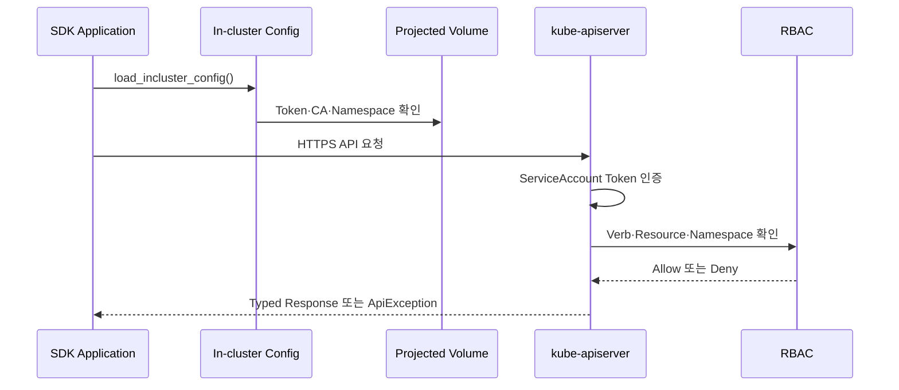

# 7. Kubernetes SDK로 Pod에서 API Server 접근

직접 REST URL, Token과 CA를 조합할 수 있지만 애플리케이션에서는 공식 Kubernetes Client Library의 In-cluster Configuration을 사용하는 편이 안전하다.

## SDK가 처리하는 항목

- API Server Host와 Port 검색
- ServiceAccount Token File 사용
- CA Bundle을 이용한 TLS 검증
- Kubernetes API Resource 직렬화
- Pagination, Watch와 API Error 처리
- 지원되는 Client에서는 Projected Token 갱신

## 인증 흐름



## Python SDK 예시

```python
from kubernetes import client, config
from kubernetes.client.exceptions import ApiException


def main() -> None:
    config.load_incluster_config()
    core = client.CoreV1Api()

    try:
        pod_list = core.list_namespaced_pod(namespace="apps")
    except ApiException as exc:
        if exc.status == 403:
            raise RuntimeError("ServiceAccount에 Pod 조회 권한이 없습니다") from exc
        raise

    for pod in pod_list.items:
        print(pod.metadata.name)


if __name__ == "__main__":
    main()
```

Token이나 CA 경로를 Source Code에 넣지 않는다. `load_incluster_config()`가 Pod에 Project된 Credential을 사용한다.

## ServiceAccount와 RBAC

```yaml
apiVersion: v1
kind: ServiceAccount
metadata:
  name: pod-inventory
  namespace: apps
---
apiVersion: rbac.authorization.k8s.io/v1
kind: Role
metadata:
  name: pod-inventory
  namespace: apps
rules:
  - apiGroups:
      - ""
    resources:
      - pods
    verbs:
      - get
      - list
      - watch
---
apiVersion: rbac.authorization.k8s.io/v1
kind: RoleBinding
metadata:
  name: pod-inventory
  namespace: apps
subjects:
  - kind: ServiceAccount
    name: pod-inventory
    namespace: apps
roleRef:
  apiGroup: rbac.authorization.k8s.io
  kind: Role
  name: pod-inventory
```

## SDK 애플리케이션 Deployment

```yaml
apiVersion: apps/v1
kind: Deployment
metadata:
  name: pod-inventory
  namespace: apps
spec:
  replicas: 1
  selector:
    matchLabels:
      app: pod-inventory
  template:
    metadata:
      labels:
        app: pod-inventory
    spec:
      serviceAccountName: pod-inventory
      containers:
        - name: inventory
          image: registry.example.test/pod-inventory:1.0.0
          securityContext:
            allowPrivilegeEscalation: false
            capabilities:
              drop:
                - ALL
            runAsNonRoot: true
```

예시 Image는 실제로 존재하는 Image가 아니다. Python Code와 호환되는 Kubernetes Client를 포함해 직접 Build하고 검증된 Digest로 배포한다.

## Namespace를 자동으로 읽기

Pod가 실행되는 Namespace를 File에서 읽을 수 있다.

```python
from pathlib import Path

namespace = Path(
    "/var/run/secrets/kubernetes.io/serviceaccount/namespace"
).read_text(encoding="utf-8").strip()
```

Downward API 환경 변수로 Namespace를 전달하는 방식도 사용할 수 있다.

```yaml
env:
  - name: POD_NAMESPACE
    valueFrom:
      fieldRef:
        fieldPath: metadata.namespace
```

## Local 개발과 In-cluster 실행 분리

개발 환경에서는 kubeconfig, Pod에서는 In-cluster Config를 선택할 수 있다.

```python
from kubernetes import config
from kubernetes.config.config_exception import ConfigException


try:
    config.load_incluster_config()
except ConfigException:
    config.load_kube_config(context="developer@study")
```

운영 Container가 예상하지 않게 Host kubeconfig를 읽지 않도록 Environment별 Entry Point를 분리하는 편이 더 명확할 수 있다.

## Watch 사용

Resource 변경을 계속 확인해야 한다면 짧은 간격의 반복 List보다 Watch를 사용한다.

```python
from kubernetes import client, config, watch

config.load_incluster_config()
core = client.CoreV1Api()
stream = watch.Watch()

for event in stream.stream(
    core.list_namespaced_pod,
    namespace="apps",
    timeout_seconds=300,
):
    pod = event["object"]
    print(event["type"], pod.metadata.name)
```

운영 Controller는 Watch 종료, Resource Version 만료, 재연결, Rate Limit와 Idempotency를 처리해야 한다. 단순 Script를 Controller처럼 사용하기보다 필요하면 client-go Controller Pattern이나 검증된 Framework를 사용한다.

## Client Version 유지보수

Kubernetes SDK와 Cluster API Version의 호환 범위를 공식 Client Repository에서 확인한다.

- Dependency Version을 명시적으로 고정한다.
- Cluster Upgrade 전에 API Deprecation과 Client 호환성을 시험한다.
- 사용 중인 Resource의 안정 API Version을 우선한다.
- SDK와 Transitive Dependency의 Security Update를 추적한다.
- Token을 Log에 포함하지 않도록 HTTP Debug Logging을 점검한다.

## 최소 권한 검증

```bash
kubectl auth can-i list pods \
  -n apps \
  --as=system:serviceaccount:apps:pod-inventory

kubectl auth can-i delete pods \
  -n apps \
  --as=system:serviceaccount:apps:pod-inventory
```

목록 조회는 `yes`, 삭제는 `no`가 되어야 한다.

## 참고 자료

- [Pod에서 공식 Client Library 사용](https://kubernetes.io/docs/tasks/run-application/access-api-from-pod/#using-official-client-libraries)
- [Kubernetes Client Libraries](https://kubernetes.io/docs/reference/using-api/client-libraries/)
- [Python Kubernetes Client](https://github.com/kubernetes-client/python)
- [Go client-go In-cluster Config](https://pkg.go.dev/k8s.io/client-go/rest#InClusterConfig)

