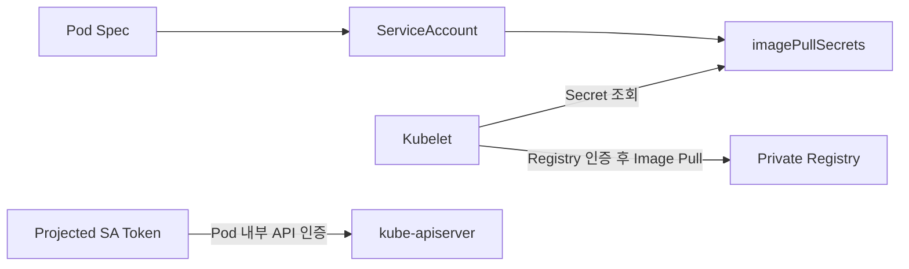

# 8. ServiceAccount에 Image Registry Secret 설정

Private Registry Image를 Pull할 때 Kubelet은 `kubernetes.io/dockerconfigjson` Secret을 사용한다. ServiceAccount의 `imagePullSecrets`에 연결하면 해당 ServiceAccount를 사용하는 새 Pod에 기본값으로 적용된다.

## API Token과 Registry Secret의 차이



- ServiceAccount Token: Pod 내부 Process가 Kubernetes API에 인증한다.
- ImagePullSecret: Kubelet이 Container 생성 전에 Registry에 인증한다.
- ImagePullSecret은 Pod Volume으로 자동 Mount되지 않는다.

두 Credential은 목적과 노출 주체가 다르므로 같은 것으로 취급하지 않는다.

## Docker Config Secret 생성

신뢰할 수 있는 Credential Helper나 Login 과정으로 준비한 임시 Docker Config를 사용한다.

```bash
kubectl create secret generic registry-pull \
  --namespace apps \
  --type=kubernetes.io/dockerconfigjson \
  --from-file=.dockerconfigjson=/secure/path/registry-config.json
```

`registry-config.json`에는 Registry Credential이 들어 있으므로 권한을 제한하고 작업 후 안전하게 삭제한다. Password를 Command Argument에 직접 적으면 Shell History와 Process 목록에 노출될 수 있다.

Secret YAML 구조는 다음과 같다.

```yaml
apiVersion: v1
kind: Secret
metadata:
  name: registry-pull
  namespace: apps
type: kubernetes.io/dockerconfigjson
data:
  .dockerconfigjson: <base64-encoded-docker-config>
```

Base64는 암호화가 아니다. 실제 값을 Git에 Commit하지 않고 External Secret Manager, GitOps 암호화 도구 또는 Platform Credential 연동을 사용한다.

## ServiceAccount에 연결

```yaml
apiVersion: v1
kind: ServiceAccount
metadata:
  name: private-image-app
  namespace: apps
imagePullSecrets:
  - name: registry-pull
automountServiceAccountToken: false
```

Registry Image만 Pull하고 Kubernetes API를 호출하지 않는 애플리케이션이라면 `automountServiceAccountToken: false`를 함께 사용할 수 있다.

## Pod에서 사용

```yaml
apiVersion: v1
kind: Pod
metadata:
  name: private-app
  namespace: apps
spec:
  serviceAccountName: private-image-app
  containers:
    - name: app
      image: registry.example.test/team/app:1.4.2
```

ServiceAccount Admission 과정에서 Pod의 `imagePullSecrets`에 ServiceAccount 설정이 반영된다.

### Pod에 직접 지정

특정 Pod만 다른 Credential을 사용한다면 Pod Spec에 직접 적을 수 있다.

```yaml
spec:
  imagePullSecrets:
    - name: registry-pull
```

같은 Namespace의 Secret만 참조할 수 있다. 여러 Namespace에서 사용하려면 각 Namespace에 Credential을 안전하게 배포하거나 Registry의 Workload Identity 연동을 사용한다.

## 현재 운영 방향

가능하면 만료되지 않는 Registry Password보다 다음 방식을 우선한다.

- Cloud Registry와 Node·Workload Identity 연동
- 짧은 수명의 Registry Access Token
- Credential Provider Plugin
- Namespace·Team별 최소 Scope Robot Account
- Read-only Pull 권한

Registry Credential에 Image Push, Delete나 관리자 권한을 함께 넣지 않는다.

## Credential 회전

ServiceAccount가 Secret 이름을 참조하므로 같은 이름의 Secret Data를 갱신할 수 있다.

```bash
kubectl get secret registry-pull -n apps
kubectl describe serviceaccount private-image-app -n apps
kubectl get pod private-app -n apps \
  -o jsonpath='{.spec.imagePullSecrets[*].name}{"\n"}'
```

이미 Node에 Cache된 Image는 Credential 갱신을 즉시 검증하지 않을 수 있다. 별도 Test Pod와 새 Tag 또는 `imagePullPolicy`를 고려해 실제 Pull을 확인한다.

Rotation 절차에는 다음이 필요하다.

1. 새 Credential 발급
2. Secret 안전 갱신
3. 새 Image Pull 검증
4. 이전 Credential 폐기
5. Audit Log와 Registry Log 확인

## ImagePullBackOff 문제 해결

```bash
kubectl describe pod private-app -n apps
kubectl get serviceaccount private-image-app -n apps -o yaml
kubectl get secret registry-pull -n apps \
  -o jsonpath='{.type}{"\n"}'
```

| Event | 확인할 내용 |
|---|---|
| `FailedToRetrieveImagePullSecret` | Secret 이름과 Namespace |
| `unauthorized` | Registry Credential과 Repository Scope |
| `manifest unknown` | Image Repository와 Tag |
| TLS 오류 | Registry Certificate와 Node Trust |
| Timeout | Node에서 Registry까지 DNS·Network·Proxy |

Secret Data를 출력해 디버깅하기 전에 Registry Log, Secret Type과 참조 관계를 먼저 확인한다.

## 기본 ServiceAccount에 Patch할 때

다음 방식도 가능하지만 Namespace의 모든 기본 Pod에 영향을 줄 수 있다.

```bash
kubectl patch serviceaccount default \
  --namespace apps \
  --type=merge \
  -p '{"imagePullSecrets":[{"name":"registry-pull"}]}'
```

전용 ServiceAccount를 만들어 Workload별 Registry 권한과 API Token Mount 정책을 구분하는 편이 명확하다.

## 참고 자료

- [Private Registry Image Pull](https://kubernetes.io/docs/tasks/configure-pod-container/pull-image-private-registry/)
- [ServiceAccount에 ImagePullSecret 추가](https://kubernetes.io/docs/tasks/configure-pod-container/configure-service-account/#add-image-pull-secret-to-service-account)
- [ServiceAccount API](https://kubernetes.io/docs/reference/kubernetes-api/authentication-resources/service-account-v1/)

